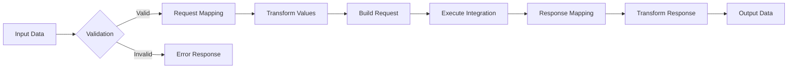

# Adaptor Service - Complete Implementation Guide

## Service Overview
**Purpose**: External system integration management and marketplace  
**Technology**: Python 3.11+, FastAPI, PostgreSQL, Redis, AsyncIO  
**Estimated Total Lines**: ~14,000  
**Complexity**: High  

---

## 🗂 Level 1: Folder Structure

```
adaptor-service/
├── src/
│   ├── api/                    # API layer (10 files, ~1,600 lines)
│   │   ├── v2/                 # Version 2 endpoints
│   │   │   ├── __init__.py
│   │   │   ├── integration_routes.py
│   │   │   ├── marketplace_routes.py
│   │   │   ├── execution_routes.py
│   │   │   └── health_routes.py
│   │   └── middleware/         # Request/response middleware
│   ├── core/                   # Core business logic (22 files, ~4,000 lines)
│   │   ├── integrations/       # Integration implementations
│   │   │   ├── __init__.py
│   │   │   ├── base_integration.py
│   │   │   ├── rest_integration.py
│   │   │   ├── graphql_integration.py
│   │   │   ├── webhook_integration.py
│   │   │   ├── database_integration.py
│   │   │   └── file_integration.py
│   │   ├── connectors/         # Pre-built connectors
│   │   │   ├── __init__.py
│   │   │   ├── salesforce_connector.py
│   │   │   ├── shopify_connector.py
│   │   │   ├── hubspot_connector.py
│   │   │   ├── stripe_connector.py
│   │   │   ├── jira_connector.py
│   │   │   └── connector_factory.py
│   │   ├── transformers/       # Data transformation
│   │   │   ├── __init__.py
│   │   │   ├── request_transformer.py
│   │   │   ├── response_transformer.py
│   │   │   ├── mapping_engine.py
│   │   │   └── jmespath_transformer.py
│   │   └── auth/               # Authentication handlers
│   │       ├── __init__.py
│   │       ├── oauth2_handler.py
│   │       ├── api_key_handler.py
│   │       ├── basic_auth_handler.py
│   │       └── jwt_handler.py
│   ├── models/                 # Data models (10 files, ~1,500 lines)
│   │   ├── __init__.py
│   │   ├── postgres/           # PostgreSQL models
│   │   │   ├── __init__.py
│   │   │   ├── integration_model.py
│   │   │   ├── connector_model.py
│   │   │   └── execution_log_model.py
│   │   ├── redis/              # Redis data structures
│   │   │   ├── __init__.py
│   │   │   ├── auth_cache.py
│   │   │   └── rate_limit_cache.py
│   │   └── domain/             # Domain models
│   │       ├── __init__.py
│   │       ├── integration_config.py
│   │       ├── execution_request.py
│   │       └── marketplace_item.py
│   ├── services/               # Service layer (12 files, ~2,200 lines)
│   │   ├── __init__.py
│   │   ├── integration_service.py
│   │   ├── execution_service.py
│   │   ├── marketplace_service.py
│   │   ├── auth_service.py
│   │   ├── transformation_service.py
│   │   ├── validation_service.py
│   │   └── testing_service.py
│   ├── repositories/           # Data access layer (6 files, ~900 lines)
│   │   ├── __init__.py
│   │   ├── integration_repository.py
│   │   ├── connector_repository.py
│   │   ├── execution_repository.py
│   │   └── marketplace_repository.py
│   ├── marketplace/            # Marketplace functionality (8 files, ~1,400 lines)
│   │   ├── __init__.py
│   │   ├── marketplace_manager.py
│   │   ├── template_engine.py
│   │   ├── connector_templates/
│   │   │   ├── crm_templates.py
│   │   │   ├── ecommerce_templates.py
│   │   │   └── productivity_templates.py
│   │   └── validation_rules.py
│   ├── utils/                  # Utilities (10 files, ~1,200 lines)
│   │   ├── __init__.py
│   │   ├── http_client.py
│   │   ├── retry_manager.py
│   │   ├── circuit_breaker.py
│   │   ├── json_path_utils.py
│   │   └── encryption_utils.py
│   ├── exceptions/             # Custom exceptions (4 files, ~300 lines)
│   ├── config/                 # Configuration (3 files, ~400 lines)
│   └── main.py                 # Application entry point
├── tests/                      # Test suite (30 files, ~4,500 lines)
├── templates/                  # Integration templates
├── scripts/                    # Utility scripts
└── requirements.txt
```

**Folder Dependencies:**
- `api/` → `services/`, `models/`
- `services/` → `core/`, `repositories/`, `marketplace/`
- `core/` → `models/`, `utils/`
- `marketplace/` → `models/`, `core/`

---

## 📄 Level 2: File Specifications

### Core Integration Files

#### `/src/core/integrations/rest_integration.py`
- **Responsibility**: REST API integration implementation
- **Complexity**: High
- **Key Classes**: 
  - `RESTIntegration` - REST API handler
  - `RESTRequestBuilder` - Request construction
  - `RESTResponseParser` - Response parsing
- **Imports**: base_integration, httpx, auth handlers
- **Exports**: RESTIntegration

#### `/src/core/connectors/salesforce_connector.py`
- **Responsibility**: Salesforce-specific integration logic
- **Complexity**: High
- **Key Classes**: 
  - `SalesforceConnector` - Main connector
  - `SalesforceAuth` - OAuth2 implementation
  - `SalesforceDataMapper` - Data mapping
- **Imports**: rest_integration, oauth2_handler
- **Exports**: SalesforceConnector

#### `/src/core/transformers/mapping_engine.py`
- **Responsibility**: Dynamic data mapping between systems
- **Complexity**: Very High
- **Key Classes**: 
  - `MappingEngine` - Core mapping logic
  - `FieldMapper` - Field-level mapping
  - `TransformationRule` - Transformation rules
- **Imports**: jmespath, validators
- **Exports**: MappingEngine

### Service Layer Files

#### `/src/services/execution_service.py`
- **Responsibility**: Execute integrations with retry and error handling
- **Complexity**: High
- **Key Classes**: 
  - `ExecutionService` - Main execution service
- **Imports**: integrations, transformers, repositories
- **Exports**: ExecutionService

#### `/src/services/marketplace_service.py`
- **Responsibility**: Manage integration marketplace
- **Complexity**: Medium
- **Key Classes**: 
  - `MarketplaceService` - Marketplace operations
- **Imports**: marketplace_manager, repositories
- **Exports**: MarketplaceService

---

## ⚙️ Level 3: Method Details

### `/src/core/integrations/rest_integration.py`

```python
class RESTIntegration(BaseIntegration):
    def __init__(
        self,
        config: IntegrationConfig,
        auth_handler: Optional[BaseAuthHandler] = None,
        http_client: Optional[AsyncHTTPClient] = None,
        retry_manager: Optional[RetryManager] = None
    ):
        super().__init__(config)
        self.auth_handler = auth_handler or self._create_auth_handler()
        self.http_client = http_client or AsyncHTTPClient()
        self.retry_manager = retry_manager or RetryManager()
        self.circuit_breaker = CircuitBreaker(
            failure_threshold=5,
            recovery_timeout=60
        )

    async def execute(
        self,
        endpoint: str,
        method: str,
        request_data: Dict[str, Any],
        timeout_ms: int = 5000,
        retry_config: Optional[RetryConfig] = None
    ) -> IntegrationResponse:
        """
        Execute REST API integration
        
        Parameters:
        - endpoint: str
            - Full URL or path to append to base_url
            - Supports path parameters: /users/{user_id}
        - method: str (GET, POST, PUT, DELETE, PATCH)
        - request_data: Dict[str, Any]
            - path_params: Dict[str, str]
            - query_params: Dict[str, Any]
            - headers: Dict[str, str]
            - body: Any (will be JSON encoded)
        - timeout_ms: int
        - retry_config: Optional[RetryConfig]
            - max_retries: int
            - backoff_strategy: str
            - retry_on_status: List[int]
            
        Returns:
        - IntegrationResponse
            - success: bool
            - status_code: int
            - data: Any
            - headers: Dict[str, str]
            - error: Optional[str]
            - execution_time_ms: int
            
        Business Logic:
        1. Check circuit breaker status
        2. Build full URL with path parameters
        3. Add authentication headers/params
        4. Build request with query params and body
        5. Execute with retry logic:
           a. Send HTTP request
           b. Handle rate limiting
           c. Retry on configured errors
        6. Parse response based on content-type
        7. Update circuit breaker state
        8. Return standardized response
        
        Error Handling:
        - CircuitOpen: Return cached/default response
        - AuthError: Refresh auth and retry once
        - RateLimit: Extract retry-after and wait
        - Timeout: Retry with exponential backoff
        - NetworkError: Retry if configured
        """

    async def build_request(
        self,
        endpoint: str,
        method: str,
        request_data: Dict[str, Any]
    ) -> PreparedRequest:
        """
        Build HTTP request with all components
        
        Parameters:
        - endpoint: URL template with placeholders
        - method: HTTP method
        - request_data: Request components
        
        Returns:
        - PreparedRequest ready for execution
        
        Business Logic:
        1. Substitute path parameters in URL
        2. Add query parameters with encoding
        3. Set default headers (Accept, Content-Type)
        4. Add custom headers
        5. Add authentication
        6. Serialize body based on content-type
        7. Validate request completeness
        """

    async def handle_rate_limiting(
        self,
        response: httpx.Response,
        retry_attempt: int
    ) -> Optional[float]:
        """
        Handle rate limiting responses
        
        Parameters:
        - response: HTTP response object
        - retry_attempt: Current retry number
        
        Returns:
        - Wait time in seconds or None
        
        Business Logic:
        1. Check for rate limit status (429)
        2. Extract retry-after header
        3. Parse as seconds or HTTP date
        4. Apply jitter to prevent thundering herd
        5. Cap maximum wait time
        6. Update rate limit metrics
        """

    async def parse_response(
        self,
        response: httpx.Response,
        expected_format: str = "auto"
    ) -> Any:
        """
        Parse response based on content type
        
        Parameters:
        - response: Raw HTTP response
        - expected_format: json|xml|text|binary|auto
        
        Returns:
        - Parsed response data
        
        Business Logic:
        1. Detect content-type if auto
        2. Parse JSON responses
        3. Parse XML responses
        4. Handle binary data
        5. Extract error messages
        6. Validate response schema
        """
```

### `/src/services/execution_service.py`

```python
class ExecutionService:
    def __init__(
        self,
        integration_repository: IntegrationRepository,
        transformation_service: TransformationService,
        validation_service: ValidationService,
        execution_repository: ExecutionRepository,
        metrics_collector: MetricsCollector,
        cache_service: CacheService
    ):
        self.integration_repo = integration_repository
        self.transformation_service = transformation_service
        self.validation_service = validation_service
        self.execution_repo = execution_repository
        self.metrics = metrics_collector
        self.cache = cache_service
        self._integration_cache = {}

    async def execute_integration(
        self,
        tenant_id: str,
        integration_id: str,
        endpoint_name: str,
        input_data: Dict[str, Any],
        options: Optional[ExecutionOptions] = None
    ) -> ExecutionResult:
        """
        Execute integration with full pipeline
        
        Parameters:
        - tenant_id: str (UUID)
        - integration_id: str (UUID)
        - endpoint_name: str (configured endpoint)
        - input_data: Dict[str, Any]
            - context: Dict (conversation context)
            - variables: Dict (dynamic values)
            - user_data: Dict (user information)
        - options: Optional[ExecutionOptions]
            - timeout_override_ms: int
            - skip_cache: bool
            - debug_mode: bool
            - mock_response: Any
            
        Returns:
        - ExecutionResult
            - success: bool
            - data: Any (transformed response)
            - raw_response: Any (original response)
            - execution_log: ExecutionLog
            - error: Optional[Error]
            
        Business Logic:
        1. Load integration configuration
        2. Validate tenant has access
        3. Get endpoint configuration
        4. Check cache if enabled
        5. Transform input using mapping rules:
           a. Apply request mapping
           b. Validate required fields
           c. Apply data transformations
        6. Get integration instance
        7. Execute with monitoring:
           a. Start metrics collection
           b. Execute integration
           c. Record execution time
        8. Transform response:
           a. Apply response mapping
           b. Extract relevant fields
           c. Format for conversation
        9. Update cache
        10. Log execution details
        11. Emit metrics
        12. Return result
        
        Error Handling:
        - IntegrationNotFound: Return 404
        - ValidationError: Return detailed errors
        - TransformationError: Log and return partial
        - ExecutionError: Apply fallback if configured
        - TimeoutError: Return timeout response
        """

    async def transform_request(
        self,
        input_data: Dict[str, Any],
        mapping_config: RequestMapping,
        endpoint_config: EndpointConfig
    ) -> Dict[str, Any]:
        """
        Transform input data to integration format
        
        Parameters:
        - input_data: Raw input from conversation
        - mapping_config: Mapping rules
        - endpoint_config: Endpoint requirements
        
        Returns:
        - Transformed request data
        
        Business Logic:
        1. Apply field mappings
        2. Execute value transformations
        3. Add default values
        4. Validate against schema
        5. Apply business rules
        6. Format for integration type
        """

    async def transform_response(
        self,
        raw_response: Any,
        mapping_config: ResponseMapping,
        conversation_context: Dict[str, Any]
    ) -> Dict[str, Any]:
        """
        Transform integration response for conversation
        
        Parameters:
        - raw_response: Raw integration response
        - mapping_config: Response mapping rules
        - conversation_context: Current context
        
        Returns:
        - Transformed response data
        
        Business Logic:
        1. Extract fields using JSON path
        2. Apply data transformations
        3. Format for conversation use
        4. Add contextual information
        5. Generate human-readable summary
        """

    async def handle_execution_error(
        self,
        error: Exception,
        integration_config: IntegrationConfig,
        context: Dict[str, Any]
    ) -> ExecutionResult:
        """
        Handle integration execution errors
        
        Parameters:
        - error: Exception that occurred
        - integration_config: Integration configuration
        - context: Execution context
        
        Returns:
        - Error result with fallback data
        
        Business Logic:
        1. Classify error type
        2. Check for configured fallbacks
        3. Apply error transformation
        4. Generate user-friendly message
        5. Log detailed error
        6. Update circuit breaker
        7. Return error result
        """
```

### `/src/core/transformers/mapping_engine.py`

```python
class MappingEngine:
    def __init__(
        self,
        jmespath_transformer: JMESPathTransformer,
        validators: Dict[str, Callable],
        formatters: Dict[str, Callable]
    ):
        self.jmespath = jmespath_transformer
        self.validators = validators
        self.formatters = formatters
        self._compiled_expressions = {}

    async def apply_mapping(
        self,
        source_data: Dict[str, Any],
        mapping_rules: List[MappingRule],
        target_schema: Optional[Dict[str, Any]] = None
    ) -> Dict[str, Any]:
        """
        Apply mapping rules to transform data
        
        Parameters:
        - source_data: Input data to transform
        - mapping_rules: List[MappingRule]
            - source_path: str (JMESPath expression)
            - target_path: str (dot notation)
            - transform: Optional[str] (transformation name)
            - default: Any (default value)
            - required: bool
        - target_schema: Optional validation schema
        
        Returns:
        - Transformed data matching target structure
        
        Business Logic:
        1. Initialize target structure
        2. For each mapping rule:
           a. Extract value from source
           b. Apply transformation if specified
           c. Validate value
           d. Set in target structure
        3. Apply default values
        4. Validate against schema
        5. Return transformed data
        
        Error Handling:
        - MappingError: Collect all errors
        - ValidationError: Include field context
        - TransformError: Use original value
        """

    def extract_value(
        self,
        data: Dict[str, Any],
        path: str,
        default: Any = None
    ) -> Any:
        """
        Extract value using JMESPath
        
        Parameters:
        - data: Source data
        - path: JMESPath expression
        - default: Default if not found
        
        Returns:
        - Extracted value or default
        
        Business Logic:
        1. Compile expression if not cached
        2. Search data with expression
        3. Handle null/missing values
        4. Return default if not found
        """

    def set_nested_value(
        self,
        target: Dict[str, Any],
        path: str,
        value: Any
    ) -> None:
        """
        Set value in nested structure
        
        Parameters:
        - target: Target dictionary
        - path: Dot notation path
        - value: Value to set
        
        Business Logic:
        1. Split path into segments
        2. Create nested structure as needed
        3. Set final value
        4. Handle list indices in path
        """

    async def apply_transformation(
        self,
        value: Any,
        transform_name: str,
        params: Optional[Dict[str, Any]] = None
    ) -> Any:
        """
        Apply named transformation to value
        
        Parameters:
        - value: Input value
        - transform_name: Transformation identifier
        - params: Transform parameters
        
        Returns:
        - Transformed value
        
        Available Transforms:
        - uppercase, lowercase, capitalize
        - date_format, timestamp_to_date
        - number_format, currency_format
        - concat, split, regex_extract
        - arithmetic operations
        - conditional transformations
        """
```

---

## 🔗 Level 4: Parameter & Type Definitions

### Core Types (`/src/models/domain/types.py`)

```python
from enum import Enum
from typing import List, Dict, Optional, Any, Union
from pydantic import BaseModel, Field, validator
from datetime import datetime

class IntegrationType(str, Enum):
    REST_API = "rest_api"
    GRAPHQL = "graphql"
    WEBHOOK = "webhook"
    DATABASE = "database"
    FILE_SYSTEM = "file_system"
    MESSAGE_QUEUE = "message_queue"
    CUSTOM = "custom"

class AuthType(str, Enum):
    NONE = "none"
    API_KEY = "api_key"
    BASIC_AUTH = "basic_auth"
    BEARER_TOKEN = "bearer_token"
    OAUTH2 = "oauth2"
    JWT = "jwt"
    CUSTOM = "custom"

class HttpMethod(str, Enum):
    GET = "GET"
    POST = "POST"
    PUT = "PUT"
    PATCH = "PATCH"
    DELETE = "DELETE"
    HEAD = "HEAD"
    OPTIONS = "OPTIONS"

# Configuration Models
class IntegrationConfig(BaseModel):
    integration_id: str = Field(default_factory=lambda: str(uuid4()))
    tenant_id: str
    name: str = Field(..., min_length=1, max_length=255)
    description: Optional[str] = None
    type: IntegrationType
    category: str  # crm, ecommerce, support, etc.
    base_url: Optional[str] = None
    auth_config: AuthConfig
    headers: Dict[str, str] = Field(default_factory=dict)
    timeout_ms: int = Field(default=5000, ge=100, le=60000)
    retry_config: RetryConfig = Field(default_factory=RetryConfig)
    rate_limit: Optional[RateLimitConfig] = None
    ssl_verify: bool = Field(default=True)
    endpoints: Dict[str, EndpointConfig] = Field(default_factory=dict)
    enabled: bool = Field(default=True)
    test_endpoint: Optional[str] = None
    metadata: Dict[str, Any] = Field(default_factory=dict)

class AuthConfig(BaseModel):
    type: AuthType
    credentials: Dict[str, Any] = Field(default_factory=dict)
    # API Key auth
    api_key_header: Optional[str] = None
    api_key_param: Optional[str] = None
    # OAuth2
    oauth2_flow: Optional[str] = None  # authorization_code, client_credentials
    token_url: Optional[str] = None
    authorization_url: Optional[str] = None
    scopes: List[str] = Field(default_factory=list)
    # Custom auth
    custom_handler: Optional[str] = None

class EndpointConfig(BaseModel):
    name: str
    path: str  # URL path with placeholders
    method: HttpMethod
    description: Optional[str] = None
    request_mapping: RequestMapping
    response_mapping: ResponseMapping
    validation_schema: Optional[Dict[str, Any]] = None
    cache_config: Optional[CacheConfig] = None
    mock_response: Optional[Any] = None

class RequestMapping(BaseModel):
    path_params: Dict[str, str] = Field(default_factory=dict)
    query_params: Dict[str, str] = Field(default_factory=dict)
    headers: Dict[str, str] = Field(default_factory=dict)
    body: Dict[str, str] = Field(default_factory=dict)
    transformations: List[TransformRule] = Field(default_factory=list)

class ResponseMapping(BaseModel):
    success_path: Optional[str] = None  # JMESPath to success indicator
    data_path: Optional[str] = None     # JMESPath to main data
    error_path: Optional[str] = None    # JMESPath to error message
    field_mappings: Dict[str, str] = Field(default_factory=dict)
    transformations: List[TransformRule] = Field(default_factory=list)
    default_values: Dict[str, Any] = Field(default_factory=dict)

class TransformRule(BaseModel):
    field: str
    transform: str  # Transform function name
    params: Optional[Dict[str, Any]] = None
    condition: Optional[str] = None  # JMESPath condition

# Execution Models
class ExecutionRequest(BaseModel):
    request_id: str = Field(default_factory=lambda: str(uuid4()))
    tenant_id: str
    integration_id: str
    endpoint_name: str
    input_data: Dict[str, Any]
    context: Dict[str, Any] = Field(default_factory=dict)
    options: ExecutionOptions = Field(default_factory=ExecutionOptions)

class ExecutionOptions(BaseModel):
    timeout_override_ms: Optional[int] = None
    skip_cache: bool = Field(default=False)
    debug_mode: bool = Field(default=False)
    mock_response: Optional[Any] = None
    retry_override: Optional[RetryConfig] = None

class ExecutionResult(BaseModel):
    request_id: str
    success: bool
    data: Optional[Any] = None
    raw_response: Optional[Any] = None
    error: Optional[ErrorDetail] = None
    execution_time_ms: int
    cached: bool = Field(default=False)
    retries: int = Field(default=0)
    metadata: Dict[str, Any] = Field(default_factory=dict)

class ErrorDetail(BaseModel):
    code: str
    message: str
    details: Optional[Dict[str, Any]] = None
    retry_after: Optional[int] = None

# Marketplace Models
class MarketplaceItem(BaseModel):
    item_id: str
    name: str
    description: str
    category: str
    type: IntegrationType
    provider: str  # Company/service name
    logo_url: Optional[str] = None
    documentation_url: Optional[str] = None
    pricing: Optional[str] = None  # Free, Paid, Freemium
    popularity: int = Field(default=0)
    rating: Optional[float] = Field(None, ge=0, le=5)
    tags: List[str] = Field(default_factory=list)
    requirements: List[str] = Field(default_factory=list)
    template: IntegrationTemplate
    created_at: datetime
    updated_at: datetime

class IntegrationTemplate(BaseModel):
    base_config: Dict[str, Any]
    endpoints: List[EndpointTemplate]
    setup_instructions: List[str]
    test_credentials: Optional[Dict[str, Any]] = None
    sample_requests: List[Dict[str, Any]] = Field(default_factory=list)

class EndpointTemplate(BaseModel):
    name: str
    description: str
    path: str
    method: HttpMethod
    required_params: List[str]
    optional_params: List[str]
    sample_request: Optional[Dict[str, Any]] = None
    sample_response: Optional[Dict[str, Any]] = None

# Monitoring Models
class ExecutionLog(BaseModel):
    log_id: str = Field(default_factory=lambda: str(uuid4()))
    tenant_id: str
    integration_id: str
    endpoint_name: str
    request_id: str
    timestamp: datetime
    duration_ms: int
    success: bool
    status_code: Optional[int] = None
    error_message: Optional[str] = None
    request_size_bytes: int
    response_size_bytes: int
    retry_count: int = Field(default=0)

class IntegrationHealth(BaseModel):
    integration_id: str
    status: str = Field(..., regex='^(healthy|degraded|unhealthy)$')
    uptime_percentage: float
    average_latency_ms: int
    error_rate: float
    last_success: Optional[datetime] = None
    last_error: Optional[datetime] = None
    consecutive_failures: int = Field(default=0)

# Retry Configuration
class RetryConfig(BaseModel):
    max_retries: int = Field(default=3, ge=0, le=10)
    backoff_strategy: str = Field(default="exponential")
    initial_delay_ms: int = Field(default=1000)
    max_delay_ms: int = Field(default=60000)
    retry_on_status: List[int] = Field(
        default_factory=lambda: [408, 429, 500, 502, 503, 504]
    )
    retry_on_errors: List[str] = Field(
        default_factory=lambda: ["timeout", "connection_error"]
    )

class RateLimitConfig(BaseModel):
    requests_per_minute: Optional[int] = None
    requests_per_hour: Optional[int] = None
    concurrent_requests: Optional[int] = None
    burst_size: Optional[int] = None

class CacheConfig(BaseModel):
    enabled: bool = Field(default=True)
    ttl_seconds: int = Field(default=300, ge=0, le=86400)
    cache_key_fields: List[str] = Field(default_factory=list)
    invalidate_on: List[str] = Field(default_factory=list)

# Validation Models
class ValidationRule(BaseModel):
    field: str
    type: str  # required, format, range, enum, pattern
    value: Any
    error_message: str

class TestCase(BaseModel):
    name: str
    description: Optional[str] = None
    endpoint: str
    input_data: Dict[str, Any]
    expected_output: Dict[str, Any]
    timeout_ms: int = Field(default=5000)
```

---

## 📊 Level 5: Cross-Service Integration

### Service Dependencies

```yaml
Adaptor Service:
  Depends On:
    - Security Hub: API key management, encryption
    - Analytics Engine: Execution metrics
    
  Provides To:
    - MCP Engine: External data access
    - Chat Service: Direct integrations
    - Admin Dashboard: Integration management
    
  Communication:
    - Sync: REST API from all services
    - Async: Kafka to Analytics Engine
    - Cache: Redis for auth tokens
    - External: Various protocols to external systems
```

### Integration Patterns

#### 1. MCP Engine Integration
```python
# /src/api/v2/execution_routes.py
@router.post("/execute/{integration_id}/{endpoint}")
async def execute_integration_endpoint(
    integration_id: str,
    endpoint: str,
    request: ExecutionRequest,
    tenant_id: str = Header(...),
    execution_service: ExecutionService = Depends()
) -> ExecutionResult:
    """
    Execute integration for MCP Engine
    
    Used for:
    - Fetching external data in flows
    - Triggering external actions
    - Validating external state
    """
```

#### 2. Marketplace Pattern
```python
# /src/marketplace/marketplace_manager.py
class MarketplaceManager:
    """
    Integration marketplace management
    
    Features:
    1. Template library
    2. One-click setup
    3. Configuration wizard
    4. Test credentials
    5. Usage analytics
    """
    
    async def install_integration(
        self,
        tenant_id: str,
        template_id: str,
        config_overrides: Dict[str, Any]
    ) -> IntegrationConfig:
        """Install integration from template"""
```

### Authentication Patterns

```python
# /src/core/auth/oauth2_handler.py
class OAuth2Handler(BaseAuthHandler):
    """
    OAuth2 authentication flow
    
    Supports:
    1. Authorization Code
    2. Client Credentials
    3. Refresh Token
    4. PKCE
    
    Token Management:
    - Automatic refresh
    - Secure storage
    - Expiry tracking
    """
    
    async def get_access_token(
        self,
        integration_id: str
    ) -> str:
        """Get valid access token, refreshing if needed"""
```

### Circuit Breaker Pattern

```python
# /src/utils/circuit_breaker.py
class CircuitBreaker:
    """
    Prevent cascading failures
    
    States:
    - Closed: Normal operation
    - Open: Failing, reject requests
    - Half-Open: Testing recovery
    
    Transitions:
    - Closed → Open: After N failures
    - Open → Half-Open: After timeout
    - Half-Open → Closed: On success
    - Half-Open → Open: On failure
    """
```

### Data Transformation Pipeline



### Performance Optimizations

```python
# /src/utils/performance.py
class IntegrationPerformance:
    """
    Optimization strategies:
    
    1. Connection Pooling
       - Per-integration pools
       - Configurable size
       - Health checks
    
    2. Request Batching
       - Combine similar requests
       - Respect rate limits
       - Optimal batch sizes
    
    3. Caching
       - Response caching
       - Token caching
       - Configuration caching
    
    4. Parallel Execution
       - Concurrent requests
       - Dependency resolution
       - Result aggregation
    """
```

---

## Testing Strategy

### Test Structure
```
tests/
├── unit/
│   ├── test_transformers/
│   ├── test_auth_handlers/
│   └── test_connectors/
├── integration/
│   ├── test_external_apis.py
│   ├── test_marketplace.py
│   └── test_execution_flow.py
└── mocks/
    ├── mock_salesforce.py
    └── mock_responses.py
```

### Critical Test Scenarios
1. **Authentication flows**
2. **Data transformation accuracy**
3. **Error handling and retries**
4. **Rate limit compliance**
5. **Circuit breaker behavior**
6. **Concurrent executions**

---

## Deployment Configuration

### Environment Variables
```env
# Service Configuration
SERVICE_NAME=adaptor-service
HTTP_PORT=8004

# Database Connections
POSTGRES_URI=postgresql://postgres:5432/adaptor_db
REDIS_URL=redis://redis-cluster:6379

# Security
ENCRYPTION_KEY=xxx  # For storing credentials
VAULT_URL=http://vault:8200  # Optional HashiCorp Vault

# Performance
MAX_CONCURRENT_INTEGRATIONS=50
DEFAULT_TIMEOUT_MS=5000
CONNECTION_POOL_SIZE=20

# Feature Flags
ENABLE_MARKETPLACE=true
ENABLE_TEST_MODE=true
ENABLE_RESPONSE_CACHING=true
```

### Monitoring Metrics
```yaml
Key Metrics:
  - Integration success rate
  - Average response time
  - Error rate by integration
  - Cache hit rate
  - Circuit breaker trips
  
Alerts:
  - Integration failures > 10%
  - Response time > 5s
  - Circuit breaker open
  - Authentication failures
```
