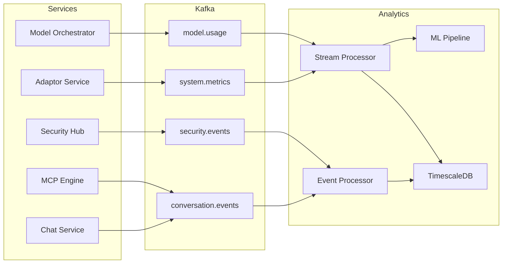

# Analytics Engine - Complete Implementation Guide

## Service Overview
**Purpose**: Real-time analytics, business intelligence, and predictive insights  
**Technology**: Python 3.11+, FastAPI, TimescaleDB, Apache Kafka, Redis  
**Estimated Total Lines**: ~16,000  
**Complexity**: Very High  

---

## 🗂 Level 1: Folder Structure

```
analytics-engine/
├── src/
│   ├── api/                    # API layer (10 files, ~1,600 lines)
│   │   ├── v2/                 # Version 2 endpoints
│   │   │   ├── __init__.py
│   │   │   ├── metrics_routes.py
│   │   │   ├── reports_routes.py
│   │   │   ├── insights_routes.py
│   │   │   ├── dashboards_routes.py
│   │   │   └── health_routes.py
│   │   └── middleware/         # Request/response middleware
│   ├── core/                   # Core analytics logic (35 files, ~6,000 lines)
│   │   ├── collectors/         # Data collection
│   │   │   ├── __init__.py
│   │   │   ├── event_collector.py
│   │   │   ├── metric_collector.py
│   │   │   ├── log_collector.py
│   │   │   └── trace_collector.py
│   │   ├── processors/         # Stream processing
│   │   │   ├── __init__.py
│   │   │   ├── event_processor.py
│   │   │   ├── aggregation_processor.py
│   │   │   ├── enrichment_processor.py
│   │   │   ├── anomaly_processor.py
│   │   │   └── real_time_processor.py
│   │   ├── analyzers/          # Analysis engines
│   │   │   ├── __init__.py
│   │   │   ├── conversation_analyzer.py
│   │   │   ├── user_behavior_analyzer.py
│   │   │   ├── performance_analyzer.py
│   │   │   ├── cost_analyzer.py
│   │   │   ├── quality_analyzer.py
│   │   │   └── predictive_analyzer.py
│   │   ├── ml/                 # Machine learning
│   │   │   ├── __init__.py
│   │   │   ├── models/
│   │   │   │   ├── intent_predictor.py
│   │   │   │   ├── churn_predictor.py
│   │   │   │   ├── anomaly_detector.py
│   │   │   │   └── satisfaction_predictor.py
│   │   │   ├── feature_engineering.py
│   │   │   ├── model_trainer.py
│   │   │   └── model_evaluator.py
│   │   └── visualizers/        # Data visualization
│   │       ├── __init__.py
│   │       ├── chart_generator.py
│   │       ├── dashboard_builder.py
│   │       ├── report_formatter.py
│   │       └── export_manager.py
│   ├── models/                 # Data models (15 files, ~2,200 lines)
│   │   ├── __init__.py
│   │   ├── timescale/          # TimescaleDB models
│   │   │   ├── __init__.py
│   │   │   ├── conversation_metrics.py
│   │   │   ├── system_metrics.py
│   │   │   ├── business_metrics.py
│   │   │   └── custom_metrics.py
│   │   ├── kafka/              # Kafka schemas
│   │   │   ├── __init__.py
│   │   │   ├── event_schemas.py
│   │   │   └── metric_schemas.py
│   │   └── domain/             # Domain models
│   │       ├── __init__.py
│   │       ├── analytics_models.py
│   │       ├── report_models.py
│   │       └── insight_models.py
│   ├── services/               # Service layer (18 files, ~3,200 lines)
│   │   ├── __init__.py
│   │   ├── metrics_service.py
│   │   ├── reporting_service.py
│   │   ├── insight_service.py
│   │   ├── dashboard_service.py
│   │   ├── alerting_service.py
│   │   ├── export_service.py
│   │   ├── ml_service.py
│   │   └── benchmark_service.py
│   ├── repositories/           # Data access layer (8 files, ~1,200 lines)
│   │   ├── __init__.py
│   │   ├── metrics_repository.py
│   │   ├── aggregation_repository.py
│   │   ├── report_repository.py
│   │   └── ml_repository.py
│   ├── streaming/              # Stream processing (10 files, ~1,800 lines)
│   │   ├── __init__.py
│   │   ├── kafka_consumer.py
│   │   ├── kafka_producer.py
│   │   ├── stream_processor.py
│   │   ├── windowing.py
│   │   └── state_store.py
│   ├── scheduling/             # Job scheduling (6 files, ~900 lines)
│   │   ├── __init__.py
│   │   ├── scheduler.py
│   │   ├── jobs/
│   │   │   ├── aggregation_jobs.py
│   │   │   ├── report_jobs.py
│   │   │   └── ml_training_jobs.py
│   │   └── job_manager.py
│   ├── utils/                  # Utilities (12 files, ~1,400 lines)
│   │   ├── __init__.py
│   │   ├── time_series_utils.py
│   │   ├── statistical_utils.py
│   │   ├── data_quality.py
│   │   └── formatters.py
│   ├── exceptions/             # Custom exceptions (4 files, ~300 lines)
│   ├── config/                 # Configuration (4 files, ~500 lines)
│   └── main.py                 # Application entry point
├── tests/                      # Test suite (40 files, ~5,500 lines)
├── notebooks/                  # Jupyter notebooks for analysis
├── ml_models/                  # Trained ML models
├── scripts/                    # Utility scripts
└── requirements.txt
```

**Folder Dependencies:**
- `api/` → `services/`, `models/`
- `services/` → `core/`, `repositories/`, `streaming/`
- `core/` → `models/`, `utils/`
- `streaming/` → `core/`, `models/`

---

## 📄 Level 2: File Specifications

### Core Analytics Files

#### `/src/core/processors/event_processor.py`
- **Responsibility**: Process incoming events from all services
- **Complexity**: Very High
- **Key Classes**: 
  - `EventProcessor` - Main event processing
  - `EventValidator` - Event validation
  - `EventEnricher` - Event enrichment
- **Imports**: kafka, models, enrichment_processor
- **Exports**: EventProcessor

#### `/src/core/analyzers/conversation_analyzer.py`
- **Responsibility**: Analyze conversation patterns and metrics
- **Complexity**: High
- **Key Classes**: 
  - `ConversationAnalyzer` - Conversation analysis
  - `FlowAnalyzer` - Flow performance
  - `IntentAnalyzer` - Intent patterns
- **Imports**: models, statistical_utils
- **Exports**: ConversationAnalyzer

#### `/src/core/ml/models/satisfaction_predictor.py`
- **Responsibility**: Predict user satisfaction scores
- **Complexity**: High
- **Key Classes**: 
  - `SatisfactionPredictor` - ML model wrapper
  - `FeatureExtractor` - Feature engineering
  - `ModelUpdater` - Online learning
- **Imports**: sklearn, tensorflow, feature_engineering
- **Exports**: SatisfactionPredictor

### Service Layer Files

#### `/src/services/metrics_service.py`
- **Responsibility**: Real-time metrics aggregation and querying
- **Complexity**: High
- **Key Classes**: 
  - `MetricsService` - Metrics operations
- **Imports**: repositories, analyzers, streaming
- **Exports**: MetricsService

#### `/src/services/insight_service.py`
- **Responsibility**: Generate actionable insights from data
- **Complexity**: Very High
- **Key Classes**: 
  - `InsightService` - Insight generation
- **Imports**: ml_service, analyzers, repositories
- **Exports**: InsightService

---

## ⚙️ Level 3: Method Details

### `/src/core/processors/event_processor.py`

```python
class EventProcessor:
    def __init__(
        self,
        kafka_consumer: KafkaConsumer,
        metric_collector: MetricCollector,
        enrichment_processor: EnrichmentProcessor,
        state_store: StateStore,
        config: ProcessorConfig
    ):
        self.consumer = kafka_consumer
        self.collector = metric_collector
        self.enricher = enrichment_processor
        self.state_store = state_store
        self.config = config
        self.processors = self._initialize_processors()
        self.error_handler = ErrorHandler()

    async def process_event_stream(
        self,
        topics: List[str],
        processing_guarantees: str = "at_least_once"
    ) -> None:
        """
        Main event processing loop
        
        Parameters:
        - topics: List[str]
            - conversation.events.v1
            - system.metrics.v1
            - model.usage.v1
            - integration.events.v1
        - processing_guarantees: str
            - at_least_once: May process duplicates
            - exactly_once: Transactional processing
            
        Business Logic:
        1. Subscribe to Kafka topics
        2. For each event batch:
           a. Validate event schema
           b. Deduplicate if needed
           c. Enrich with context
           d. Extract metrics
           e. Update state
           f. Trigger aggregations
           g. Detect anomalies
           h. Route to analyzers
        3. Commit offsets
        4. Handle errors gracefully
        
        Error Handling:
        - SchemaError: Send to dead letter queue
        - EnrichmentError: Process without enrichment
        - StateError: Rebuild from snapshot
        - CommitError: Retry with backoff
        """

    async def process_conversation_event(
        self,
        event: ConversationEvent,
        context: ProcessingContext
    ) -> ProcessingResult:
        """
        Process conversation lifecycle events
        
        Parameters:
        - event: ConversationEvent
            - event_type: str
            - conversation_id: str
            - tenant_id: str
            - timestamp: datetime
            - data: Dict[str, Any]
        - context: ProcessingContext
            - window: TimeWindow
            - state: Dict[str, Any]
            
        Returns:
        - ProcessingResult
            - metrics_extracted: List[Metric]
            - state_updates: Dict[str, Any]
            - triggered_aggregations: List[str]
            
        Business Logic:
        1. Validate event completeness
        2. Extract standard metrics:
           a. Response time
           b. Message count
           c. Session duration
           d. Completion status
        3. Extract custom metrics:
           a. Intent switches
           b. Confidence scores
           c. Error rates
        4. Update conversation state
        5. Check for patterns:
           a. Abandonment signals
           b. Satisfaction indicators
           c. Error patterns
        6. Trigger real-time aggregations
        7. Store for batch processing
        8. Return extracted data
        """

    async def enrich_event(
        self,
        event: BaseEvent,
        enrichment_config: EnrichmentConfig
    ) -> EnrichedEvent:
        """
        Enrich event with additional context
        
        Parameters:
        - event: Base event to enrich
        - enrichment_config: What to enrich
        
        Returns:
        - EnrichedEvent with additional data
        
        Business Logic:
        1. Add temporal context:
           a. Day of week
           b. Hour of day
           c. Business hours flag
        2. Add user context:
           a. User segment
           b. Historical behavior
           c. Lifetime value
        3. Add system context:
           a. Current load
           b. Service health
           c. Feature flags
        4. Add business context:
           a. Campaign data
           b. A/B test variant
           c. Customer tier
        5. Calculate derived fields
        6. Return enriched event
        """

    async def detect_anomalies(
        self,
        metrics: List[Metric],
        detection_window: TimeWindow
    ) -> List[Anomaly]:
        """
        Real-time anomaly detection
        
        Parameters:
        - metrics: Current metrics
        - detection_window: Time window for comparison
        
        Returns:
        - List of detected anomalies
        
        Business Logic:
        1. Load historical baselines
        2. Apply detection algorithms:
           a. Statistical (Z-score, IQR)
           b. ML-based (Isolation Forest)
           c. Rule-based thresholds
        3. Check for:
           a. Spike detection
           b. Drop detection
           c. Pattern changes
           d. Seasonal violations
        4. Calculate severity scores
        5. Filter by significance
        6. Generate anomaly objects
        7. Trigger alerts if needed
        """
```

### `/src/services/insight_service.py`

```python
class InsightService:
    def __init__(
        self,
        ml_service: MLService,
        conversation_analyzer: ConversationAnalyzer,
        user_analyzer: UserBehaviorAnalyzer,
        performance_analyzer: PerformanceAnalyzer,
        report_repository: ReportRepository,
        cache_service: CacheService
    ):
        self.ml_service = ml_service
        self.conversation_analyzer = conversation_analyzer
        self.user_analyzer = user_analyzer
        self.performance_analyzer = performance_analyzer
        self.report_repo = report_repository
        self.cache = cache_service

    async def generate_insights(
        self,
        tenant_id: str,
        time_range: TimeRange,
        insight_types: List[InsightType],
        options: InsightOptions = None
    ) -> InsightReport:
        """
        Generate comprehensive insights report
        
        Parameters:
        - tenant_id: str
        - time_range: TimeRange
            - start: datetime
            - end: datetime
            - granularity: str
        - insight_types: List[InsightType]
            - CONVERSATION_PATTERNS
            - USER_BEHAVIOR
            - PERFORMANCE_TRENDS
            - COST_OPTIMIZATION
            - PREDICTIVE
        - options: InsightOptions
            - include_recommendations: bool
            - confidence_threshold: float
            - max_insights: int
            
        Returns:
        - InsightReport
            - insights: List[Insight]
            - summary: InsightSummary
            - recommendations: List[Recommendation]
            - confidence_scores: Dict[str, float]
            
        Business Logic:
        1. Validate time range and permissions
        2. Check cache for recent insights
        3. Gather data from multiple sources
        4. For each insight type:
           a. Run specialized analysis
           b. Apply ML models
           c. Calculate significance
           d. Generate explanations
        5. Correlate insights across types
        6. Rank by business impact
        7. Generate recommendations
        8. Format for presentation
        9. Cache results
        10. Return insight report
        
        Error Handling:
        - InsufficientData: Return partial insights
        - MLModelError: Use fallback analysis
        - TimeoutError: Return cached results
        """

    async def analyze_conversation_patterns(
        self,
        tenant_id: str,
        time_range: TimeRange,
        min_conversations: int = 100
    ) -> ConversationInsights:
        """
        Analyze conversation patterns and trends
        
        Parameters:
        - tenant_id: Tenant identifier
        - time_range: Analysis period
        - min_conversations: Minimum data threshold
        
        Returns:
        - ConversationInsights object
        
        Business Logic:
        1. Load conversation metrics
        2. Identify patterns:
           a. Peak usage times
           b. Common flow paths
           c. Drop-off points
           d. Success patterns
        3. Calculate key metrics:
           a. Completion rates
           b. Average duration
           c. Intent distribution
           d. Channel performance
        4. Detect trends:
           a. Growing intents
           b. Declining paths
           c. Seasonal patterns
        5. Find correlations:
           a. Time vs completion
           b. Channel vs satisfaction
           c. Intent vs duration
        6. Generate visualizations
        7. Create actionable insights
        """

    async def predict_user_behavior(
        self,
        tenant_id: str,
        user_segment: Optional[str] = None,
        prediction_window: int = 30
    ) -> BehaviorPredictions:
        """
        Predict future user behavior
        
        Parameters:
        - tenant_id: Tenant identifier
        - user_segment: Optional segment filter
        - prediction_window: Days to predict
        
        Returns:
        - BehaviorPredictions
        
        Business Logic:
        1. Load historical user data
        2. Extract behavioral features:
           a. Interaction frequency
           b. Intent patterns
           c. Channel preferences
           d. Time patterns
        3. Apply predictive models:
           a. Churn prediction
           b. Engagement forecast
           c. Intent prediction
           d. Value estimation
        4. Calculate confidence intervals
        5. Identify at-risk users
        6. Generate recommendations:
           a. Retention strategies
           b. Engagement tactics
           c. Personalization options
        7. Format predictions
        """

    async def optimize_costs(
        self,
        tenant_id: str,
        cost_data: CostMetrics,
        constraints: CostConstraints
    ) -> CostOptimizationPlan:
        """
        Generate cost optimization recommendations
        
        Parameters:
        - tenant_id: Tenant identifier
        - cost_data: Current cost metrics
        - constraints: Optimization constraints
        
        Returns:
        - CostOptimizationPlan
        
        Business Logic:
        1. Analyze cost breakdown:
           a. By model provider
           b. By operation type
           c. By time of day
           d. By conversation type
        2. Identify inefficiencies:
           a. Overuse of expensive models
           b. Unnecessary API calls
           c. Poor caching utilization
           d. Redundant operations
        3. Simulate optimizations:
           a. Model routing changes
           b. Caching improvements
           c. Batch processing
           d. Off-peak scheduling
        4. Calculate potential savings
        5. Assess quality impact
        6. Generate recommendations
        7. Create implementation plan
        """
```

### `/src/core/ml/models/satisfaction_predictor.py`

```python
class SatisfactionPredictor:
    def __init__(
        self,
        model_path: str,
        feature_config: FeatureConfig,
        update_strategy: UpdateStrategy = UpdateStrategy.BATCH
    ):
        self.model = self._load_model(model_path)
        self.feature_extractor = FeatureExtractor(feature_config)
        self.update_strategy = update_strategy
        self.performance_monitor = ModelPerformanceMonitor()
        self.online_learner = OnlineLearner() if update_strategy == UpdateStrategy.ONLINE else None

    async def predict_satisfaction(
        self,
        conversation_data: ConversationData,
        user_history: Optional[UserHistory] = None,
        context: Optional[PredictionContext] = None
    ) -> SatisfactionPrediction:
        """
        Predict user satisfaction score
        
        Parameters:
        - conversation_data: ConversationData
            - messages: List[Message]
            - duration: int
            - intent_flow: List[str]
            - resolution_status: str
        - user_history: Optional past interactions
        - context: Optional prediction context
        
        Returns:
        - SatisfactionPrediction
            - score: float (0-1)
            - confidence: float (0-1)
            - factors: List[SatisfactionFactor]
            - explanation: str
            
        Business Logic:
        1. Extract conversation features:
           a. Response time metrics
           b. Message sentiment progression
           c. Intent complexity
           d. Error occurrences
           e. Resolution indicators
        2. Extract user features if available:
           a. Historical satisfaction
           b. Interaction frequency
           c. Preference alignment
        3. Engineer derived features:
           a. Sentiment delta
           b. Complexity score
           c. Efficiency ratio
        4. Prepare feature vector
        5. Apply model prediction
        6. Calculate confidence:
           a. Feature completeness
           b. Historical accuracy
           c. Prediction variance
        7. Identify key factors
        8. Generate explanation
        9. Track prediction for learning
        10. Return prediction result
        
        Error Handling:
        - FeatureError: Use default features
        - ModelError: Return baseline prediction
        - DataError: Return low confidence
        """

    def extract_conversation_features(
        self,
        conversation: ConversationData
    ) -> ConversationFeatures:
        """
        Extract ML features from conversation
        
        Parameters:
        - conversation: Raw conversation data
        
        Returns:
        - ConversationFeatures object
        
        Feature Categories:
        1. Temporal Features:
           - Total duration
           - Average response time
           - Time between messages
           - Session time of day
        
        2. Interaction Features:
           - Message count
           - Turn count
           - Words per message
           - Question count
        
        3. Sentiment Features:
           - Initial sentiment
           - Final sentiment
           - Sentiment trajectory
           - Negative message ratio
        
        4. Complexity Features:
           - Intent switches
           - Unique intents
           - Entity count
           - Clarification requests
        
        5. Resolution Features:
           - Goal achievement
           - Error count
           - Retry attempts
           - Escalation flag
        """

    async def update_model(
        self,
        feedback_batch: List[SatisfactionFeedback],
        validation_split: float = 0.2
    ) -> ModelUpdateResult:
        """
        Update model with new feedback data
        
        Parameters:
        - feedback_batch: Labeled satisfaction data
        - validation_split: Validation data percentage
        
        Returns:
        - ModelUpdateResult
        
        Business Logic:
        1. Validate feedback data quality
        2. Extract features from conversations
        3. Split into train/validation
        4. Apply update strategy:
           a. Online: Incremental update
           b. Batch: Retrain periodically
           c. Hybrid: Both approaches
        5. Evaluate on validation set
        6. Compare with current performance
        7. Decide on model update:
           a. Accept if improved
           b. Reject if degraded
           c. A/B test if marginal
        8. Update model metadata
        9. Log update results
        10. Schedule next update
        """
```

---

## 🔗 Level 4: Parameter & Type Definitions

### Analytics Types (`/src/models/domain/analytics_types.py`)

```python
from enum import Enum
from typing import List, Dict, Optional, Any, Union, Tuple
from pydantic import BaseModel, Field, validator
from datetime import datetime, timedelta
import numpy as np

class MetricType(str, Enum):
    COUNTER = "counter"
    GAUGE = "gauge"
    HISTOGRAM = "histogram"
    SUMMARY = "summary"
    RATE = "rate"

class AggregationType(str, Enum):
    SUM = "sum"
    AVG = "avg"
    MIN = "min"
    MAX = "max"
    COUNT = "count"
    P50 = "p50"
    P95 = "p95"
    P99 = "p99"

class InsightType(str, Enum):
    CONVERSATION_PATTERNS = "conversation_patterns"
    USER_BEHAVIOR = "user_behavior"
    PERFORMANCE_TRENDS = "performance_trends"
    COST_OPTIMIZATION = "cost_optimization"
    QUALITY_METRICS = "quality_metrics"
    PREDICTIVE = "predictive"
    ANOMALY = "anomaly"

class TimeGranularity(str, Enum):
    MINUTE = "minute"
    HOUR = "hour"
    DAY = "day"
    WEEK = "week"
    MONTH = "month"
    QUARTER = "quarter"

# Event Models
class BaseEvent(BaseModel):
    event_id: str = Field(default_factory=lambda: str(uuid4()))
    event_type: str
    tenant_id: str
    timestamp: datetime
    source_service: str
    version: str = Field(default="1.0")
    metadata: Dict[str, Any] = Field(default_factory=dict)

class ConversationEvent(BaseEvent):
    conversation_id: str
    user_id: str
    channel: str
    event_data: Dict[str, Any]
    
    class Config:
        event_types = [
            "conversation.started",
            "conversation.message.sent",
            "conversation.message.received",
            "conversation.completed",
            "conversation.abandoned",
            "conversation.escalated"
        ]

class SystemMetricEvent(BaseEvent):
    metric_name: str
    metric_value: float
    metric_type: MetricType
    tags: Dict[str, str] = Field(default_factory=dict)
    unit: Optional[str] = None

class ModelUsageEvent(BaseEvent):
    model_provider: str
    model_name: str
    operation: str
    tokens_used: int
    cost_cents: float
    latency_ms: int
    success: bool

# Metric Models
class Metric(BaseModel):
    metric_id: str = Field(default_factory=lambda: str(uuid4()))
    name: str
    value: float
    type: MetricType
    timestamp: datetime
    tags: Dict[str, str] = Field(default_factory=dict)
    unit: Optional[str] = None
    aggregation_window: Optional[str] = None

class MetricQuery(BaseModel):
    metric_names: List[str]
    time_range: 'TimeRange'
    aggregation: AggregationType
    group_by: List[str] = Field(default_factory=list)
    filters: Dict[str, Any] = Field(default_factory=dict)
    granularity: TimeGranularity = Field(default=TimeGranularity.HOUR)
    fill_missing: bool = Field(default=True)

class MetricResult(BaseModel):
    query: MetricQuery
    data: List['MetricDataPoint']
    metadata: Dict[str, Any] = Field(default_factory=dict)
    execution_time_ms: int

class MetricDataPoint(BaseModel):
    timestamp: datetime
    value: float
    tags: Dict[str, str] = Field(default_factory=dict)
    confidence: Optional[float] = None

# Time Series Models
class TimeRange(BaseModel):
    start: datetime
    end: datetime
    timezone: str = Field(default="UTC")
    
    @validator('end')
    def validate_time_range(cls, v, values):
        if 'start' in values and v <= values['start']:
            raise ValueError('End time must be after start time')
        return v

class TimeWindow(BaseModel):
    size: int
    unit: str  # seconds, minutes, hours, days
    slide: Optional[int] = None  # For sliding windows
    
    def to_seconds(self) -> int:
        """Convert window to seconds"""
        units = {
            "seconds": 1,
            "minutes": 60,
            "hours": 3600,
            "days": 86400
        }
        return self.size * units.get(self.unit, 1)

class TimeSeries(BaseModel):
    name: str
    data_points: List[Tuple[datetime, float]]
    metadata: Dict[str, Any] = Field(default_factory=dict)
    
    def resample(self, frequency: str) -> 'TimeSeries':
        """Resample time series to different frequency"""
        pass

# Analytics Models
class ConversationMetrics(BaseModel):
    conversation_id: str
    tenant_id: str
    start_time: datetime
    end_time: Optional[datetime] = None
    duration_seconds: Optional[int] = None
    message_count: int = Field(default=0)
    user_messages: int = Field(default=0)
    bot_messages: int = Field(default=0)
    intent_changes: int = Field(default=0)
    unique_intents: List[str] = Field(default_factory=list)
    completion_status: str
    satisfaction_score: Optional[float] = None
    error_count: int = Field(default=0)
    avg_response_time_ms: Optional[float] = None
    total_cost_cents: float = Field(default=0.0)
    channel: str
    user_segment: Optional[str] = None

class UserBehaviorMetrics(BaseModel):
    user_id: str
    tenant_id: str
    period_start: datetime
    period_end: datetime
    total_conversations: int
    completed_conversations: int
    abandoned_conversations: int
    avg_session_duration: float
    preferred_channel: str
    most_common_intents: List[str]
    satisfaction_trend: Optional[float] = None
    engagement_score: float
    churn_risk: float = Field(ge=0, le=1)

class PerformanceMetrics(BaseModel):
    service: str
    timestamp: datetime
    request_count: int
    error_count: int
    error_rate: float
    latency_p50: float
    latency_p95: float
    latency_p99: float
    throughput: float
    cpu_usage: float
    memory_usage: float
    active_connections: int

# Insight Models
class Insight(BaseModel):
    insight_id: str = Field(default_factory=lambda: str(uuid4()))
    type: InsightType
    title: str
    description: str
    impact: str  # low, medium, high, critical
    confidence: float = Field(ge=0, le=1)
    supporting_data: Dict[str, Any]
    recommendations: List[str] = Field(default_factory=list)
    tags: List[str] = Field(default_factory=list)
    created_at: datetime = Field(default_factory=datetime.utcnow)

class InsightReport(BaseModel):
    report_id: str = Field(default_factory=lambda: str(uuid4()))
    tenant_id: str
    time_range: TimeRange
    insights: List[Insight]
    summary: 'InsightSummary'
    recommendations: List['Recommendation']
    confidence_scores: Dict[str, float]
    generated_at: datetime = Field(default_factory=datetime.utcnow)

class InsightSummary(BaseModel):
    total_insights: int
    by_type: Dict[str, int]
    by_impact: Dict[str, int]
    key_findings: List[str]
    action_items: List[str]

class Recommendation(BaseModel):
    recommendation_id: str = Field(default_factory=lambda: str(uuid4()))
    title: str
    description: str
    impact: str
    effort: str  # low, medium, high
    priority: int = Field(ge=1, le=5)
    category: str
    expected_benefit: str
    implementation_steps: List[str]

# ML Models
class PredictionResult(BaseModel):
    prediction: Any
    confidence: float = Field(ge=0, le=1)
    model_version: str
    features_used: List[str]
    explanation: Optional[str] = None
    metadata: Dict[str, Any] = Field(default_factory=dict)

class SatisfactionPrediction(PredictionResult):
    score: float = Field(ge=0, le=1)
    factors: List['SatisfactionFactor']
    recommendation: Optional[str] = None

class SatisfactionFactor(BaseModel):
    factor: str
    impact: float  # Positive or negative
    description: str

class ChurnPrediction(PredictionResult):
    churn_probability: float = Field(ge=0, le=1)
    risk_factors: List[str]
    retention_actions: List[str]
    time_window_days: int

class AnomalyDetectionResult(BaseModel):
    anomalies: List['Anomaly']
    baseline_stats: Dict[str, float]
    detection_method: str
    sensitivity: float

class Anomaly(BaseModel):
    anomaly_id: str = Field(default_factory=lambda: str(uuid4()))
    timestamp: datetime
    metric_name: str
    observed_value: float
    expected_value: float
    deviation_score: float
    severity: str  # low, medium, high, critical
    possible_causes: List[str]

# Reporting Models
class Report(BaseModel):
    report_id: str = Field(default_factory=lambda: str(uuid4()))
    name: str
    type: str  # operational, executive, custom
    tenant_id: str
    time_range: TimeRange
    sections: List['ReportSection']
    generated_at: datetime = Field(default_factory=datetime.utcnow)
    format: str = Field(default="html")

class ReportSection(BaseModel):
    title: str
    content_type: str  # text, chart, table, metric
    content: Any
    order: int

class Dashboard(BaseModel):
    dashboard_id: str = Field(default_factory=lambda: str(uuid4()))
    name: str
    tenant_id: str
    layout: List['DashboardWidget']
    refresh_interval: int = Field(default=300)  # seconds
    filters: Dict[str, Any] = Field(default_factory=dict)
    created_by: str
    created_at: datetime = Field(default_factory=datetime.utcnow)

class DashboardWidget(BaseModel):
    widget_id: str = Field(default_factory=lambda: str(uuid4()))
    type: str  # metric, chart, table, text
    title: str
    query: MetricQuery
    visualization_config: Dict[str, Any]
    position: Dict[str, int]  # x, y, width, height
    refresh_interval: Optional[int] = None

# Export Models
class ExportRequest(BaseModel):
    export_type: str  # csv, json, pdf, excel
    data_type: str  # metrics, insights, report
    filters: Dict[str, Any]
    time_range: TimeRange
    include_raw_data: bool = Field(default=False)
    email_to: Optional[List[str]] = None

class ExportResult(BaseModel):
    export_id: str = Field(default_factory=lambda: str(uuid4()))
    status: str  # pending, processing, completed, failed
    file_url: Optional[str] = None
    file_size_bytes: Optional[int] = None
    rows_exported: Optional[int] = None
    created_at: datetime = Field(default_factory=datetime.utcnow)
    completed_at: Optional[datetime] = None
    error_message: Optional[str] = None
```

### Streaming Models (`/src/models/kafka/stream_models.py`)

```python
class StreamingWindow(BaseModel):
    window_type: str  # tumbling, sliding, session
    window_size: TimeWindow
    grace_period: Optional[int] = None  # seconds
    retention: Optional[int] = None  # seconds

class StreamAggregation(BaseModel):
    aggregation_id: str
    window: StreamingWindow
    group_by: List[str]
    aggregations: Dict[str, AggregationType]
    filters: Optional[Dict[str, Any]] = None

class StreamState(BaseModel):
    state_key: str
    state_value: Any
    window_start: datetime
    window_end: datetime
    last_updated: datetime
    event_count: int
```

---

## 📊 Level 5: Cross-Service Integration

### Service Dependencies

```yaml
Analytics Engine:
  Depends On:
    - Security Hub: Access control, audit logs
    - All Services: Event streams
    
  Provides To:
    - Admin Dashboard: Real-time metrics, reports
    - All Services: Performance metrics
    - Business Users: Insights and predictions
    
  Communication:
    - Async: Kafka from all services
    - Sync: REST API for queries
    - Streaming: WebSocket for real-time
    - Batch: Scheduled jobs
```

### Event Flow Architecture



### Real-time Processing Pipeline

```python
# /src/streaming/pipeline.py
class AnalyticsPipeline:
    """
    Real-time stream processing pipeline
    
    Stages:
    1. Ingestion
       - Multi-topic consumption
       - Schema validation
       - Deduplication
    
    2. Enrichment
       - Context addition
       - User segmentation
       - Business metadata
    
    3. Processing
       - Metric extraction
       - Pattern detection
       - Anomaly detection
    
    4. Aggregation
       - Time windows
       - Dimensional rollups
       - Statistical summaries
    
    5. Storage
       - Hot data in Redis
       - Time-series in TimescaleDB
       - Archives in S3
    """
```

### ML Pipeline Integration

```python
# /src/core/ml/pipeline.py
class MLPipeline:
    """
    Machine learning pipeline
    
    Components:
    1. Feature Store
       - Real-time features
       - Batch features
       - Feature versioning
    
    2. Model Registry
       - Version control
       - A/B testing
       - Performance tracking
    
    3. Training Pipeline
       - Scheduled retraining
       - Online learning
       - Hyperparameter tuning
    
    4. Serving Layer
       - Model caching
       - Batch predictions
       - Real-time inference
    
    5. Monitoring
       - Drift detection
       - Performance decay
       - Retraining triggers
    """
```

### Performance Optimizations

```python
# /src/utils/optimizations.py
class AnalyticsOptimizations:
    """
    Performance optimization strategies:
    
    1. Data Partitioning
       - By tenant
       - By time
       - By metric type
    
    2. Materialized Views
       - Common aggregations
       - Frequently accessed
       - Auto-refresh
    
    3. Caching Strategy
       - Query results: 5min
       - Aggregations: 1min
       - ML predictions: 10min
    
    4. Parallel Processing
       - Kafka partitions
       - Thread pools
       - Async operations
    
    5. Data Compression
       - TimescaleDB compression
       - Parquet for archives
       - Streaming compression
    """
```

---

## Testing Strategy

### Test Structure
```
tests/
├── unit/
│   ├── test_processors/
│   ├── test_analyzers/
│   └── test_ml_models/
├── integration/
│   ├── test_kafka_pipeline.py
│   ├── test_timescale_queries.py
│   └── test_ml_pipeline.py
└── performance/
    ├── test_throughput.py
    └── test_query_performance.py
```

### Critical Test Scenarios
1. **High-volume event processing**
2. **Complex aggregation accuracy**
3. **ML model predictions**
4. **Real-time anomaly detection**
5. **Report generation performance**
6. **Data consistency across windows**

---

## Deployment Configuration

### Environment Variables
```env
# Service Configuration
SERVICE_NAME=analytics-engine
HTTP_PORT=8006

# Database Connections
TIMESCALE_URI=postgresql://timescale:5432/analytics_db
REDIS_URL=redis://redis-cluster:6379

# Kafka Configuration
KAFKA_BROKERS=kafka-1:9092,kafka-2:9092,kafka-3:9092
KAFKA_CONSUMER_GROUP=analytics-engine
KAFKA_AUTO_OFFSET_RESET=earliest

# Stream Processing
STREAM_PROCESSING_THREADS=16
BATCH_SIZE=1000
WINDOW_RETENTION_HOURS=24

# ML Configuration
ML_MODEL_PATH=/models
FEATURE_STORE_PATH=/features
MODEL_UPDATE_FREQUENCY=daily

# Performance
QUERY_CACHE_TTL_SECONDS=300
MAX_QUERY_EXECUTION_TIME_MS=30000
PARALLEL_QUERY_LIMIT=10

# Storage
HOT_DATA_RETENTION_DAYS=7
WARM_DATA_RETENTION_DAYS=90
COLD_DATA_RETENTION_DAYS=365
```

### Monitoring Dashboard
```yaml
Key Metrics:
  - Events processed per second
  - Processing latency (p50, p95, p99)
  - Active streaming windows
  - Query response times
  - ML model accuracy
  - Storage utilization
  
Alerts:
  - Processing lag > 5 minutes
  - Error rate > 1%
  - Query timeout
  - Model drift detected
  - Storage > 80%
```

---

## Data Retention and Archival

### Retention Policies
```yaml
Hot Data (Redis):
  - Real-time metrics: 1 hour
  - Aggregations: 24 hours
  - Session data: 7 days

Warm Data (TimescaleDB):
  - Raw metrics: 7 days
  - Hourly aggregations: 90 days
  - Daily aggregations: 1 year

Cold Data (S3/Glacier):
  - Compressed archives: 7 years
  - Compliance data: As required
```
