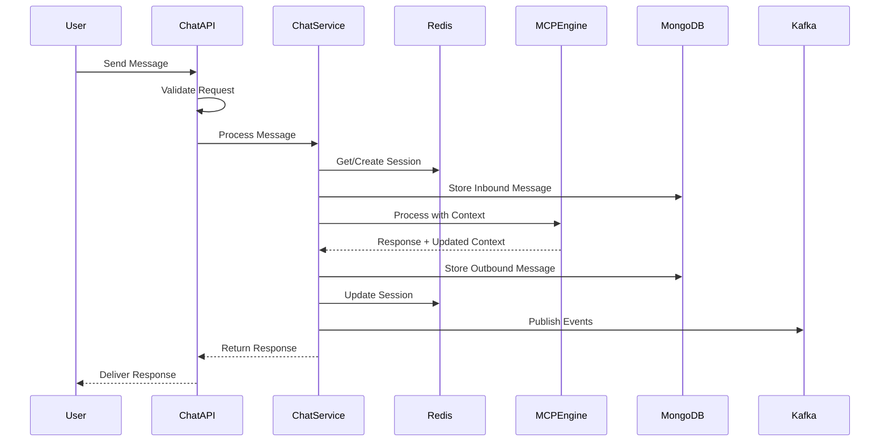

# Chat Service - Complete Implementation Guide

## Service Overview
**Purpose**: Message ingestion, normalization, and delivery across all channels  
**Technology**: Python 3.11+, FastAPI, MongoDB, Redis, Kafka  
**Estimated Total Lines**: ~15,000  
**Complexity**: High  

---

## 🗂 Level 1: Folder Structure

```
chat-service/
├── src/
│   ├── api/                    # API layer (15 files, ~2,500 lines)
│   │   ├── v2/                 # Version 2 endpoints
│   │   │   ├── __init__.py
│   │   │   ├── chat_routes.py  # Main chat endpoints
│   │   │   ├── conversation_routes.py
│   │   │   └── health_routes.py
│   │   ├── middleware/         # Request/response middleware
│   │   │   ├── __init__.py
│   │   │   ├── auth_middleware.py
│   │   │   ├── rate_limit_middleware.py
│   │   │   ├── tenant_middleware.py
│   │   │   └── error_handler.py
│   │   └── validators/         # Request validation schemas
│   │       ├── __init__.py
│   │       ├── message_validators.py
│   │       ├── conversation_validators.py
│   │       └── common_validators.py
│   ├── core/                   # Core business logic (20 files, ~3,500 lines)
│   │   ├── channels/           # Channel-specific implementations
│   │   │   ├── __init__.py
│   │   │   ├── base_channel.py
│   │   │   ├── web_channel.py
│   │   │   ├── whatsapp_channel.py
│   │   │   ├── messenger_channel.py
│   │   │   ├── slack_channel.py
│   │   │   ├── teams_channel.py
│   │   │   └── channel_factory.py
│   │   ├── processors/         # Message processing logic
│   │   │   ├── __init__.py
│   │   │   ├── base_processor.py
│   │   │   ├── text_processor.py
│   │   │   ├── media_processor.py
│   │   │   ├── location_processor.py
│   │   │   └── processor_factory.py
│   │   └── normalizers/        # Data normalization
│   │       ├── __init__.py
│   │       ├── message_normalizer.py
│   │       ├── content_normalizer.py
│   │       └── metadata_normalizer.py
│   ├── models/                 # Data models (10 files, ~1,500 lines)
│   │   ├── __init__.py
│   │   ├── base_model.py
│   │   ├── mongo/              # MongoDB document models
│   │   │   ├── __init__.py
│   │   │   ├── conversation_model.py
│   │   │   ├── message_model.py
│   │   │   └── session_model.py
│   │   └── redis/              # Redis data structures
│   │       ├── __init__.py
│   │       ├── session_cache.py
│   │       ├── rate_limit_cache.py
│   │       └── conversation_state.py
│   ├── services/               # Service layer (12 files, ~2,000 lines)
│   │   ├── __init__.py
│   │   ├── message_service.py
│   │   ├── conversation_service.py
│   │   ├── channel_service.py
│   │   ├── session_service.py
│   │   ├── delivery_service.py
│   │   └── audit_service.py
│   ├── repositories/           # Data access layer (8 files, ~1,200 lines)
│   │   ├── __init__.py
│   │   ├── base_repository.py
│   │   ├── mongo_repository.py
│   │   ├── redis_repository.py
│   │   ├── conversation_repository.py
│   │   ├── message_repository.py
│   │   └── session_repository.py
│   ├── events/                 # Event handling (6 files, ~800 lines)
│   │   ├── __init__.py
│   │   ├── event_publisher.py
│   │   ├── event_subscriber.py
│   │   ├── kafka_producer.py
│   │   ├── kafka_consumer.py
│   │   └── event_schemas.py
│   ├── utils/                  # Utilities (15 files, ~1,800 lines)
│   │   ├── __init__.py
│   │   ├── logger.py
│   │   ├── metrics.py
│   │   ├── encryption.py
│   │   ├── validators.py
│   │   ├── formatters.py
│   │   ├── date_utils.py
│   │   └── id_generator.py
│   ├── exceptions/             # Custom exceptions (5 files, ~300 lines)
│   │   ├── __init__.py
│   │   ├── base_exceptions.py
│   │   ├── channel_exceptions.py
│   │   ├── validation_exceptions.py
│   │   └── service_exceptions.py
│   ├── config/                 # Configuration (3 files, ~400 lines)
│   │   ├── __init__.py
│   │   ├── settings.py
│   │   └── constants.py
│   └── main.py                 # Application entry point
├── tests/                      # Test suite (30 files, ~4,000 lines)
│   ├── unit/
│   ├── integration/
│   └── e2e/
├── docker/
│   ├── Dockerfile
│   └── docker-compose.yml
├── k8s/
│   ├── deployment.yaml
│   ├── service.yaml
│   └── configmap.yaml
├── scripts/
│   ├── start.sh
│   └── health_check.sh
├── requirements.txt
├── requirements-dev.txt
└── README.md
```

**Folder Dependencies:**
- `api/` → `services/`, `models/`, `validators/`
- `services/` → `repositories/`, `core/`, `models/`, `events/`
- `repositories/` → `models/`, `utils/`
- `core/` → `models/`, `utils/`
- `events/` → `models/`, `utils/`

---

## 📄 Level 2: File Specifications

### API Layer Files

#### `/src/api/v2/chat_routes.py`
- **Responsibility**: Define REST endpoints for chat operations
- **Complexity**: Medium
- **Key Functions**: 
  - `send_message()` - POST endpoint
  - `get_conversation()` - GET endpoint
  - `list_conversations()` - GET endpoint with pagination
  - `export_conversation()` - POST endpoint
- **Imports**: FastAPI, services, validators, models
- **Exports**: router object

#### `/src/api/middleware/auth_middleware.py`
- **Responsibility**: JWT validation and user context injection
- **Complexity**: High
- **Key Classes**: 
  - `AuthMiddleware` - Main middleware class
  - `JWTValidator` - Token validation
- **Imports**: jwt, redis, security_hub_client
- **Exports**: AuthMiddleware class

#### `/src/api/validators/message_validators.py`
- **Responsibility**: Pydantic schemas for request/response validation
- **Complexity**: Medium
- **Key Classes**: 
  - `SendMessageRequest`
  - `MessageResponse`
  - `MessageContent`
  - `ChannelMetadata`
- **Imports**: pydantic, typing, datetime
- **Exports**: All validator classes

### Core Layer Files

#### `/src/core/channels/base_channel.py`
- **Responsibility**: Abstract base class for all channel implementations
- **Complexity**: Medium
- **Key Classes**: 
  - `BaseChannel` (ABC)
  - `ChannelConfig`
  - `ChannelResponse`
- **Imports**: abc, typing, models
- **Exports**: BaseChannel, ChannelConfig, ChannelResponse

#### `/src/core/channels/whatsapp_channel.py`
- **Responsibility**: WhatsApp-specific message handling
- **Complexity**: High
- **Key Classes**: 
  - `WhatsAppChannel(BaseChannel)`
  - `WhatsAppWebhookHandler`
  - `WhatsAppMessageFormatter`
- **Imports**: base_channel, httpx, crypto
- **Exports**: WhatsAppChannel

#### `/src/core/processors/text_processor.py`
- **Responsibility**: Process and validate text messages
- **Complexity**: Medium
- **Key Classes**: 
  - `TextProcessor(BaseProcessor)`
  - `TextValidationRules`
- **Imports**: base_processor, validators, sanitizers
- **Exports**: TextProcessor

### Service Layer Files

#### `/src/services/message_service.py`
- **Responsibility**: Core message handling business logic
- **Complexity**: High
- **Key Classes**: 
  - `MessageService`
- **Imports**: repositories, models, processors, events
- **Exports**: MessageService

### Repository Layer Files

#### `/src/repositories/conversation_repository.py`
- **Responsibility**: MongoDB operations for conversations
- **Complexity**: Medium
- **Key Classes**: 
  - `ConversationRepository(BaseRepository)`
- **Imports**: motor, models, base_repository
- **Exports**: ConversationRepository

---

## ⚙️ Level 3: Method Details

### `/src/api/v2/chat_routes.py`

```python
@router.post("/message", response_model=MessageResponse)
async def send_message(
    request: SendMessageRequest,
    tenant_id: str = Header(...),
    auth_context: AuthContext = Depends(get_auth_context),
    message_service: MessageService = Depends(get_message_service)
) -> MessageResponse:
    """
    Send a message through the chat system
    
    Parameters:
    - request: SendMessageRequest
        - message_id: UUID (required)
        - conversation_id: UUID (optional)
        - user_id: str (required)
        - content: MessageContent (required)
        - channel: ChannelType (required)
        - channel_metadata: dict (optional)
    - tenant_id: str from header (required)
    - auth_context: Injected auth context
    - message_service: Injected service
    
    Returns:
    - MessageResponse with processed message and response
    
    Business Logic:
    1. Validate request against channel requirements
    2. Create or retrieve conversation
    3. Process message through appropriate processor
    4. Send to MCP Engine for response generation
    5. Deliver response through channel
    6. Store conversation and message
    7. Publish analytics events
    
    Error Handling:
    - ValidationError: 400 Bad Request
    - ChannelError: 503 Service Unavailable
    - TenantNotFound: 404 Not Found
    - RateLimitExceeded: 429 Too Many Requests
    """
```

### `/src/services/message_service.py`

```python
class MessageService:
    def __init__(
        self,
        conversation_repo: ConversationRepository,
        message_repo: MessageRepository,
        channel_service: ChannelService,
        event_publisher: EventPublisher,
        mcp_client: MCPEngineClient
    ):
        self.conversation_repo = conversation_repo
        self.message_repo = message_repo
        self.channel_service = channel_service
        self.event_publisher = event_publisher
        self.mcp_client = mcp_client

    async def process_message(
        self,
        tenant_id: str,
        message_request: SendMessageRequest,
        auth_context: AuthContext
    ) -> MessageResponse:
        """
        Core message processing logic
        
        Parameters:
        - tenant_id: str (validated UUID)
        - message_request: SendMessageRequest (validated)
        - auth_context: AuthContext with user permissions
        
        Returns:
        - MessageResponse with bot response
        
        Business Logic:
        1. Acquire distributed lock for conversation
        2. Load or create conversation context
        3. Validate message against channel rules
        4. Normalize message content
        5. Store inbound message
        6. Send to MCP Engine with context
        7. Process MCP response
        8. Format response for channel
        9. Deliver through channel
        10. Store outbound message
        11. Update conversation state
        12. Release lock
        13. Publish events asynchronously
        
        Error Handling:
        - LockTimeout: Retry with backoff
        - MCPTimeout: Use fallback response
        - ChannelDeliveryError: Queue for retry
        - StorageError: Log and continue
        """
        
    async def _get_or_create_conversation(
        self,
        tenant_id: str,
        conversation_id: Optional[str],
        user_id: str,
        channel: ChannelType,
        session_id: Optional[str]
    ) -> Conversation:
        """
        Get existing or create new conversation
        
        Parameters:
        - tenant_id: str
        - conversation_id: Optional[str]
        - user_id: str
        - channel: ChannelType enum
        - session_id: Optional[str]
        
        Returns:
        - Conversation object
        
        Business Logic:
        1. If conversation_id provided, fetch and validate
        2. If not found or not provided, create new
        3. Link to session if provided
        4. Initialize conversation context
        5. Set initial state from default flow
        """
```

### `/src/core/channels/whatsapp_channel.py`

```python
class WhatsAppChannel(BaseChannel):
    async def send_message(
        self,
        recipient: str,
        content: MessageContent,
        metadata: Optional[Dict[str, Any]] = None
    ) -> ChannelResponse:
        """
        Send message through WhatsApp Business API
        
        Parameters:
        - recipient: str (phone number with country code)
            - Format: "+1234567890"
            - Validation: E.164 format
        - content: MessageContent
            - type: MessageType enum
            - text: Optional[str] (max 4096 chars)
            - media: Optional[MediaContent]
            - buttons: Optional[List[Button]]
        - metadata: Optional[Dict[str, Any]]
            - reply_to: Optional[str] (message_id)
            - preview_url: Optional[bool]
        
        Returns:
        - ChannelResponse
            - success: bool
            - message_id: str
            - timestamp: datetime
            - delivery_status: DeliveryStatus
        
        Business Logic:
        1. Validate recipient phone format
        2. Build WhatsApp API payload
        3. Handle media upload if needed
        4. Apply rate limiting
        5. Send via WhatsApp Cloud API
        6. Parse response and extract message_id
        7. Store delivery receipt webhook URL
        
        Error Handling:
        - InvalidPhoneNumber: Raise ValidationError
        - MediaUploadFailed: Retry once, then fail
        - RateLimitExceeded: Queue for later
        - APIError: Log and raise ChannelError
        """
```

---

## 🔗 Level 4: Parameter & Type Definitions

### Common Types (`/src/models/types.py`)

```python
from enum import Enum
from typing import TypedDict, Optional, List, Dict, Any, Union
from datetime import datetime
from pydantic import BaseModel, Field, validator

class ChannelType(str, Enum):
    WEB = "web"
    WHATSAPP = "whatsapp"
    MESSENGER = "messenger"
    SLACK = "slack"
    TEAMS = "teams"
    SMS = "sms"
    VOICE = "voice"

class MessageType(str, Enum):
    TEXT = "text"
    IMAGE = "image"
    FILE = "file"
    AUDIO = "audio"
    VIDEO = "video"
    LOCATION = "location"
    QUICK_REPLY = "quick_reply"
    CAROUSEL = "carousel"

class ConversationStatus(str, Enum):
    ACTIVE = "active"
    COMPLETED = "completed"
    ABANDONED = "abandoned"
    ESCALATED = "escalated"
    ERROR = "error"

class DeliveryStatus(str, Enum):
    SENT = "sent"
    DELIVERED = "delivered"
    READ = "read"
    FAILED = "failed"

# Pydantic Models
class MediaContent(BaseModel):
    url: str = Field(..., regex=r'^https?://')
    type: str = Field(..., description="MIME type")
    size_bytes: int = Field(..., ge=0, le=52428800)  # Max 50MB
    alt_text: Optional[str] = Field(None, max_length=500)
    thumbnail_url: Optional[str] = None
    
    @validator('type')
    def validate_mime_type(cls, v):
        allowed_types = ['image/jpeg', 'image/png', 'image/gif', 
                        'video/mp4', 'audio/mpeg', 'application/pdf']
        if v not in allowed_types:
            raise ValueError(f'Unsupported media type: {v}')
        return v

class LocationContent(BaseModel):
    latitude: float = Field(..., ge=-90, le=90)
    longitude: float = Field(..., ge=-180, le=180)
    accuracy_meters: Optional[int] = Field(None, ge=0)
    address: Optional[str] = Field(None, max_length=500)

class QuickReply(BaseModel):
    title: str = Field(..., max_length=20)
    payload: str = Field(..., max_length=1000)
    content_type: str = Field(default="text")

class Button(BaseModel):
    type: str = Field(..., regex=r'^(postback|url|phone|share)$')
    title: str = Field(..., max_length=20)
    payload: Optional[str] = None
    url: Optional[str] = None

class MessageContent(BaseModel):
    type: MessageType
    text: Optional[str] = Field(None, max_length=4096)
    language: Optional[str] = Field(default="en", regex=r'^[a-z]{2}$')
    media: Optional[MediaContent] = None
    location: Optional[LocationContent] = None
    quick_replies: Optional[List[QuickReply]] = Field(None, max_items=10)
    buttons: Optional[List[Button]] = Field(None, max_items=3)
    
    @validator('text')
    def text_required_for_text_type(cls, v, values):
        if values.get('type') == MessageType.TEXT and not v:
            raise ValueError('Text content required for text messages')
        return v

class ChannelMetadata(BaseModel):
    platform_message_id: Optional[str] = None
    platform_user_id: Optional[str] = None
    thread_id: Optional[str] = None
    workspace_id: Optional[str] = None
    additional_data: Optional[Dict[str, Any]] = Field(default_factory=dict)

class ProcessingHints(BaseModel):
    priority: str = Field(default="normal", regex=r'^(low|normal|high|urgent)$')
    expected_response_type: Optional[MessageType] = None
    bypass_automation: bool = Field(default=False)
    require_human_review: bool = Field(default=False)

# Request/Response Models
class SendMessageRequest(BaseModel):
    message_id: str = Field(default_factory=lambda: str(uuid4()))
    conversation_id: Optional[str] = None
    user_id: str = Field(..., min_length=1, max_length=255)
    session_id: Optional[str] = None
    channel: ChannelType
    timestamp: datetime = Field(default_factory=datetime.utcnow)
    content: MessageContent
    channel_metadata: Optional[ChannelMetadata] = None
    processing_hints: Optional[ProcessingHints] = None
    
    class Config:
        use_enum_values = True
        json_encoders = {
            datetime: lambda v: v.isoformat()
        }

class ConversationContext(BaseModel):
    current_intent: Optional[str] = None
    entities: Dict[str, Any] = Field(default_factory=dict)
    slots: Dict[str, Any] = Field(default_factory=dict)
    user_profile: Dict[str, Any] = Field(default_factory=dict)
    conversation_stage: Optional[str] = None

class MessageResponse(BaseModel):
    message_id: str
    conversation_id: str
    response: MessageContent
    conversation_state: ConversationContext
    processing_metadata: Dict[str, Any]
    
# Type Aliases for clarity
TenantId = str
UserId = str
ConversationId = str
MessageId = str

# Generic Response Types
from typing import TypeVar, Generic

T = TypeVar('T')

class PaginatedResponse(BaseModel, Generic[T]):
    items: List[T]
    total: int
    page: int
    page_size: int
    has_next: bool
    has_previous: bool

class APIResponse(BaseModel, Generic[T]):
    status: str = Field(default="success")
    data: Optional[T] = None
    error: Optional[Dict[str, Any]] = None
    meta: Dict[str, Any] = Field(default_factory=dict)
```

### Validation Schemas (`/src/api/validators/schemas.py`)

```python
from pydantic import BaseModel, Field, validator
from typing import Optional, List
import re

class PhoneNumberValidator(BaseModel):
    phone: str
    
    @validator('phone')
    def validate_e164(cls, v):
        pattern = r'^\+[1-9]\d{1,14}$'
        if not re.match(pattern, v):
            raise ValueError('Invalid E.164 phone number format')
        return v

class EmailValidator(BaseModel):
    email: str
    
    @validator('email')
    def validate_email(cls, v):
        pattern = r'^[a-zA-Z0-9._%+-]+@[a-zA-Z0-9.-]+\.[a-zA-Z]{2,}$'
        if not re.match(pattern, v.lower()):
            raise ValueError('Invalid email format')
        return v.lower()

class PaginationParams(BaseModel):
    page: int = Field(default=1, ge=1)
    page_size: int = Field(default=20, ge=1, le=100)
    sort_by: Optional[str] = None
    sort_order: str = Field(default="desc", regex=r'^(asc|desc)$')

class DateRangeFilter(BaseModel):
    start_date: Optional[datetime] = None
    end_date: Optional[datetime] = None
    
    @validator('end_date')
    def validate_date_range(cls, v, values):
        if v and values.get('start_date') and v < values['start_date']:
            raise ValueError('End date must be after start date')
        return v

class ConversationFilters(BaseModel):
    status: Optional[ConversationStatus] = None
    channel: Optional[ChannelType] = None
    user_id: Optional[str] = None
    date_range: Optional[DateRangeFilter] = None
    search_query: Optional[str] = Field(None, max_length=200)
```

---

## 📊 Level 5: Cross-Service Integration

### Service Dependencies

```yaml
Chat Service:
  Depends On:
    - Security Hub: Authentication, authorization
    - MCP Engine: Message processing, response generation
    - Analytics Engine: Event publishing
    
  Provides To:
    - MCP Engine: Normalized messages
    - Analytics Engine: Conversation events
    - Admin Dashboard: Real-time updates
    
  Communication:
    - Sync: gRPC to MCP Engine, Security Hub
    - Async: Kafka to Analytics Engine
    - Cache: Redis for sessions
```

### Integration Points

#### 1. MCP Engine Integration
```python
# /src/clients/mcp_client.py
class MCPEngineClient:
    """gRPC client for MCP Engine communication"""
    
    async def process_message(
        self,
        tenant_id: str,
        message: ProcessMessageRequest
    ) -> ProcessMessageResponse:
        """
        Send message to MCP Engine for processing
        
        Request includes:
        - conversation_id
        - message_content
        - conversation_context
        - user_profile
        - processing_hints
        
        Response includes:
        - response_content
        - updated_context
        - next_expected_inputs
        - confidence_scores
        """
```

#### 2. Event Publishing
```python
# /src/events/publishers.py
class ConversationEventPublisher:
    """Kafka event publisher for analytics"""
    
    async def publish_message_received(
        self,
        tenant_id: str,
        conversation_id: str,
        message_data: Dict[str, Any]
    ):
        """
        Publish to topic: conversation.events.v1
        
        Event Schema:
        - event_type: "message.received"
        - tenant_id: str
        - conversation_id: str
        - timestamp: ISO 8601
        - channel: str
        - user_id: str
        - message_type: str
        - metadata: dict
        """
```

#### 3. Security Integration
```python
# /src/clients/security_client.py
class SecurityHubClient:
    """gRPC client for Security Hub"""
    
    async def validate_token(
        self,
        token: str
    ) -> TokenValidationResponse:
        """Validate JWT token and get user context"""
    
    async def check_permissions(
        self,
        user_context: UserContext,
        resource: str,
        action: str
    ) -> bool:
        """Check if user has permission for action"""
```

### Data Flow Patterns



### Error Handling Strategy

```python
# /src/exceptions/handlers.py
class ErrorHandlingStrategy:
    """
    Centralized error handling with fallback chains
    
    Error Categories:
    1. Transient (retry with backoff)
       - Network timeouts
       - Rate limits
       - Temporary service unavailability
       
    2. Permanent (fail fast)
       - Invalid input
       - Authentication failures
       - Not found errors
       
    3. Degraded (fallback response)
       - MCP Engine timeout
       - Model service errors
       - Integration failures
    """
```

### Performance Optimization

```python
# /src/utils/performance.py
class PerformanceOptimizations:
    """
    Key optimizations:
    
    1. Connection Pooling
       - MongoDB: 100 connections
       - Redis: 50 connections
       - gRPC: Channel pooling
       
    2. Caching Strategy
       - Session data: 1 hour TTL
       - User profiles: 15 minutes
       - Channel configs: 5 minutes
       
    3. Batch Processing
       - Event publishing: 100ms window
       - Analytics aggregation: 1 second
       
    4. Async Operations
       - Non-blocking I/O throughout
       - Fire-and-forget for analytics
       - Parallel channel delivery
    """
```

---

## Testing Strategy

### Test Structure
```
tests/
├── unit/
│   ├── test_channels/
│   ├── test_services/
│   └── test_processors/
├── integration/
│   ├── test_api_endpoints.py
│   ├── test_database_operations.py
│   └── test_external_services.py
└── e2e/
    ├── test_message_flow.py
    └── test_conversation_lifecycle.py
```

### Key Test Scenarios
1. **Channel-specific message handling**
2. **Multi-tenant isolation**
3. **Rate limiting enforcement**
4. **Error recovery and retries**
5. **Session management**
6. **Event publishing reliability**

---

## Deployment Configuration

### Kubernetes Resources
```yaml
# k8s/deployment.yaml
apiVersion: apps/v1
kind: Deployment
metadata:
  name: chat-service
spec:
  replicas: 3
  strategy:
    type: RollingUpdate
    rollingUpdate:
      maxSurge: 1
      maxUnavailable: 0
```

### Environment Variables
```env
# Service Configuration
SERVICE_NAME=chat-service
SERVICE_PORT=8001
LOG_LEVEL=INFO

# Database Connections
MONGODB_URI=mongodb://mongo-cluster:27017
REDIS_URL=redis://redis-cluster:6379

# External Services
MCP_ENGINE_URL=mcp-engine:50051
SECURITY_HUB_URL=security-hub:50052

# Kafka Configuration
KAFKA_BROKERS=kafka-1:9092,kafka-2:9092,kafka-3:9092
KAFKA_TOPIC_PREFIX=chatbot.platform

# Performance Tuning
MAX_CONNECTIONS_MONGO=100
MAX_CONNECTIONS_REDIS=50
REQUEST_TIMEOUT_MS=30000
```
