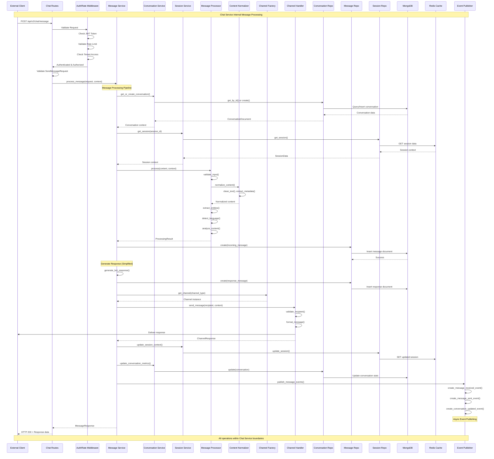

# Chat Service Architecture - Internal Diagrams

## 1. Chat Service Internal Architecture

```mermaid
graph TB
    subgraph "Chat Service Container"
        subgraph "API Layer (Port 8001)"
            direction TB
            subgraph "Route Handlers"
                CHAT_ROUTES["/api/v2/chat/message<br/>send_message()"]
                CONV_ROUTES["/api/v2/chat/conversations<br/>get_history(), list_conversations()"]
                WEBHOOK_ROUTES["/api/v2/webhooks<br/>whatsapp, slack, teams"]
                HEALTH_ROUTES["/api/v2/health<br/>health_check()"]
            end
            
            subgraph "Middleware Stack"
                AUTH_MW[Auth Middleware<br/>JWT validation]
                RATE_MW[Rate Limit Middleware<br/>Redis-based limiting]
                TENANT_MW[Tenant Middleware<br/>Multi-tenant isolation]
                ERROR_MW[Error Handler<br/>Standardized responses]
            end
            
            subgraph "Validators"
                MSG_VALIDATORS[Message Validators<br/>SendMessageRequest<br/>MessageResponse]
                CONV_VALIDATORS[Conversation Validators<br/>Pagination, Filters]
                COMMON_VALIDATORS[Common Validators<br/>Phone, Email, Dates]
            end
        end
        
        subgraph "Service Layer"
            direction TB
            MSG_SERVICE[Message Service<br/>• process_message()<br/>• handle_webhook()<br/>• generate_response()]
            
            CONV_SERVICE[Conversation Service<br/>• get_conversation_history()<br/>• close_conversation()<br/>• export_conversation()]
            
            SESS_SERVICE[Session Service<br/>• create_session()<br/>• update_context()<br/>• cleanup_expired()]
            
            CHAN_SERVICE[Channel Service<br/>• send_message()<br/>• validate_recipient()<br/>• format_content()]
            
            DELIVERY_SERVICE[Delivery Service<br/>• track_delivery()<br/>• retry_failed()<br/>• update_status()]
            
            AUDIT_SERVICE[Audit Service<br/>• log_activity()<br/>• compliance_tracking()]
        end
        
        subgraph "Core Business Logic"
            direction TB
            subgraph "Channel Implementations"
                BASE_CHANNEL[BaseChannel<br/>Abstract Interface]
                WEB_CHANNEL[WebChannel<br/>HTTP/WebSocket]
                WHATSAPP_CHANNEL[WhatsAppChannel<br/>Business API]
                SLACK_CHANNEL[SlackChannel<br/>Bot API]
                TEAMS_CHANNEL[TeamsChannel<br/>Bot Framework]
                MESSENGER_CHANNEL[MessengerChannel<br/>Graph API]
                CHANNEL_FACTORY[ChannelFactory<br/>Dynamic creation]
            end
            
            subgraph "Message Processors"
                BASE_PROCESSOR[BaseProcessor<br/>Abstract Interface]
                TEXT_PROCESSOR[TextProcessor<br/>Language detection<br/>Entity extraction]
                MEDIA_PROCESSOR[MediaProcessor<br/>File validation<br/>Format conversion]
                LOCATION_PROCESSOR[LocationProcessor<br/>Coordinate validation]
                PROCESSOR_FACTORY[ProcessorFactory<br/>Dynamic selection]
            end
            
            subgraph "Normalizers"
                MSG_NORMALIZER[MessageNormalizer<br/>Format standardization]
                CONTENT_NORMALIZER[ContentNormalizer<br/>Text cleaning]
                METADATA_NORMALIZER[MetadataNormalizer<br/>Header extraction]
            end
        end
        
        subgraph "Repository Layer"
            CONV_REPO[ConversationRepository<br/>MongoDB operations]
            MSG_REPO[MessageRepository<br/>MongoDB operations]
            SESS_REPO[SessionRepository<br/>Redis operations]
            RATE_REPO[RateLimitRepository<br/>Redis operations]
            BASE_REPO[BaseRepository<br/>Common patterns]
        end
        
        subgraph "Data Models"
            subgraph "MongoDB Models"
                CONV_MODEL[ConversationDocument<br/>Schema & validation]
                MSG_MODEL[MessageDocument<br/>Schema & validation]
                USER_MODEL[UserDocument<br/>Schema & validation]
            end
            
            subgraph "Redis Models"
                SESSION_CACHE[SessionData<br/>Cache structure]
                RATE_CACHE[RateLimitCache<br/>Counter structure]
                CONV_STATE[ConversationState<br/>Context storage]
            end
            
            subgraph "Type Definitions"
                TYPES[Common Types<br/>ChannelType, MessageType<br/>Enums & Models]
            end
        end
        
        subgraph "Event Handling"
            EVENT_PUBLISHER[EventPublisher<br/>Kafka producer]
            EVENT_SCHEMAS[Event Schemas<br/>Message events<br/>Conversation events]
            KAFKA_PRODUCER[KafkaProducer<br/>Reliable publishing]
        end
        
        subgraph "Configuration & Utils"
            CONFIG[Settings<br/>Environment config]
            LOGGER[StructLog<br/>Structured logging]
            METRICS[Metrics<br/>Performance tracking]
            EXCEPTIONS[Custom Exceptions<br/>Error hierarchy]
        end
    end
    
    subgraph "External Dependencies"
        MONGODB[(MongoDB<br/>Persistent storage)]
        REDIS[(Redis<br/>Cache & sessions)]
        KAFKA[Kafka<br/>Event streaming]
    end

    %% API Flow
    CHAT_ROUTES --> AUTH_MW
    CONV_ROUTES --> AUTH_MW
    WEBHOOK_ROUTES --> RATE_MW
    AUTH_MW --> RATE_MW
    RATE_MW --> TENANT_MW
    TENANT_MW --> ERROR_MW
    ERROR_MW --> MSG_VALIDATORS
    MSG_VALIDATORS --> MSG_SERVICE
    
    %% Service Dependencies
    MSG_SERVICE --> CONV_SERVICE
    MSG_SERVICE --> SESS_SERVICE
    MSG_SERVICE --> CHAN_SERVICE
    MSG_SERVICE --> PROCESSOR_FACTORY
    MSG_SERVICE --> CHANNEL_FACTORY
    CHAN_SERVICE --> BASE_CHANNEL
    
    %% Channel Inheritance
    BASE_CHANNEL --> WEB_CHANNEL
    BASE_CHANNEL --> WHATSAPP_CHANNEL
    BASE_CHANNEL --> SLACK_CHANNEL
    BASE_CHANNEL --> TEAMS_CHANNEL
    BASE_CHANNEL --> MESSENGER_CHANNEL
    CHANNEL_FACTORY --> BASE_CHANNEL
    
    %% Processor Inheritance
    BASE_PROCESSOR --> TEXT_PROCESSOR
    BASE_PROCESSOR --> MEDIA_PROCESSOR
    BASE_PROCESSOR --> LOCATION_PROCESSOR
    PROCESSOR_FACTORY --> BASE_PROCESSOR
    
    %% Repository Layer
    MSG_SERVICE --> CONV_REPO
    MSG_SERVICE --> MSG_REPO
    CONV_SERVICE --> CONV_REPO
    SESS_SERVICE --> SESS_REPO
    RATE_MW --> RATE_REPO
    
    %% Data Layer
    CONV_REPO --> CONV_MODEL
    MSG_REPO --> MSG_MODEL
    CONV_REPO --> MONGODB
    MSG_REPO --> MONGODB
    SESS_REPO --> SESSION_CACHE
    SESS_REPO --> REDIS
    
    %% Event Publishing
    MSG_SERVICE --> EVENT_PUBLISHER
    EVENT_PUBLISHER --> EVENT_SCHEMAS
    EVENT_PUBLISHER --> KAFKA_PRODUCER
    KAFKA_PRODUCER --> KAFKA

    style MSG_SERVICE fill:#e3f2fd
    style CONV_SERVICE fill:#f3e5f5
    style CHANNEL_FACTORY fill:#e8f5e8
    style PROCESSOR_FACTORY fill:#fff3e0
    style MONGODB fill:#ffebee
    style REDIS fill:#f1f8e9
```

## 2. Message Processing Flow (Chat Service Internal)



## 3. Channel Architecture & Factory Pattern

```mermaid
graph TB
    subgraph "Channel Management"
        CHANNEL_FACTORY[Channel Factory<br/>get_channel(type: ChannelType)<br/>register_channel()<br/>validate_config()]
        
        CHANNEL_CONFIG[Channel Config<br/>• API credentials<br/>• Rate limits<br/>• Message format rules<br/>• Feature flags]
    end
    
    subgraph "Base Channel Interface"
        BASE_CHANNEL[BaseChannel (ABC)<br/>+ send_message()<br/>+ validate_recipient()<br/>+ format_message()<br/>+ validate_content()<br/>+ health_check()]
        
        CHANNEL_RESPONSE[ChannelResponse<br/>• success: bool<br/>• message_id: str<br/>• delivery_status<br/>• error_info<br/>• metadata]
    end
    
    subgraph "Channel Implementations"
        WEB_CHANNEL[WebChannel<br/>━━━━━━━━━━━━━━<br/>+ send_message()<br/>+ format_message()<br/>━━━━━━━━━━━━━━<br/>• HTTP/WebSocket<br/>• Real-time updates<br/>• File uploads<br/>• Typing indicators]
        
        WHATSAPP_CHANNEL[WhatsAppChannel<br/>━━━━━━━━━━━━━━<br/>+ send_message()<br/>+ validate_recipient()<br/>+ format_message()<br/>+ process_webhook()<br/>━━━━━━━━━━━━━━<br/>• Business API v18.0<br/>• E.164 phone validation<br/>• Media support<br/>• Interactive buttons<br/>• Template messages]
        
        SLACK_CHANNEL[SlackChannel<br/>━━━━━━━━━━━━━━<br/>+ send_message()<br/>+ format_message()<br/>+ handle_interactions()<br/>━━━━━━━━━━━━━━<br/>• Bot Token Auth<br/>• Block Kit UI<br/>• Thread responses<br/>• Slash commands<br/>• Interactive buttons]
        
        TEAMS_CHANNEL[TeamsChannel<br/>━━━━━━━━━━━━━━<br/>+ send_message()<br/>+ format_message()<br/>+ handle_activities()<br/>━━━━━━━━━━━━━━<br/>• Bot Framework<br/>• Adaptive Cards<br/>• Meeting integration<br/>• @mentions]
        
        MESSENGER_CHANNEL[MessengerChannel<br/>━━━━━━━━━━━━━━<br/>+ send_message()<br/>+ format_message()<br/>+ handle_postbacks()<br/>━━━━━━━━━━━━━━<br/>• Graph API<br/>• Persistent menu<br/>• Quick replies<br/>• Generic templates]
    end
    
    subgraph "Message Formatting"
        direction TB
        
        subgraph "Format Adapters"
            TEXT_FORMATTER[Text Formatter<br/>• Plain text<br/>• Markdown<br/>• Length limits]
            
            MEDIA_FORMATTER[Media Formatter<br/>• Image/Video/Audio<br/>• File attachments<br/>• Thumbnail generation]
            
            INTERACTIVE_FORMATTER[Interactive Formatter<br/>• Buttons<br/>• Quick replies<br/>• Carousels<br/>• Lists]
            
            LOCATION_FORMATTER[Location Formatter<br/>• Coordinates<br/>• Address<br/>• Maps integration]
        end
    end
    
    subgraph "Webhook Processing"
        WEBHOOK_PROCESSOR[Webhook Processor<br/>+ process_webhook()<br/>+ verify_signature()<br/>+ extract_events()]
        
        subgraph "Event Types"
            MSG_RECEIVED[Message Received]
            MSG_DELIVERED[Message Delivered]
            MSG_READ[Message Read]
            USER_TYPING[User Typing]
            STATUS_UPDATE[Status Update]
        end
    end
    
    subgraph "Validation & Security"
        RECIPIENT_VALIDATOR[Recipient Validator<br/>• Phone numbers (E.164)<br/>• Email addresses<br/>• User IDs<br/>• Channel-specific formats]
        
        SIGNATURE_VALIDATOR[Signature Validator<br/>• HMAC-SHA256<br/>• Webhook verification<br/>• Rate limiting<br/>• IP whitelisting]
        
        CONTENT_VALIDATOR[Content Validator<br/>• Message type support<br/>• Length limits<br/>• Media validation<br/>• Safety checks]
    end

    %% Factory Pattern
    CHANNEL_FACTORY --> CHANNEL_CONFIG
    CHANNEL_FACTORY --> BASE_CHANNEL
    
    %% Channel Inheritance
    BASE_CHANNEL --> WEB_CHANNEL
    BASE_CHANNEL --> WHATSAPP_CHANNEL
    BASE_CHANNEL --> SLACK_CHANNEL
    BASE_CHANNEL --> TEAMS_CHANNEL
    BASE_CHANNEL --> MESSENGER_CHANNEL
    
    %% Response Usage
    WEB_CHANNEL --> CHANNEL_RESPONSE
    WHATSAPP_CHANNEL --> CHANNEL_RESPONSE
    SLACK_CHANNEL --> CHANNEL_RESPONSE
    TEAMS_CHANNEL --> CHANNEL_RESPONSE
    MESSENGER_CHANNEL --> CHANNEL_RESPONSE
    
    %% Formatting
    WEB_CHANNEL --> TEXT_FORMATTER
    WHATSAPP_CHANNEL --> MEDIA_FORMATTER
    SLACK_CHANNEL --> INTERACTIVE_FORMATTER
    TEAMS_CHANNEL --> INTERACTIVE_FORMATTER
    MESSENGER_CHANNEL --> INTERACTIVE_FORMATTER
    
    %% Webhook Processing
    WHATSAPP_CHANNEL --> WEBHOOK_PROCESSOR
    SLACK_CHANNEL --> WEBHOOK_PROCESSOR
    TEAMS_CHANNEL --> WEBHOOK_PROCESSOR
    MESSENGER_CHANNEL --> WEBHOOK_PROCESSOR
    
    WEBHOOK_PROCESSOR --> MSG_RECEIVED
    WEBHOOK_PROCESSOR --> MSG_DELIVERED
    WEBHOOK_PROCESSOR --> MSG_READ
    WEBHOOK_PROCESSOR --> USER_TYPING
    WEBHOOK_PROCESSOR --> STATUS_UPDATE
    
    %% Validation
    BASE_CHANNEL --> RECIPIENT_VALIDATOR
    BASE_CHANNEL --> CONTENT_VALIDATOR
    WEBHOOK_PROCESSOR --> SIGNATURE_VALIDATOR

    style CHANNEL_FACTORY fill:#e3f2fd
    style BASE_CHANNEL fill:#f3e5f5
    style WHATSAPP_CHANNEL fill:#e8f5e8
    style WEBHOOK_PROCESSOR fill:#fff3e0
    style SIGNATURE_VALIDATOR fill:#ffebee
```

## 4. Repository Pattern & Data Layer

```mermaid
graph TB
    subgraph "Service Layer"
        MSG_SERVICE[Message Service]
        CONV_SERVICE[Conversation Service]
        SESS_SERVICE[Session Service]
        RATE_SERVICE[Rate Limit Service]
    end
    
    subgraph "Repository Layer"
        direction TB
        
        BASE_REPO[BaseRepository (ABC)<br/>━━━━━━━━━━━━━━━━━<br/>+ create(entity)<br/>+ get_by_id(id)<br/>+ update(entity)<br/>+ delete(id)<br/>+ list(filters)<br/>━━━━━━━━━━━━━━━━━<br/>• Common patterns<br/>• Error handling<br/>• Logging<br/>• Validation]
        
        subgraph "MongoDB Repositories"
            CONV_REPO[ConversationRepository<br/>━━━━━━━━━━━━━━━━━━━━━<br/>+ create(conversation)<br/>+ get_by_id(conv_id)<br/>+ get_by_user(user_id)<br/>+ update_metrics(conv_id)<br/>+ list_by_tenant(tenant_id)<br/>+ close_conversation(conv_id)<br/>━━━━━━━━━━━━━━━━━━━━━<br/>• Conversation lifecycle<br/>• User conversation history<br/>• Status management<br/>• Metrics tracking]
            
            MSG_REPO[MessageRepository<br/>━━━━━━━━━━━━━━━━━━━━━<br/>+ create(message)<br/>+ get_by_conversation(conv_id)<br/>+ get_last_message(conv_id)<br/>+ update_delivery_status(msg_id)<br/>+ get_messages_paginated()<br/>+ search_messages(query)<br/>━━━━━━━━━━━━━━━━━━━━━<br/>• Message persistence<br/>• Conversation history<br/>• Delivery tracking<br/>• Search capabilities]
            
            USER_REPO[UserRepository<br/>━━━━━━━━━━━━━━━━━━━━━<br/>+ create(user)<br/>+ get_by_id(user_id)<br/>+ update_profile(user_id)<br/>+ get_by_tenant(tenant_id)<br/>━━━━━━━━━━━━━━━━━━━━━<br/>• User management<br/>• Profile data<br/>• Tenant relationships]
        end
        
        subgraph "Redis Repositories"
            SESS_REPO[SessionRepository<br/>━━━━━━━━━━━━━━━━━━━━━<br/>+ create_session(session_data)<br/>+ get_session(session_id)<br/>+ update_session(session_data)<br/>+ extend_session(session_id)<br/>+ delete_session(session_id)<br/>+ cleanup_expired()<br/>━━━━━━━━━━━━━━━━━━━━━<br/>• Session management<br/>• TTL handling<br/>• Context storage<br/>• Cleanup jobs]
            
            RATE_REPO[RateLimitRepository<br/>━━━━━━━━━━━━━━━━━━━━━<br/>+ check_rate_limit(key, limit)<br/>+ increment_counter(key)<br/>+ reset_limits(key)<br/>+ get_remaining(key)<br/>━━━━━━━━━━━━━━━━━━━━━<br/>• Rate limiting<br/>• Counter management<br/>• Window-based limits<br/>• Tenant isolation]
            
            CACHE_REPO[CacheRepository<br/>━━━━━━━━━━━━━━━━━━━━━<br/>+ set(key, value, ttl)<br/>+ get(key)<br/>+ delete(key)<br/>+ exists(key)<br/>━━━━━━━━━━━━━━━━━━━━━<br/>• General caching<br/>• Conversation state<br/>• User profiles<br/>• Configuration cache]
        end
    end
    
    subgraph "Data Models"
        direction TB
        
        subgraph "MongoDB Documents"
            CONV_MODEL[ConversationDocument<br/>━━━━━━━━━━━━━━━━━━━━━<br/>conversation_id: str<br/>tenant_id: str<br/>user_id: str<br/>session_id: str<br/>channel: ChannelType<br/>status: ConversationStatus<br/>context: ConversationContext<br/>metrics: ConversationMetrics<br/>created_at: datetime<br/>updated_at: datetime<br/>━━━━━━━━━━━━━━━━━━━━━<br/>+ update_last_activity()<br/>+ is_active()<br/>+ add_context()]
            
            MSG_MODEL[MessageDocument<br/>━━━━━━━━━━━━━━━━━━━━━<br/>message_id: str<br/>conversation_id: str<br/>tenant_id: str<br/>user_id: str<br/>direction: MessageDirection<br/>content: MessageContent<br/>ai_analysis: dict<br/>processing: dict<br/>delivery: dict<br/>timestamp: datetime<br/>━━━━━━━━━━━━━━━━━━━━━<br/>+ is_from_user()<br/>+ is_from_bot()<br/>+ get_content_type()]
            
            USER_MODEL[UserDocument<br/>━━━━━━━━━━━━━━━━━━━━━<br/>user_id: str<br/>tenant_id: str<br/>profile: UserProfile<br/>preferences: dict<br/>created_at: datetime<br/>last_active: datetime<br/>━━━━━━━━━━━━━━━━━━━━━<br/>+ update_last_active()<br/>+ get_preference()]
        end
        
        subgraph "Redis Data Structures"
            SESSION_DATA[SessionData<br/>━━━━━━━━━━━━━━━━━━━━━<br/>session_id: str<br/>tenant_id: str<br/>user_id: str<br/>conversation_id: str<br/>channel: ChannelType<br/>context: dict<br/>expires_at: datetime<br/>━━━━━━━━━━━━━━━━━━━━━<br/>+ is_expired()<br/>+ extend_expiry()<br/>+ to_json()]
            
            RATE_LIMIT_DATA[RateLimitData<br/>━━━━━━━━━━━━━━━━━━━━━<br/>key: str<br/>count: int<br/>window_start: datetime<br/>limit: int<br/>━━━━━━━━━━━━━━━━━━━━━<br/>+ is_limit_exceeded()<br/>+ get_reset_time()]
            
            CONV_STATE[ConversationState<br/>━━━━━━━━━━━━━━━━━━━━━<br/>conversation_id: str<br/>current_intent: str<br/>entities: dict<br/>slots: dict<br/>stage: str<br/>━━━━━━━━━━━━━━━━━━━━━<br/>+ update_intent()<br/>+ add_entity()]
        end
    end
    
    subgraph "Database Connections"
        MONGODB[(MongoDB<br/>Primary Database<br/>━━━━━━━━━━━<br/>• Conversations<br/>• Messages<br/>• Users<br/>• Audit logs)]
        
        REDIS[(Redis<br/>Cache & Sessions<br/>━━━━━━━━━━━<br/>• Sessions<br/>• Rate limits<br/>• Conversation state<br/>• Cache data)]
    end
    
    subgraph "Connection Management"
        MONGO_CLIENT[MongoDB Client<br/>• Connection pooling<br/>• Replica set support<br/>• Automatic failover<br/>• Read preferences]
        
        REDIS_CLIENT[Redis Client<br/>• Connection pooling<br/>• Cluster support<br/>• Pub/sub capability<br/>• Pipeline support]
    end

    %% Service to Repository
    MSG_SERVICE --> CONV_REPO
    MSG_SERVICE --> MSG_REPO
    CONV_SERVICE --> CONV_REPO
    CONV_SERVICE --> MSG_REPO
    SESS_SERVICE --> SESS_REPO
    RATE_SERVICE --> RATE_REPO
    
    %% Repository Inheritance
    BASE_REPO --> CONV_REPO
    BASE_REPO --> MSG_REPO
    BASE_REPO --> USER_REPO
    BASE_REPO --> SESS_REPO
    BASE_REPO --> RATE_REPO
    BASE_REPO --> CACHE_REPO
    
    %% Repository to Models
    CONV_REPO --> CONV_MODEL
    MSG_REPO --> MSG_MODEL
    USER_REPO --> USER_MODEL
    SESS_REPO --> SESSION_DATA
    RATE_REPO --> RATE_LIMIT_DATA
    CACHE_REPO --> CONV_STATE
    
    %% Repository to Database
    CONV_REPO --> MONGO_CLIENT
    MSG_REPO --> MONGO_CLIENT
    USER_REPO --> MONGO_CLIENT
    SESS_REPO --> REDIS_CLIENT
    RATE_REPO --> REDIS_CLIENT
    CACHE_REPO --> REDIS_CLIENT
    
    %% Database Connections
    MONGO_CLIENT --> MONGODB
    REDIS_CLIENT --> REDIS

    style BASE_REPO fill:#e3f2fd
    style CONV_REPO fill:#f3e5f5
    style MSG_REPO fill:#e8f5e8
    style SESS_REPO fill:#fff3e0
    style CONV_MODEL fill:#ffebee
    style SESSION_DATA fill:#f1f8e9
    style MONGODB fill:#fce4ec
    style REDIS fill:#e0f2f1
```

## 5. Event System & Internal Messaging

```mermaid
graph TB
    subgraph "Event Sources (Chat Service)"
        MSG_SERVICE[Message Service<br/>• Message processing<br/>• Response generation<br/>• Delivery tracking]
        
        CONV_SERVICE[Conversation Service<br/>• Conversation lifecycle<br/>• Status changes<br/>• Metrics updates]
        
        SESS_SERVICE[Session Service<br/>• Session creation<br/>• Context updates<br/>• Expiry handling]
        
        WEBHOOK_HANDLER[Webhook Handler<br/>• External events<br/>• Platform updates<br/>• Delivery confirmations]
        
        API_ROUTES[API Routes<br/>• Request events<br/>• Error events<br/>• Performance metrics]
    end
    
    subgraph "Event Management"
        EVENT_MANAGER[Event Manager<br/>━━━━━━━━━━━━━━━━━━━<br/>+ register_handler(handler)<br/>+ publish(event)<br/>+ process_event(event)<br/>+ start_consumers()<br/>━━━━━━━━━━━━━━━━━━━<br/>• Handler registration<br/>• Event routing<br/>• Error handling<br/>• Performance tracking]
        
        EVENT_ROUTER[Event Router<br/>━━━━━━━━━━━━━━━━━━━<br/>+ route_by_type()<br/>+ apply_filters()<br/>+ load_balance()<br/>━━━━━━━━━━━━━━━━━━━<br/>• Pattern matching<br/>• Handler selection<br/>• Load distribution]
    end
    
    subgraph "Event Types (Chat Service Specific)"
        direction TB
        
        subgraph "Message Events"
            MSG_RECEIVED[MessageReceivedEvent<br/>━━━━━━━━━━━━━━━━━━━<br/>message_id: str<br/>conversation_id: str<br/>user_id: str<br/>channel: str<br/>content: MessageContent<br/>processing_result: dict<br/>━━━━━━━━━━━━━━━━━━━<br/>Topic: chat.message.received.v1]
            
            MSG_SENT[MessageSentEvent<br/>━━━━━━━━━━━━━━━━━━━<br/>message_id: str<br/>conversation_id: str<br/>recipient: str<br/>delivery_status: str<br/>channel_response: dict<br/>━━━━━━━━━━━━━━━━━━━<br/>Topic: chat.message.sent.v1]
            
            MSG_DELIVERED[MessageDeliveredEvent<br/>━━━━━━━━━━━━━━━━━━━<br/>message_id: str<br/>platform_message_id: str<br/>delivery_timestamp: datetime<br/>channel_metadata: dict<br/>━━━━━━━━━━━━━━━━━━━<br/>Topic: chat.message.delivered.v1]
        end
        
        subgraph "Conversation Events"
            CONV_STARTED[ConversationStartedEvent<br/>━━━━━━━━━━━━━━━━━━━<br/>conversation_id: str<br/>user_id: str<br/>channel: str<br/>flow_id: str<br/>initial_context: dict<br/>━━━━━━━━━━━━━━━━━━━<br/>Topic: chat.conversation.started.v1]
            
            CONV_UPDATED[ConversationUpdatedEvent<br/>━━━━━━━━━━━━━━━━━━━<br/>conversation_id: str<br/>context_changes: dict<br/>trigger: str<br/>previous_context: dict<br/>new_context: dict<br/>━━━━━━━━━━━━━━━━━━━<br/>Topic: chat.conversation.updated.v1]
            
            CONV_ENDED[ConversationEndedEvent<br/>━━━━━━━━━━━━━━━━━━━<br/>conversation_id: str<br/>end_reason: str<br/>duration_seconds: int<br/>message_count: int<br/>satisfaction_score: float<br/>━━━━━━━━━━━━━━━━━━━<br/>Topic: chat.conversation.ended.v1]
        end
        
        subgraph "Session Events"
            SESS_STARTED[SessionStartedEvent<br/>━━━━━━━━━━━━━━━━━━━<br/>session_id: str<br/>user_id: str<br/>channel: str<br/>device_info: dict<br/>━━━━━━━━━━━━━━━━━━━<br/>Topic: chat.session.started.v1]
            
            SESS_ENDED[SessionEndedEvent<br/>━━━━━━━━━━━━━━━━━━━<br/>session_id: str<br/>duration_seconds: int<br/>end_reason: str<br/>session_summary: dict<br/>━━━━━━━━━━━━━━━━━━━<br/>Topic: chat.session.ended.v1]
        end
    end
    
    subgraph "Event Infrastructure"
        KAFKA_PRODUCER[Kafka Event Producer<br/>━━━━━━━━━━━━━━━━━━━━━<br/>+ publish_event(event)<br/>+ publish_batch(events)<br/>+ start() / stop()<br/>━━━━━━━━━━━━━━━━━━━━━<br/>• Reliable publishing<br/>• Batch processing<br/>• Error handling<br/>• Performance metrics]
        
        KAFKA_CONSUMER[Kafka Event Consumer<br/>━━━━━━━━━━━━━━━━━━━━━<br/>+ subscribe(topics)<br/>+ consume_events()<br/>+ commit_offsets()<br/>━━━━━━━━━━━━━━━━━━━━━<br/>• Group processing<br/>• Offset management<br/>• Auto-scaling<br/>• Dead letter queue]
        
        KAFKA_TOPICS[Kafka Topics<br/>━━━━━━━━━━━━━━━━━━━━━<br/>chat.message.*<br/>chat.conversation.*<br/>chat.session.*<br/>chat.system.*<br/>━━━━━━━━━━━━━━━━━━━━━<br/>• Partitioned by tenant<br/>• Retention policies<br/>• Replication factor: 3]
    end
    
    subgraph "Event Handlers (Internal)"
        ANALYTICS_HANDLER[Analytics Handler<br/>━━━━━━━━━━━━━━━━━━━<br/>+ handle_message_events()<br/>+ calculate_metrics()<br/>+ update_dashboards()<br/>━━━━━━━━━━━━━━━━━━━<br/>• Real-time metrics<br/>• KPI calculation<br/>• Performance tracking]
        
        AUDIT_HANDLER[Audit Handler<br/>━━━━━━━━━━━━━━━━━━━<br/>+ log_user_activity()<br/>+ track_data_access()<br/>+ compliance_logging()<br/>━━━━━━━━━━━━━━━━━━━<br/>• Security monitoring<br/>• Compliance tracking<br/>• Data governance]
        
        NOTIFICATION_HANDLER[Notification Handler<br/>━━━━━━━━━━━━━━━━━━━<br/>+ send_alerts()<br/>+ escalate_issues()<br/>+ notify_admins()<br/>━━━━━━━━━━━━━━━━━━━<br/>• Error notifications<br/>• Performance alerts<br/>• Business alerts]
        
        CACHE_HANDLER[Cache Handler<br/>━━━━━━━━━━━━━━━━━━━<br/>+ invalidate_cache()<br/>+ update_counters()<br/>+ refresh_data()<br/>━━━━━━━━━━━━━━━━━━━<br/>• Cache management<br/>• Data consistency<br/>• Performance optimization]
    end
    
    subgraph "Error Handling"
        DLQ[Dead Letter Queue<br/>━━━━━━━━━━━━━━━━━━━<br/>• Failed events<br/>• Retry mechanism<br/>• Manual intervention<br/>• Error analysis]
        
        ERROR_HANDLER[Error Handler<br/>━━━━━━━━━━━━━━━━━━━<br/>+ handle_processing_error()<br/>+ retry_with_backoff()<br/>+ escalate_to_dlq()<br/>━━━━━━━━━━━━━━━━━━━<br/>• Exponential backoff<br/>• Circuit breaker<br/>• Error categorization]
    end

    %% Event Sources
    MSG_SERVICE --> EVENT_MANAGER
    CONV_SERVICE --> EVENT_MANAGER
    SESS_SERVICE --> EVENT_MANAGER
    WEBHOOK_HANDLER --> EVENT_MANAGER
    API_ROUTES --> EVENT_MANAGER
    
    %% Event Management
    EVENT_MANAGER --> EVENT_ROUTER
    EVENT_MANAGER --> KAFKA_PRODUCER
    
    %% Event Publishing
    KAFKA_PRODUCER --> KAFKA_TOPICS
    
    %% Event Consumption
    KAFKA_TOPICS --> KAFKA_CONSUMER
    KAFKA_CONSUMER --> EVENT_ROUTER
    
    %% Event Routing
    EVENT_ROUTER --> ANALYTICS_HANDLER
    EVENT_ROUTER --> AUDIT_HANDLER
    EVENT_ROUTER --> NOTIFICATION_HANDLER
    EVENT_ROUTER --> CACHE_HANDLER
    
    %% Error Handling
    EVENT_ROUTER --> ERROR_HANDLER
    ERROR_HANDLER --> DLQ
    DLQ -.-> EVENT_ROUTER
    
    %% Event Types
    MSG_SERVICE -.-> MSG_RECEIVED
    MSG_SERVICE -.-> MSG_SENT
    WEBHOOK_HANDLER -.-> MSG_DELIVERED
    CONV_SERVICE -.-> CONV_STARTED
    CONV_SERVICE -.-> CONV_UPDATED
    CONV_SERVICE -.-> CONV_ENDED
    SESS_SERVICE -.-> SESS_STARTED
    SESS_SERVICE -.-> SESS_ENDED

    style EVENT_MANAGER fill:#e3f2fd
    style MSG_RECEIVED fill:#f3e5f5
    style CONV_STARTED fill:#e8f5e8
    style KAFKA_PRODUCER fill:#fff3e0
    style ANALYTICS_HANDLER fill:#ffebee
    style DLQ fill:#fce4ec
```

## Chat Service Architecture Summary

### Core Design Principles

1. **Layered Architecture**: Clear separation between API, Service, Core Logic, and Data layers
2. **Factory Patterns**: Dynamic instantiation of channels and processors
3. **Repository Pattern**: Abstracted data access with MongoDB and Redis
4. **Event-Driven**: Internal event system for real-time analytics and monitoring
5. **Multi-tenancy**: Tenant isolation at all architectural levels

### Key Features

- **15,000+ lines of code** across ~100 files
- **5 communication channels** with extensible factory pattern
- **Multi-type message processing** (text, media, location, interactive)
- **Session management** with Redis-based caching
- **Rate limiting** with tenant-specific quotas
- **Comprehensive event system** for internal messaging
- **Repository abstraction** for clean data access patterns

### Technology Stack

- **FastAPI** with async/await for high-performance API
- **MongoDB** for conversation and message persistence
- **Redis** for sessions, caching, and rate limiting
- **Kafka** for internal event streaming
- **Pydantic** for data validation throughout
- **structlog** for structured logging and monitoring

This architecture provides a robust, scalable foundation for the chat service component of the larger multi-tenant AI platform.
