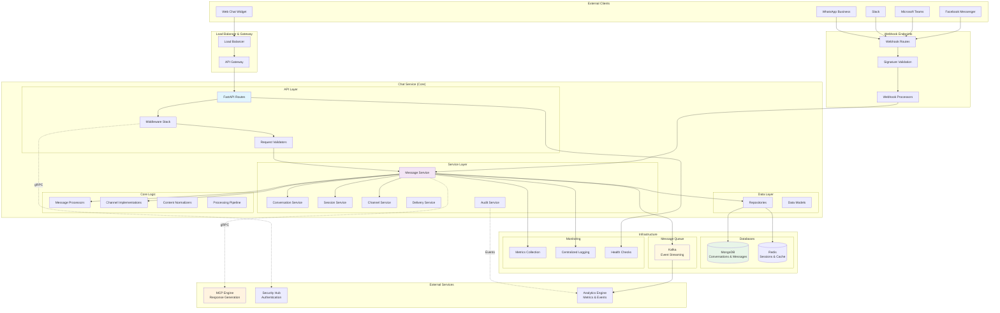
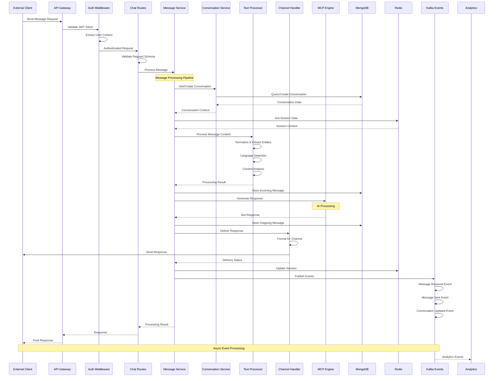
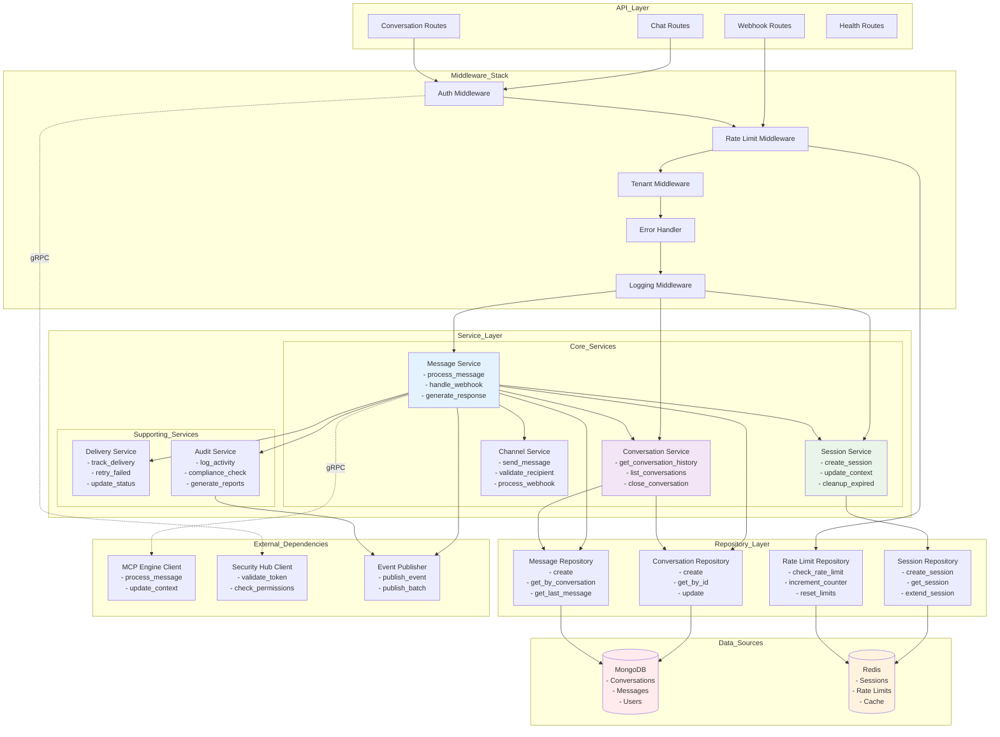
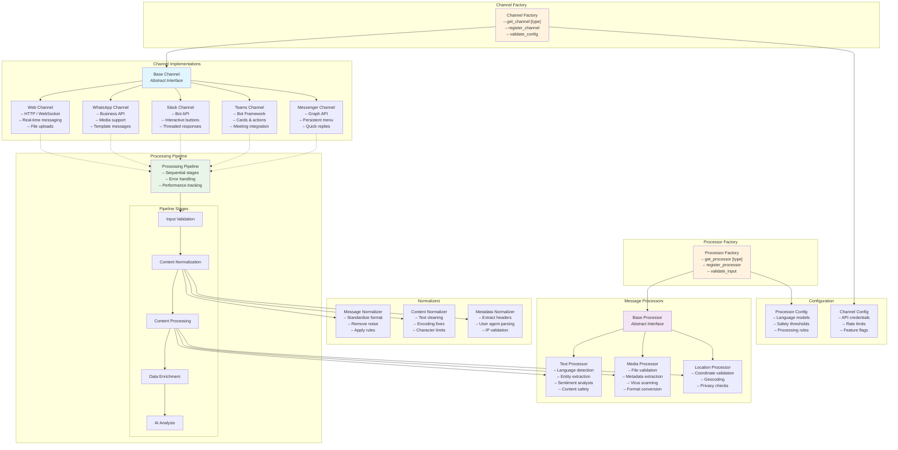
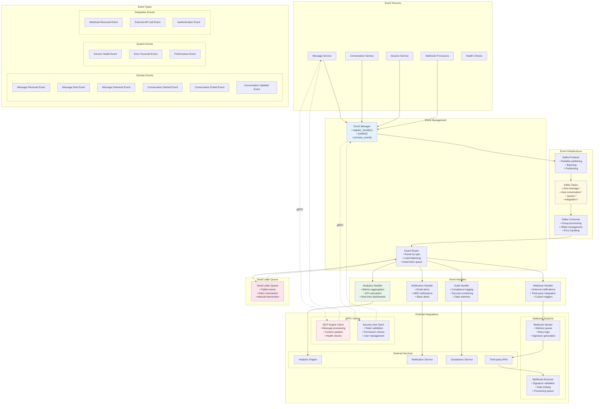

# Multi-Tenant AI Chatbot Platform - Architecture Diagrams

## 1. Overall System Architecture

## 2. Message Processing Flow

## 3. Service Layer Architecture

## 4. Channel & Processor Architecture

## 5. Event & Integration Architecture

## Architecture Summary

### Key Components Overview

1. **API Layer**: FastAPI-based REST endpoints with comprehensive middleware stack
2. **Service Layer**: Business logic orchestration with dependency injection
3. **Core Logic**: Channel abstractions and message processors with factory patterns
4. **Data Layer**: MongoDB for persistence, Redis for caching and sessions
5. **Event System**: Kafka-based event streaming for real-time analytics
6. **External Integration**: gRPC clients and webhook handling for external services

### Design Principles

- **Multi-tenancy**: Tenant isolation at all levels
- **Scalability**: Horizontal scaling with stateless services
- **Reliability**: Circuit breakers, retries, and dead letter queues
- **Security**: JWT authentication, rate limiting, content validation
- **Observability**: Comprehensive logging, metrics, and health checks
- **Extensibility**: Factory patterns and plugin architecture

### Technology Stack

- **Framework**: FastAPI with async/await
- **Databases**: MongoDB (primary), Redis (cache/sessions)
- **Messaging**: Apache Kafka for event streaming
- **Integration**: gRPC for service communication
- **Monitoring**: Structured logging with metrics collection
- **Deployment**: Kubernetes-ready with containerization