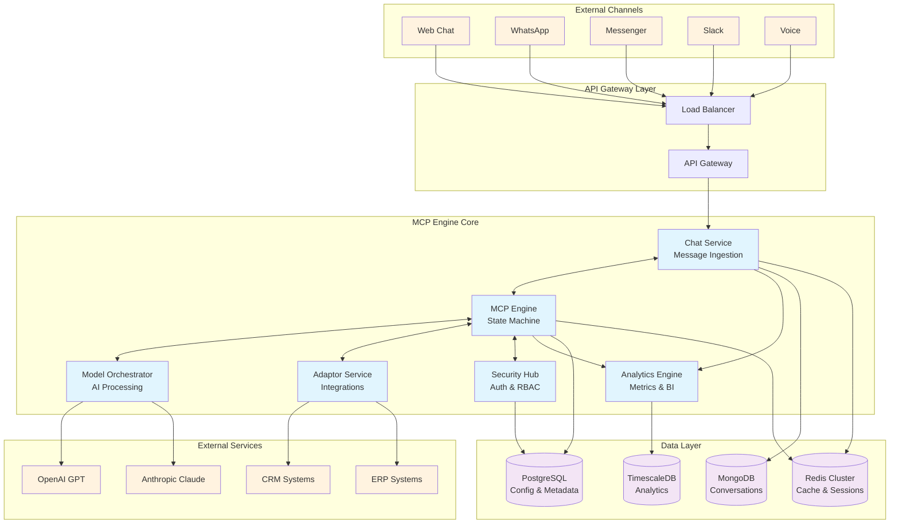
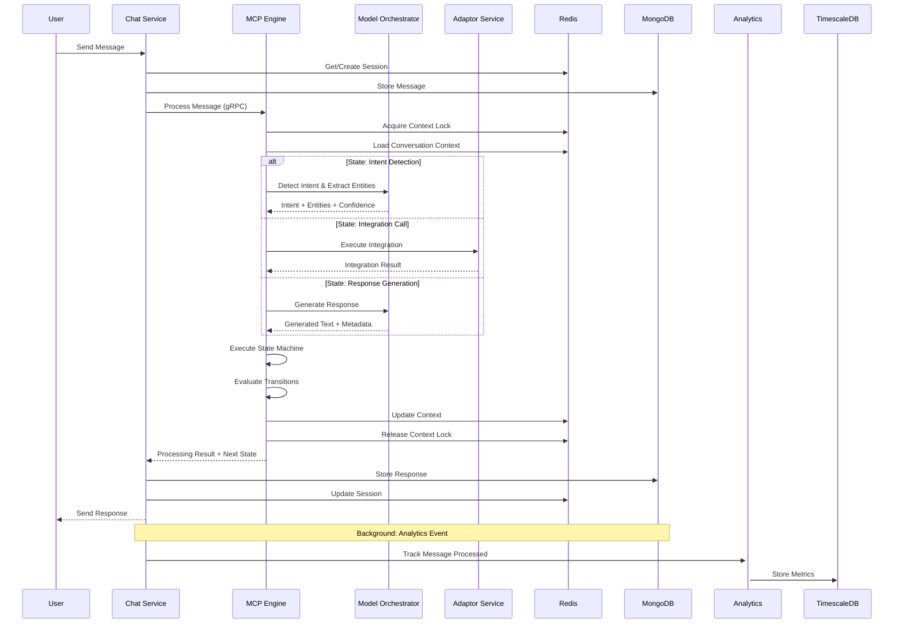
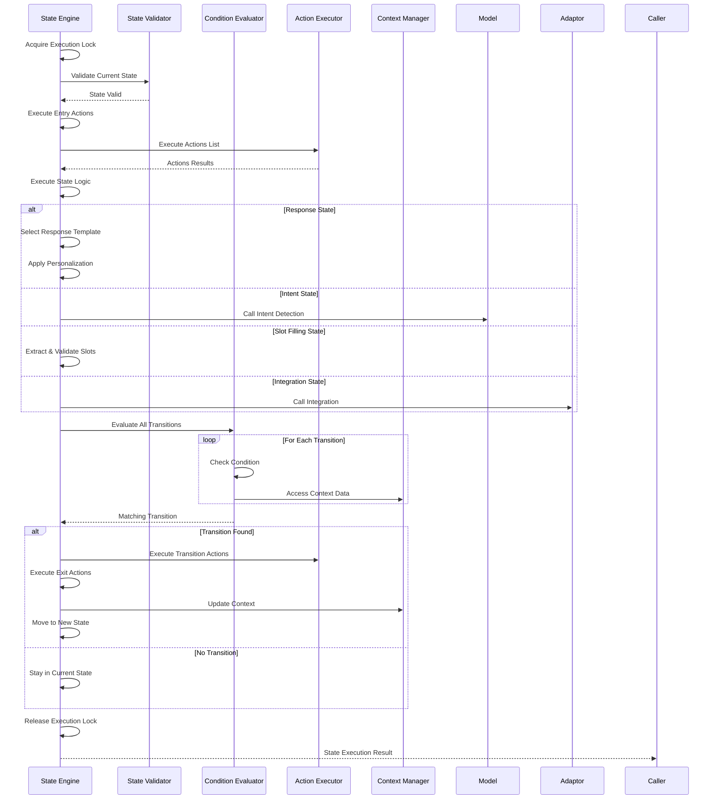
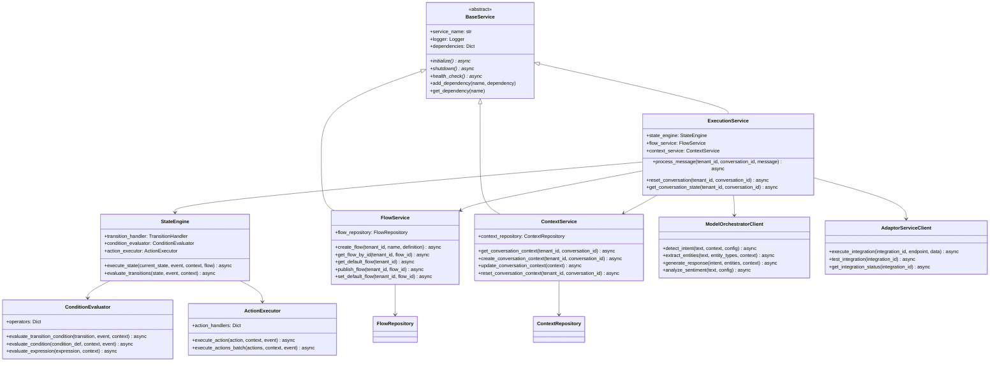

# MCP Engine Architecture Diagrams

## 1. High-Level System Architecture



## 2. Message Processing Sequence Diagram



## 3. State Machine Execution Flow



## 4. Service Layer Class Diagram



## 5. Database Architecture & Data Flow

```mermaid
graph TB
    subgraph "Application Layer"
        API[API Layer]
        SERVICES[Service Layer]
        REPOS[Repository Layer]
    end
    
    subgraph "PostgreSQL - Configuration & Metadata"
        PG_TENANTS[tenants]
        PG_USERS[tenant_users]
        PG_FLOWS[conversation_flows]
        PG_INTEGRATIONS[integrations]
        PG_API_KEYS[api_keys]
    end
    
    subgraph "MongoDB - Conversations & Messages"
        MONGO_CONV[conversations]
        MONGO_MSG[messages]
        MONGO_KB[knowledge_base]
    end
    
    subgraph "Redis Cluster - Cache & Sessions"
        REDIS_SESSION[session:{tenant}:{session_id}]
        REDIS_CONTEXT[conversation:{tenant}:{conv_id}]
        REDIS_RATE[rate_limit:{identifier}]
        REDIS_CACHE[cache:{service}:{key}]
    end
    
    subgraph "TimescaleDB - Analytics"
        TS_SYSTEM[system_metrics]
        TS_CONV[conversation_analytics]
        TS_MODEL[model_usage_analytics]
        TS_CUSTOM[custom_metrics]
    end
    
    API --> SERVICES
    SERVICES --> REPOS
    
    REPOS --> PG_TENANTS
    REPOS --> PG_USERS
    REPOS --> PG_FLOWS
    REPOS --> PG_INTEGRATIONS
    REPOS --> PG_API_KEYS
    
    REPOS --> MONGO_CONV
    REPOS --> MONGO_MSG
    REPOS --> MONGO_KB
    
    SERVICES --> REDIS_SESSION
    SERVICES --> REDIS_CONTEXT
    API --> REDIS_RATE
    SERVICES --> REDIS_CACHE
    
    SERVICES --> TS_SYSTEM
    SERVICES --> TS_CONV
    SERVICES --> TS_MODEL
    SERVICES --> TS_CUSTOM
    
    classDef postgres fill:#336791,color:#fff
    classDef mongo fill:#4db33d,color:#fff
    classDef redis fill:#d82c20,color:#fff
    classDef timescale fill:#ffa500,color:#fff
    classDef app fill:#2196f3,color:#fff
    
    class PG_TENANTS,PG_USERS,PG_FLOWS,PG_INTEGRATIONS,PG_API_KEYS postgres
    class MONGO_CONV,MONGO_MSG,MONGO_KB mongo
    class REDIS_SESSION,REDIS_CONTEXT,REDIS_RATE,REDIS_CACHE redis
    class TS_SYSTEM,TS_CONV,TS_MODEL,TS_CUSTOM timescale
    class API,SERVICES,REPOS app
```

## Data Flow Patterns

### 1. **Configuration Data Flow**
- **PostgreSQL** → Services → Redis Cache → Application Logic
- Tenant configs, flow definitions, integration settings

### 2. **Conversation Data Flow**
- **User Input** → Chat Service → MongoDB (persist) → MCP Engine
- **Context Updates** → Redis (real-time) → MongoDB (persistence)

### 3. **Analytics Data Flow**
- **Real-time Events** → Kafka → Analytics Engine → TimescaleDB
- **Metrics Collection** → Redis (counters) → TimescaleDB (aggregation)

### 4. **Cache Strategy**
- **L1**: Redis (hot data, sessions, rate limits)
- **L2**: Application memory (parsed configs, templates)
- **Write-through**: Critical data written to persistent storage
- **Write-behind**: Analytics data batched for performance

