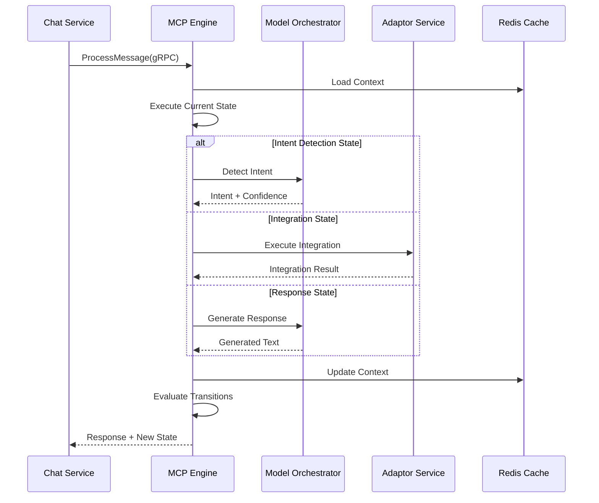

# MCP Engine - Complete Implementation Guide

## Service Overview
**Purpose**: Conversation flow management and state machine execution  
**Technology**: Python 3.11+, FastAPI, Redis, PostgreSQL, gRPC  
**Estimated Total Lines**: ~18,000  
**Complexity**: Very High  

---

## 🗂 Level 1: Folder Structure

```
mcp-engine/
├── src/
│   ├── api/                    # API layer (12 files, ~2,000 lines)
│   │   ├── v2/                 # Version 2 endpoints
│   │   │   ├── __init__.py
│   │   │   ├── flow_routes.py  # Flow management endpoints
│   │   │   ├── execution_routes.py
│   │   │   └── health_routes.py
│   │   ├── grpc/               # gRPC service definitions
│   │   │   ├── __init__.py
│   │   │   ├── mcp_service.py
│   │   │   └── proto/
│   │   └── middleware/         # Request/response middleware
│   ├── core/                   # Core business logic (30 files, ~5,500 lines)
│   │   ├── state_machine/      # State machine implementation
│   │   │   ├── __init__.py
│   │   │   ├── state_engine.py
│   │   │   ├── state_validator.py
│   │   │   ├── transition_handler.py
│   │   │   ├── condition_evaluator.py
│   │   │   └── action_executor.py
│   │   ├── flows/              # Flow management
│   │   │   ├── __init__.py
│   │   │   ├── flow_manager.py
│   │   │   ├── flow_parser.py
│   │   │   ├── flow_validator.py
│   │   │   └── flow_versioning.py
│   │   ├── context/            # Context management
│   │   │   ├── __init__.py
│   │   │   ├── context_manager.py
│   │   │   ├── slot_manager.py
│   │   │   ├── entity_resolver.py
│   │   │   └── variable_manager.py
│   │   ├── integration/        # Integration orchestration
│   │   │   ├── __init__.py
│   │   │   ├── integration_orchestrator.py
│   │   │   ├── request_builder.py
│   │   │   └── response_handler.py
│   │   └── ab_testing/         # A/B testing engine
│   │       ├── __init__.py
│   │       ├── experiment_manager.py
│   │       ├── variant_selector.py
│   │       └── metrics_collector.py
│   ├── models/                 # Data models (15 files, ~2,200 lines)
│   │   ├── __init__.py
│   │   ├── postgres/           # PostgreSQL models
│   │   │   ├── __init__.py
│   │   │   ├── flow_model.py
│   │   │   ├── state_model.py
│   │   │   └── experiment_model.py
│   │   ├── redis/              # Redis data structures
│   │   │   ├── __init__.py
│   │   │   ├── execution_state.py
│   │   │   ├── context_cache.py
│   │   │   └── flow_cache.py
│   │   └── domain/             # Domain models
│   │       ├── __init__.py
│   │       ├── state_machine.py
│   │       ├── flow_definition.py
│   │       └── execution_context.py
│   ├── services/               # Service layer (20 files, ~3,500 lines)
│   │   ├── __init__.py
│   │   ├── execution_service.py
│   │   ├── flow_service.py
│   │   ├── state_service.py
│   │   ├── context_service.py
│   │   ├── integration_service.py
│   │   ├── intent_service.py
│   │   ├── slot_filling_service.py
│   │   └── response_generation_service.py
│   ├── repositories/           # Data access layer (10 files, ~1,500 lines)
│   │   ├── __init__.py
│   │   ├── flow_repository.py
│   │   ├── state_repository.py
│   │   ├── context_repository.py
│   │   └── experiment_repository.py
│   ├── clients/                # External service clients (8 files, ~1,200 lines)
│   │   ├── __init__.py
│   │   ├── model_orchestrator_client.py
│   │   ├── adaptor_service_client.py
│   │   ├── analytics_client.py
│   │   └── cache_client.py
│   ├── utils/                  # Utilities (12 files, ~1,500 lines)
│   │   ├── __init__.py
│   │   ├── json_schema_validator.py
│   │   ├── expression_evaluator.py
│   │   ├── template_engine.py
│   │   └── flow_visualizer.py
│   ├── exceptions/             # Custom exceptions (6 files, ~400 lines)
│   ├── config/                 # Configuration (4 files, ~500 lines)
│   └── main.py                 # Application entry point
├── tests/                      # Test suite (40 files, ~6,000 lines)
├── scripts/                    # Utility scripts
├── proto/                      # Protocol buffer definitions
└── requirements.txt
```

**Folder Dependencies:**
- `api/` → `services/`, `models/`
- `services/` → `core/`, `repositories/`, `clients/`
- `core/` → `models/`, `utils/`
- `repositories/` → `models/`
- `clients/` → external services

---

## 📄 Level 2: File Specifications

### Core State Machine Files

#### `/src/core/state_machine/state_engine.py`
- **Responsibility**: Core state machine execution engine
- **Complexity**: Very High
- **Key Classes**: 
  - `StateEngine` - Main execution engine
  - `StateExecutor` - State execution logic
  - `TransitionManager` - State transition handling
- **Imports**: models, transition_handler, condition_evaluator, action_executor
- **Exports**: StateEngine, StateExecutor

#### `/src/core/state_machine/condition_evaluator.py`
- **Responsibility**: Evaluate conditions for state transitions
- **Complexity**: High
- **Key Classes**: 
  - `ConditionEvaluator` - Main evaluator
  - `ExpressionParser` - Parse condition expressions
  - `ConditionContext` - Evaluation context
- **Imports**: expression_evaluator, models
- **Exports**: ConditionEvaluator

#### `/src/core/flows/flow_manager.py`
- **Responsibility**: Manage conversation flow lifecycle
- **Complexity**: High
- **Key Classes**: 
  - `FlowManager` - Flow CRUD operations
  - `FlowVersionManager` - Version control
  - `FlowPublisher` - Publishing flows
- **Imports**: flow_parser, flow_validator, repositories
- **Exports**: FlowManager

### Service Layer Files

#### `/src/services/execution_service.py`
- **Responsibility**: Orchestrate state machine execution
- **Complexity**: Very High
- **Key Classes**: 
  - `ExecutionService` - Main service class
- **Imports**: state_engine, context_service, integration_service
- **Exports**: ExecutionService

#### `/src/services/slot_filling_service.py`
- **Responsibility**: Handle slot filling for data collection
- **Complexity**: High
- **Key Classes**: 
  - `SlotFillingService` - Slot management
  - `SlotValidator` - Validation logic
- **Imports**: models, context_service, intent_service
- **Exports**: SlotFillingService

### API Layer Files

#### `/src/api/grpc/mcp_service.py`
- **Responsibility**: gRPC service implementation
- **Complexity**: Medium
- **Key Classes**: 
  - `MCPServicer` - gRPC service implementation
- **Imports**: grpc, execution_service, proto
- **Exports**: MCPServicer

---

## ⚙️ Level 3: Method Details

### `/src/core/state_machine/state_engine.py`

```python
class StateEngine:
    def __init__(
        self,
        transition_handler: TransitionHandler,
        condition_evaluator: ConditionEvaluator,
        action_executor: ActionExecutor,
        logger: Logger
    ):
        self.transition_handler = transition_handler
        self.condition_evaluator = condition_evaluator
        self.action_executor = action_executor
        self.logger = logger
        self._execution_lock = asyncio.Lock()

    async def execute_state(
        self,
        current_state: State,
        event: StateEvent,
        context: ExecutionContext,
        flow_definition: FlowDefinition
    ) -> StateExecutionResult:
        """
        Execute a single state and determine next transition
        
        Parameters:
        - current_state: State
            - name: str
            - type: StateType enum
            - config: dict
            - transitions: List[Transition]
        - event: StateEvent
            - type: str
            - data: dict
            - timestamp: datetime
        - context: ExecutionContext
            - conversation_id: str
            - tenant_id: str
            - slots: dict
            - variables: dict
            - history: List[str]
        - flow_definition: FlowDefinition
            - states: Dict[str, State]
            - global_handlers: dict
            
        Returns:
        - StateExecutionResult
            - new_state: str
            - actions: List[Action]
            - context_updates: dict
            - errors: List[Error]
            
        Business Logic:
        1. Acquire execution lock for conversation
        2. Validate current state exists in flow
        3. Execute state-specific logic based on type:
           - response: Generate and return response
           - intent: Detect intent from input
           - slot_filling: Collect required information
           - integration: Call external service
           - condition: Evaluate branching logic
        4. Evaluate all transitions for the state
        5. Select first matching transition
        6. Execute transition actions
        7. Update context with results
        8. Release lock and return result
        
        Error Handling:
        - StateNotFound: Use error recovery state
        - TransitionError: Log and stay in current state
        - ActionError: Continue with partial results
        - LockTimeout: Retry with exponential backoff
        """

    async def evaluate_transitions(
        self,
        state: State,
        event: StateEvent,
        context: ExecutionContext
    ) -> Optional[Transition]:
        """
        Evaluate all transitions and return the first match
        
        Parameters:
        - state: State with transitions
        - event: Current event
        - context: Current execution context
        
        Returns:
        - Matching Transition or None
        
        Business Logic:
        1. Sort transitions by priority
        2. For each transition:
           a. Parse condition expression
           b. Build evaluation context
           c. Evaluate condition
           d. If true, return transition
        3. Return default/fallback transition if exists
        4. Return None if no match
        """

    async def execute_state_actions(
        self,
        state: State,
        context: ExecutionContext,
        event: StateEvent
    ) -> List[Action]:
        """
        Execute actions associated with a state
        
        Parameters:
        - state: State with action configurations
        - context: Execution context
        - event: Triggering event
        
        Returns:
        - List of executed actions
        
        Business Logic:
        1. Build action context from state + event
        2. For each action in state.config.actions:
           a. Validate action type
           b. Prepare action parameters
           c. Execute action via action_executor
           d. Collect results
        3. Handle action failures gracefully
        4. Return all action results
        """
```

### `/src/services/execution_service.py`

```python
class ExecutionService:
    def __init__(
        self,
        state_engine: StateEngine,
        flow_repository: FlowRepository,
        context_service: ContextService,
        integration_service: IntegrationService,
        response_service: ResponseGenerationService,
        analytics_client: AnalyticsClient,
        cache_client: CacheClient
    ):
        self.state_engine = state_engine
        self.flow_repository = flow_repository
        self.context_service = context_service
        self.integration_service = integration_service
        self.response_service = response_service
        self.analytics_client = analytics_client
        self.cache = cache_client

    async def process_message(
        self,
        tenant_id: str,
        conversation_id: str,
        message: InboundMessage,
        processing_hints: Optional[ProcessingHints] = None
    ) -> ProcessingResult:
        """
        Main entry point for message processing
        
        Parameters:
        - tenant_id: str (UUID)
        - conversation_id: str (UUID)
        - message: InboundMessage
            - content: MessageContent
            - user_id: str
            - channel: str
            - metadata: dict
        - processing_hints: Optional[ProcessingHints]
            - priority: str
            - bypass_cache: bool
            - force_flow: Optional[str]
            
        Returns:
        - ProcessingResult
            - response: MessageContent
            - new_state: str
            - context_updates: dict
            - actions_performed: List[str]
            - processing_time_ms: int
            
        Business Logic:
        1. Load or create conversation context
        2. Determine applicable flow (default, forced, or context-based)
        3. Load flow definition (with caching)
        4. Create state event from message
        5. Get current state from context
        6. Execute state machine:
           a. Process current state
           b. Handle transitions
           c. Execute new state entry actions
        7. Generate response based on state output
        8. Update conversation context
        9. Publish analytics events
        10. Return processing result
        
        Error Handling:
        - FlowNotFound: Use tenant default flow
        - StateExecutionError: Use error recovery flow
        - IntegrationTimeout: Return timeout message
        - ContextLoadError: Create new context
        """

    async def execute_integration(
        self,
        integration_config: IntegrationConfig,
        context: ExecutionContext,
        timeout_ms: int = 5000
    ) -> IntegrationResult:
        """
        Execute external integration within state
        
        Parameters:
        - integration_config: IntegrationConfig
            - integration_id: str
            - endpoint: str
            - method: str
            - request_mapping: dict
            - response_mapping: dict
        - context: ExecutionContext
        - timeout_ms: int
        
        Returns:
        - IntegrationResult
            - success: bool
            - data: dict
            - error: Optional[str]
            
        Business Logic:
        1. Build request from context using mapping
        2. Call integration service with timeout
        3. Map response to context variables
        4. Handle errors and timeouts
        5. Return structured result
        """

    async def handle_slot_filling(
        self,
        slot_config: SlotConfig,
        user_input: str,
        context: ExecutionContext
    ) -> SlotFillingResult:
        """
        Handle slot filling state logic
        
        Parameters:
        - slot_config: SlotConfig
            - required_slots: List[str]
            - optional_slots: List[str]
            - validation_rules: dict
            - prompts: dict
        - user_input: str
        - context: ExecutionContext
        
        Returns:
        - SlotFillingResult
            - filled_slots: dict
            - remaining_slots: List[str]
            - validation_errors: dict
            - next_prompt: Optional[str]
            
        Business Logic:
        1. Extract entities from user input
        2. Match entities to slot names
        3. Validate slot values
        4. Update context with valid slots
        5. Determine next unfilled slot
        6. Generate prompt for next slot
        7. Check if all required slots filled
        """
```

### `/src/core/flows/flow_parser.py`

```python
class FlowParser:
    def __init__(self, schema_validator: JsonSchemaValidator):
        self.schema_validator = schema_validator
        self.state_types = StateTypeRegistry()

    async def parse_flow_definition(
        self,
        flow_json: dict,
        validate: bool = True
    ) -> FlowDefinition:
        """
        Parse JSON flow definition into domain model
        
        Parameters:
        - flow_json: dict
            - name: str
            - version: str
            - initial_state: str
            - states: dict
            - global_handlers: dict
        - validate: bool
        
        Returns:
        - FlowDefinition object
        
        Business Logic:
        1. Validate against JSON schema if requested
        2. Parse metadata (name, version, description)
        3. Parse each state definition:
           a. Validate state type
           b. Parse state configuration
           c. Parse transitions
           d. Parse actions
        4. Parse global handlers
        5. Validate state references
        6. Build flow graph for analysis
        7. Return FlowDefinition object
        
        Error Handling:
        - SchemaValidationError: Return detailed errors
        - InvalidStateType: List supported types
        - CircularReference: Detect and report
        - MissingState: Report all missing references
        """

    def parse_state(
        self,
        state_name: str,
        state_config: dict
    ) -> State:
        """
        Parse individual state configuration
        
        Parameters:
        - state_name: str
        - state_config: dict
            - type: str
            - config: dict
            - transitions: list
            
        Returns:
        - State object
        
        Business Logic:
        1. Validate state type exists
        2. Get state type handler
        3. Parse type-specific configuration
        4. Parse transitions list
        5. Validate transition conditions
        6. Return State object
        """
```

---

## 🔗 Level 4: Parameter & Type Definitions

### Domain Models (`/src/models/domain/`)

```python
from enum import Enum
from typing import List, Dict, Optional, Any, Union
from pydantic import BaseModel, Field, validator
from datetime import datetime

class StateType(str, Enum):
    RESPONSE = "response"
    INTENT = "intent"
    SLOT_FILLING = "slot_filling"
    INTEGRATION = "integration"
    CONDITION = "condition"
    WAIT = "wait"
    END = "end"

class TransitionCondition(str, Enum):
    ANY_INPUT = "any_input"
    INTENT_MATCH = "intent_match"
    SLOT_FILLED = "slot_filled"
    INTEGRATION_SUCCESS = "integration_success"
    INTEGRATION_ERROR = "integration_error"
    EXPRESSION = "expression"
    TIMEOUT = "timeout"
    LOW_CONFIDENCE = "low_confidence"

class ActionType(str, Enum):
    SEND_MESSAGE = "send_message"
    SET_VARIABLE = "set_variable"
    CLEAR_VARIABLE = "clear_variable"
    CALL_INTEGRATION = "call_integration"
    LOG_EVENT = "log_event"
    TRIGGER_FLOW = "trigger_flow"

# State Configuration Models
class ResponseStateConfig(BaseModel):
    response_templates: Dict[str, str]
    response_type: str = Field(default="text")
    personalization: bool = Field(default=True)
    typing_indicator: bool = Field(default=True)
    delay_ms: Optional[int] = Field(None, ge=0, le=5000)

class IntentStateConfig(BaseModel):
    intent_patterns: List[str]
    confidence_threshold: float = Field(default=0.7, ge=0.0, le=1.0)
    fallback_intent: Optional[str] = None
    context_aware: bool = Field(default=True)

class SlotFillingConfig(BaseModel):
    required_slots: List[str]
    optional_slots: List[str] = Field(default_factory=list)
    validation_rules: Dict[str, str] = Field(default_factory=dict)
    prompts: Dict[str, str]
    retry_prompts: Dict[str, str] = Field(default_factory=dict)
    max_retries: int = Field(default=3, ge=1, le=5)

class IntegrationStateConfig(BaseModel):
    integration_id: str
    endpoint: str
    method: str = Field(default="GET")
    timeout_ms: int = Field(default=5000, ge=100, le=30000)
    retry_config: Dict[str, Any] = Field(default_factory=dict)
    request_mapping: Dict[str, str]
    response_mapping: Dict[str, str]
    error_handling: Dict[str, Any] = Field(default_factory=dict)

# Transition Models
class Transition(BaseModel):
    condition: TransitionCondition
    condition_value: Optional[str] = None
    expression: Optional[str] = None
    target_state: str
    priority: int = Field(default=100, ge=0, le=1000)
    actions: List[Dict[str, Any]] = Field(default_factory=list)
    
    @validator('expression')
    def validate_expression(cls, v, values):
        if values.get('condition') == TransitionCondition.EXPRESSION and not v:
            raise ValueError('Expression required for expression condition')
        return v

# State Model
class State(BaseModel):
    name: str
    type: StateType
    config: Union[
        ResponseStateConfig,
        IntentStateConfig,
        SlotFillingConfig,
        IntegrationStateConfig,
        Dict[str, Any]
    ]
    transitions: List[Transition]
    entry_actions: List[Dict[str, Any]] = Field(default_factory=list)
    exit_actions: List[Dict[str, Any]] = Field(default_factory=list)
    metadata: Dict[str, Any] = Field(default_factory=dict)

# Flow Definition
class FlowDefinition(BaseModel):
    flow_id: str
    tenant_id: str
    name: str
    version: str
    description: Optional[str] = None
    initial_state: str
    states: Dict[str, State]
    global_handlers: Dict[str, Any] = Field(default_factory=dict)
    variables: Dict[str, Any] = Field(default_factory=dict)
    metadata: Dict[str, Any] = Field(default_factory=dict)
    
    @validator('initial_state')
    def validate_initial_state(cls, v, values):
        states = values.get('states', {})
        if v not in states:
            raise ValueError(f'Initial state {v} not found in states')
        return v

# Execution Context
class ExecutionContext(BaseModel):
    conversation_id: str
    tenant_id: str
    user_id: str
    current_state: str
    previous_states: List[str] = Field(default_factory=list)
    slots: Dict[str, Any] = Field(default_factory=dict)
    variables: Dict[str, Any] = Field(default_factory=dict)
    user_profile: Dict[str, Any] = Field(default_factory=dict)
    intent_history: List[str] = Field(default_factory=list)
    integration_results: Dict[str, Any] = Field(default_factory=dict)
    error_count: int = Field(default=0)
    created_at: datetime = Field(default_factory=datetime.utcnow)
    updated_at: datetime = Field(default_factory=datetime.utcnow)
    
    class Config:
        json_encoders = {
            datetime: lambda v: v.isoformat()
        }

# Event Models
class StateEvent(BaseModel):
    type: str
    data: Dict[str, Any]
    timestamp: datetime = Field(default_factory=datetime.utcnow)
    source: Optional[str] = None

class MessageEvent(StateEvent):
    type: str = Field(default="message")
    data: Dict[str, Any] = Field(default_factory=dict)
    
    def __init__(self, message_content: str, **kwargs):
        super().__init__(
            data={"text": message_content, **kwargs}
        )

# Result Models
class StateExecutionResult(BaseModel):
    success: bool
    new_state: Optional[str] = None
    actions: List[Dict[str, Any]] = Field(default_factory=list)
    context_updates: Dict[str, Any] = Field(default_factory=dict)
    response: Optional[Dict[str, Any]] = None
    errors: List[str] = Field(default_factory=list)
    execution_time_ms: int = Field(default=0)

class ProcessingResult(BaseModel):
    conversation_id: str
    current_state: str
    response: Dict[str, Any]
    context_updates: Dict[str, Any]
    actions_performed: List[str]
    confidence_scores: Dict[str, float] = Field(default_factory=dict)
    processing_time_ms: int
    ab_variant: Optional[str] = None

# A/B Testing Models
class ExperimentConfig(BaseModel):
    experiment_id: str
    name: str
    enabled: bool = Field(default=True)
    start_date: datetime
    end_date: Optional[datetime] = None
    variants: List['Variant']
    metrics: List[str]
    allocation_method: str = Field(default="random")

class Variant(BaseModel):
    name: str
    percentage: float = Field(ge=0, le=100)
    modifications: Dict[str, Any]
    metadata: Dict[str, Any] = Field(default_factory=dict)

# Integration Models
class IntegrationConfig(BaseModel):
    integration_id: str
    name: str
    type: str  # rest, graphql, grpc, etc.
    base_url: str
    authentication: Dict[str, Any]
    headers: Dict[str, str] = Field(default_factory=dict)
    timeout_ms: int = Field(default=5000)
    retry_policy: Dict[str, Any] = Field(default_factory=dict)

class IntegrationResult(BaseModel):
    success: bool
    status_code: Optional[int] = None
    data: Optional[Dict[str, Any]] = None
    error: Optional[str] = None
    execution_time_ms: int
    retries: int = Field(default=0)
```

### gRPC Protocol Definitions (`/proto/mcp.proto`)

```protobuf
syntax = "proto3";

package mcp.v2;

service MCPEngine {
    rpc ProcessMessage(ProcessMessageRequest) returns (ProcessMessageResponse);
    rpc GetConversationState(GetStateRequest) returns (GetStateResponse);
    rpc ResetConversation(ResetRequest) returns (ResetResponse);
}

message ProcessMessageRequest {
    string tenant_id = 1;
    string conversation_id = 2;
    MessageContent content = 3;
    map<string, string> metadata = 4;
    ProcessingHints hints = 5;
}

message MessageContent {
    string type = 1;
    string text = 2;
    map<string, string> attributes = 3;
}

message ProcessingHints {
    string priority = 1;
    bool bypass_cache = 2;
    string force_flow = 3;
}

message ProcessMessageResponse {
    string conversation_id = 1;
    string current_state = 2;
    MessageContent response = 3;
    map<string, string> context_updates = 4;
    repeated string actions_performed = 5;
    int32 processing_time_ms = 6;
}
```

---

## 📊 Level 5: Cross-Service Integration

### Service Dependencies

```yaml
MCP Engine:
  Depends On:
    - Model Orchestrator: Intent detection, response generation
    - Adaptor Service: External integrations
    - Security Hub: Flow access control
    - Analytics Engine: Event tracking
    
  Provides To:
    - Chat Service: Message processing
    - Admin Dashboard: Flow management
    - Analytics Engine: Execution metrics
    
  Communication:
    - Sync: gRPC from Chat Service
    - Sync: REST/gRPC to Model Orchestrator
    - Sync: REST to Adaptor Service
    - Async: Kafka to Analytics Engine
    - Cache: Redis for state and context
```

### Integration Patterns

#### 1. Model Orchestrator Integration
```python
# /src/clients/model_orchestrator_client.py
class ModelOrchestratorClient:
    async def detect_intent(
        self,
        text: str,
        context: Dict[str, Any],
        tenant_config: ModelConfig
    ) -> IntentDetectionResult:
        """
        Call Model Orchestrator for intent detection
        
        Request includes:
        - text: User input
        - conversation_history: Last N messages
        - user_context: Profile, preferences
        - model_preferences: From tenant config
        """

    async def generate_response(
        self,
        intent: str,
        context: Dict[str, Any],
        template: Optional[str],
        tenant_config: ModelConfig
    ) -> ResponseGenerationResult:
        """
        Generate contextual response
        """
```

#### 2. Adaptor Service Integration
```python
# /src/clients/adaptor_service_client.py
class AdaptorServiceClient:
    async def execute_integration(
        self,
        integration_id: str,
        endpoint: str,
        request_data: Dict[str, Any],
        timeout_ms: int = 5000
    ) -> IntegrationExecutionResult:
        """
        Execute external integration via Adaptor Service
        
        Handles:
        - Request transformation
        - Authentication
        - Error handling
        - Response mapping
        """
```

### State Synchronization

```python
# /src/core/context/distributed_context.py
class DistributedContextManager:
    """
    Manage distributed conversation context across services
    
    Patterns:
    1. Optimistic locking for updates
    2. Event sourcing for history
    3. Cache-aside for performance
    4. Eventual consistency for analytics
    """
    
    async def acquire_context_lock(
        self,
        conversation_id: str,
        timeout_ms: int = 5000
    ) -> ContextLock:
        """
        Distributed lock using Redis
        """
    
    async def sync_context_update(
        self,
        conversation_id: str,
        updates: Dict[str, Any]
    ):
        """
        Propagate context updates to:
        - Redis cache
        - MongoDB for persistence
        - Kafka for analytics
        """
```

### Flow Execution Patterns



### Performance Optimizations

```python
# /src/utils/performance_optimizations.py
class MCPPerformanceOptimizer:
    """
    Key Optimizations:
    
    1. Flow Caching
       - Cache parsed flows in Redis
       - 5-minute TTL with refresh
       - Lazy loading on cache miss
    
    2. Context Batching
       - Batch context updates
       - Write-behind cache pattern
       - Async persistence
    
    3. Parallel Execution
       - Parallel intent detection
       - Concurrent integration calls
       - Async action execution
    
    4. Circuit Breakers
       - For external service calls
       - Fallback responses
       - Graceful degradation
    """
```

### Monitoring and Metrics

```python
# /src/utils/metrics.py
class MCPMetrics:
    """
    Key Metrics:
    
    1. Execution Metrics
       - State execution time
       - Transition evaluation time
       - Total processing time
    
    2. Flow Metrics
       - Flow completion rate
       - State visit frequency
       - Error state entries
    
    3. Integration Metrics
       - Integration success rate
       - Response times
       - Timeout frequency
    
    4. Business Metrics
       - Intent detection accuracy
       - Slot filling success
       - User satisfaction proxy
    """
```

---

## Testing Strategy

### Test Categories
```
tests/
├── unit/
│   ├── test_state_engine.py
│   ├── test_condition_evaluator.py
│   └── test_flow_parser.py
├── integration/
│   ├── test_execution_flow.py
│   ├── test_external_services.py
│   └── test_context_management.py
└── e2e/
    ├── test_complete_conversations.py
    └── test_flow_scenarios.py
```

### Critical Test Scenarios
1. **Complex state transitions**
2. **Parallel flow execution**
3. **Error recovery flows**
4. **A/B testing variants**
5. **Integration timeouts**
6. **Context consistency**

---

## Deployment Configuration

### Environment Variables
```env
# Service Configuration
SERVICE_NAME=mcp-engine
GRPC_PORT=50051
HTTP_PORT=8002

# Database Connections
POSTGRES_URI=postgresql://postgres:5432/mcp_db
REDIS_URL=redis://redis-cluster:6379

# External Services
MODEL_ORCHESTRATOR_URL=model-orchestrator:50053
ADAPTOR_SERVICE_URL=http://adaptor-service:8004

# Performance Settings
MAX_PARALLEL_EXECUTIONS=100
STATE_EXECUTION_TIMEOUT_MS=10000
CONTEXT_LOCK_TIMEOUT_MS=5000

# Feature Flags
ENABLE_AB_TESTING=true
ENABLE_FLOW_VERSIONING=true
ENABLE_VISUAL_DESIGNER=true
```
