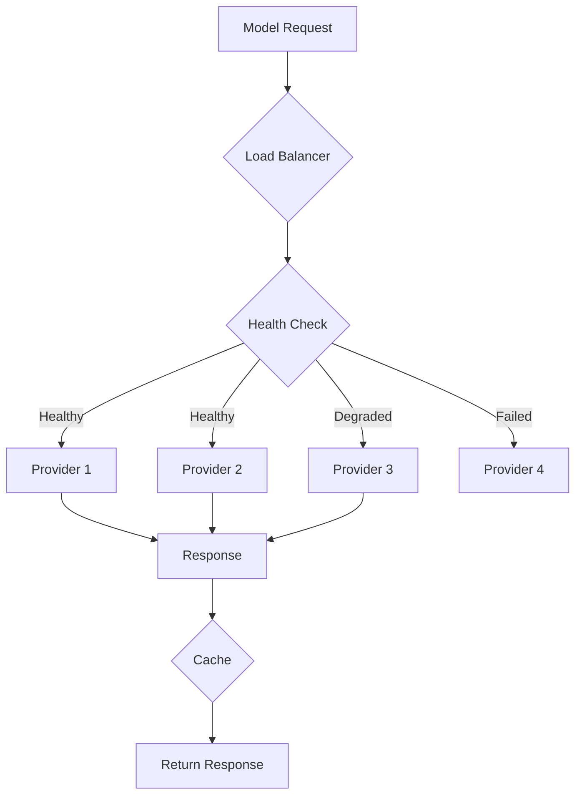

# Model Orchestrator - Complete Implementation Guide

## Service Overview
**Purpose**: AI model management, intelligent routing, and cost optimization  
**Technology**: Python 3.11+, FastAPI, Redis, PostgreSQL, AsyncIO  
**Estimated Total Lines**: ~16,000  
**Complexity**: Very High  

---

## 🗂 Level 1: Folder Structure

```
model-orchestrator/
├── src/
│   ├── api/                    # API layer (10 files, ~1,800 lines)
│   │   ├── v2/                 # Version 2 endpoints
│   │   │   ├── __init__.py
│   │   │   ├── model_routes.py # Model processing endpoints
│   │   │   ├── config_routes.py
│   │   │   └── health_routes.py
│   │   ├── grpc/               # gRPC service definitions
│   │   │   ├── __init__.py
│   │   │   └── model_service.py
│   │   └── middleware/         # Request/response middleware
│   ├── core/                   # Core business logic (25 files, ~4,500 lines)
│   │   ├── routing/            # Model routing logic
│   │   │   ├── __init__.py
│   │   │   ├── router.py
│   │   │   ├── cost_optimizer.py
│   │   │   ├── performance_scorer.py
│   │   │   ├── fallback_chain.py
│   │   │   └── load_balancer.py
│   │   ├── providers/          # LLM provider implementations
│   │   │   ├── __init__.py
│   │   │   ├── base_provider.py
│   │   │   ├── openai_provider.py
│   │   │   ├── anthropic_provider.py
│   │   │   ├── google_provider.py
│   │   │   ├── azure_provider.py
│   │   │   ├── huggingface_provider.py
│   │   │   └── custom_provider.py
│   │   ├── operations/         # Model operations
│   │   │   ├── __init__.py
│   │   │   ├── intent_detector.py
│   │   │   ├── response_generator.py
│   │   │   ├── entity_extractor.py
│   │   │   ├── sentiment_analyzer.py
│   │   │   ├── summarizer.py
│   │   │   └── embeddings_generator.py
│   │   └── optimization/       # Cost and performance optimization
│   │       ├── __init__.py
│   │       ├── cache_manager.py
│   │       ├── response_cache.py
│   │       ├── prompt_optimizer.py
│   │       └── token_calculator.py
│   ├── models/                 # Data models (12 files, ~1,800 lines)
│   │   ├── __init__.py
│   │   ├── postgres/           # PostgreSQL models
│   │   │   ├── __init__.py
│   │   │   ├── model_config.py
│   │   │   ├── usage_metrics.py
│   │   │   └── provider_status.py
│   │   ├── redis/              # Redis data structures
│   │   │   ├── __init__.py
│   │   │   ├── response_cache.py
│   │   │   ├── rate_limits.py
│   │   │   └── provider_health.py
│   │   └── domain/             # Domain models
│   │       ├── __init__.py
│   │       ├── model_request.py
│   │       ├── model_response.py
│   │       └── routing_decision.py
│   ├── services/               # Service layer (15 files, ~2,800 lines)
│   │   ├── __init__.py
│   │   ├── orchestration_service.py
│   │   ├── routing_service.py
│   │   ├── provider_service.py
│   │   ├── cache_service.py
│   │   ├── metrics_service.py
│   │   ├── config_service.py
│   │   └── health_monitor_service.py
│   ├── repositories/           # Data access layer (8 files, ~1,200 lines)
│   │   ├── __init__.py
│   │   ├── config_repository.py
│   │   ├── metrics_repository.py
│   │   ├── cache_repository.py
│   │   └── provider_repository.py
│   ├── monitoring/             # Monitoring and metrics (6 files, ~900 lines)
│   │   ├── __init__.py
│   │   ├── metrics_collector.py
│   │   ├── cost_tracker.py
│   │   ├── performance_monitor.py
│   │   └── alert_manager.py
│   ├── utils/                  # Utilities (10 files, ~1,500 lines)
│   │   ├── __init__.py
│   │   ├── prompt_templates.py
│   │   ├── token_counter.py
│   │   ├── response_formatter.py
│   │   └── retry_handler.py
│   ├── exceptions/             # Custom exceptions (5 files, ~300 lines)
│   ├── config/                 # Configuration (4 files, ~500 lines)
│   └── main.py                 # Application entry point
├── tests/                      # Test suite (35 files, ~5,000 lines)
├── scripts/                    # Utility scripts
└── requirements.txt
```

**Folder Dependencies:**
- `api/` → `services/`, `models/`
- `services/` → `core/`, `repositories/`, `monitoring/`
- `core/` → `models/`, `utils/`
- `repositories/` → `models/`

---

## 📄 Level 2: File Specifications

### Core Routing Files

#### `/src/core/routing/router.py`
- **Responsibility**: Main routing engine for model selection
- **Complexity**: Very High
- **Key Classes**: 
  - `ModelRouter` - Core routing logic
  - `RoutingStrategy` - Strategy pattern implementation
  - `RouteDecision` - Routing decision container
- **Imports**: providers, cost_optimizer, performance_scorer, load_balancer
- **Exports**: ModelRouter, RoutingStrategy

#### `/src/core/routing/cost_optimizer.py`
- **Responsibility**: Optimize model selection based on cost
- **Complexity**: High
- **Key Classes**: 
  - `CostOptimizer` - Cost calculation and optimization
  - `CostModel` - Provider cost models
  - `UsagePredictor` - Token usage prediction
- **Imports**: token_calculator, models
- **Exports**: CostOptimizer

#### `/src/core/providers/openai_provider.py`
- **Responsibility**: OpenAI API integration
- **Complexity**: High
- **Key Classes**: 
  - `OpenAIProvider` - OpenAI implementation
  - `OpenAIStreamHandler` - Streaming response handler
  - `OpenAITokenizer` - Token counting
- **Imports**: base_provider, httpx, tiktoken
- **Exports**: OpenAIProvider

### Service Layer Files

#### `/src/services/orchestration_service.py`
- **Responsibility**: Main orchestration logic
- **Complexity**: Very High
- **Key Classes**: 
  - `OrchestrationService` - Core service class
- **Imports**: routing_service, provider_service, cache_service
- **Exports**: OrchestrationService

#### `/src/services/routing_service.py`
- **Responsibility**: Route requests to appropriate models
- **Complexity**: High
- **Key Classes**: 
  - `RoutingService` - Routing decisions
  - `FallbackHandler` - Fallback chain management
- **Imports**: router, providers, monitoring
- **Exports**: RoutingService

---

## ⚙️ Level 3: Method Details

### `/src/core/routing/router.py`

```python
class ModelRouter:
    def __init__(
        self,
        cost_optimizer: CostOptimizer,
        performance_scorer: PerformanceScorer,
        load_balancer: LoadBalancer,
        provider_registry: ProviderRegistry,
        logger: Logger
    ):
        self.cost_optimizer = cost_optimizer
        self.performance_scorer = performance_scorer
        self.load_balancer = load_balancer
        self.provider_registry = provider_registry
        self.logger = logger
        self._routing_cache = TTLCache(maxsize=1000, ttl=300)

    async def route_request(
        self,
        request: ModelRequest,
        tenant_config: TenantModelConfig,
        routing_strategy: RoutingStrategy = RoutingStrategy.BALANCED
    ) -> RouteDecision:
        """
        Route request to optimal model based on strategy
        
        Parameters:
        - request: ModelRequest
            - operation: OperationType enum
            - input_text: str
            - max_tokens: Optional[int]
            - temperature: Optional[float]
            - constraints: ModelConstraints
        - tenant_config: TenantModelConfig
            - model_preferences: Dict[str, ModelPreference]
            - cost_limits: CostLimits
            - performance_targets: PerformanceTargets
            - fallback_chain: List[ModelProvider]
        - routing_strategy: RoutingStrategy
            - COST_OPTIMIZED: Minimize cost
            - PERFORMANCE_OPTIMIZED: Maximize quality/speed
            - BALANCED: Balance cost and performance
            
        Returns:
        - RouteDecision
            - primary_provider: ModelProvider
            - primary_model: str
            - fallback_providers: List[ModelProvider]
            - estimated_cost: float
            - estimated_latency: int
            - routing_reason: str
            
        Business Logic:
        1. Check cache for similar request
        2. Get available providers for operation
        3. Filter by tenant preferences
        4. Apply routing strategy:
           a. Cost: Sort by estimated cost
           b. Performance: Sort by quality score
           c. Balanced: Calculate combined score
        5. Check provider health status
        6. Apply rate limits and quotas
        7. Consider current load distribution
        8. Build fallback chain
        9. Cache routing decision
        10. Return decision with metadata
        
        Error Handling:
        - NoProvidersAvailable: Use emergency fallback
        - AllProvidersDown: Return service unavailable
        - QuotaExceeded: Route to next best option
        - InvalidOperation: Return bad request
        """

    async def calculate_routing_scores(
        self,
        providers: List[ModelProvider],
        request: ModelRequest,
        strategy: RoutingStrategy
    ) -> List[ProviderScore]:
        """
        Calculate routing scores for each provider
        
        Parameters:
        - providers: List of available providers
        - request: Current request
        - strategy: Routing strategy
        
        Returns:
        - List of ProviderScore objects sorted by score
        
        Business Logic:
        1. For each provider:
           a. Estimate token usage
           b. Calculate cost
           c. Get performance metrics
           d. Check current load
        2. Apply strategy-specific scoring:
           - Cost: 1 / estimated_cost
           - Performance: quality_score * (1 / latency)
           - Balanced: weighted combination
        3. Apply tenant-specific weights
        4. Normalize scores to 0-1 range
        5. Sort by score descending
        """

    async def build_fallback_chain(
        self,
        primary_provider: ModelProvider,
        available_providers: List[ModelProvider],
        max_fallbacks: int = 3
    ) -> List[ModelProvider]:
        """
        Build intelligent fallback chain
        
        Parameters:
        - primary_provider: Selected primary provider
        - available_providers: All available providers
        - max_fallbacks: Maximum fallback providers
        
        Returns:
        - Ordered list of fallback providers
        
        Business Logic:
        1. Remove primary from available list
        2. Group by provider type (diversification)
        3. Sort by reliability score
        4. Ensure different provider types
        5. Consider cost implications
        6. Limit to max_fallbacks
        """
```

### `/src/services/orchestration_service.py`

```python
class OrchestrationService:
    def __init__(
        self,
        routing_service: RoutingService,
        provider_service: ProviderService,
        cache_service: CacheService,
        metrics_service: MetricsService,
        config_service: ConfigService,
        retry_handler: RetryHandler
    ):
        self.routing_service = routing_service
        self.provider_service = provider_service
        self.cache_service = cache_service
        self.metrics_service = metrics_service
        self.config_service = config_service
        self.retry_handler = retry_handler
        self._semaphore = asyncio.Semaphore(100)  # Concurrent request limit

    async def process_request(
        self,
        tenant_id: str,
        operation: OperationType,
        request_data: Dict[str, Any],
        options: Optional[ProcessingOptions] = None
    ) -> ModelResponse:
        """
        Main entry point for model orchestration
        
        Parameters:
        - tenant_id: str (UUID)
        - operation: OperationType
            - INTENT_DETECTION
            - RESPONSE_GENERATION
            - ENTITY_EXTRACTION
            - SENTIMENT_ANALYSIS
            - SUMMARIZATION
            - EMBEDDINGS
        - request_data: Dict[str, Any]
            - text: str (required)
            - context: Optional[Dict]
            - language: Optional[str]
            - custom_params: Optional[Dict]
        - options: Optional[ProcessingOptions]
            - use_cache: bool
            - force_provider: Optional[str]
            - max_retries: int
            - timeout_ms: int
            
        Returns:
        - ModelResponse
            - result: Any (operation-specific)
            - metadata: ResponseMetadata
            - usage: TokenUsage
            - performance: PerformanceMetrics
            
        Business Logic:
        1. Validate request and tenant quota
        2. Check cache if enabled
        3. Build model request object
        4. Get tenant configuration
        5. Route to optimal provider
        6. Execute with fallback chain:
           a. Try primary provider
           b. On failure, try fallbacks
           c. Apply retry logic
        7. Post-process response
        8. Update cache
        9. Track metrics
        10. Return formatted response
        
        Error Handling:
        - ValidationError: Return 400
        - QuotaExceeded: Return 429
        - AllProvidersFailed: Return 503
        - Timeout: Return 504
        """

    async def execute_with_fallback(
        self,
        route_decision: RouteDecision,
        request: ModelRequest,
        options: ProcessingOptions
    ) -> ProviderResponse:
        """
        Execute request with fallback chain
        
        Parameters:
        - route_decision: Routing decision with fallbacks
        - request: Model request
        - options: Processing options
        
        Returns:
        - ProviderResponse from successful provider
        
        Business Logic:
        1. Create provider chain (primary + fallbacks)
        2. For each provider in chain:
           a. Check if provider is healthy
           b. Apply rate limiting
           c. Execute request with timeout
           d. If successful, return response
           e. If failed, log error and continue
        3. If all providers fail, raise AllProvidersFailed
        
        Error Handling:
        - ProviderTimeout: Move to next provider
        - ProviderError: Log and continue
        - RateLimitExceeded: Skip provider
        """

    async def execute_provider_request(
        self,
        provider: ModelProvider,
        request: ModelRequest,
        timeout_ms: int
    ) -> ProviderResponse:
        """
        Execute request with specific provider
        
        Parameters:
        - provider: Target model provider
        - request: Model request
        - timeout_ms: Request timeout
        
        Returns:
        - ProviderResponse
        
        Business Logic:
        1. Get provider client
        2. Transform request to provider format
        3. Add authentication headers
        4. Execute with timeout
        5. Handle streaming if applicable
        6. Parse provider response
        7. Calculate token usage
        8. Return standardized response
        """
```

### `/src/core/providers/openai_provider.py`

```python
class OpenAIProvider(BaseProvider):
    def __init__(
        self,
        api_key: str,
        organization_id: Optional[str] = None,
        base_url: str = "https://api.openai.com/v1",
        timeout: int = 30000,
        max_retries: int = 3
    ):
        super().__init__("openai", timeout, max_retries)
        self.api_key = api_key
        self.organization_id = organization_id
        self.base_url = base_url
        self.client = self._create_client()
        self.tokenizer = self._init_tokenizer()

    async def generate_response(
        self,
        messages: List[Message],
        model: str = "gpt-4-turbo",
        temperature: float = 0.7,
        max_tokens: Optional[int] = None,
        stream: bool = False,
        **kwargs
    ) -> ProviderResponse:
        """
        Generate response using OpenAI API
        
        Parameters:
        - messages: List[Message]
            - role: str (system/user/assistant)
            - content: str
        - model: str (model identifier)
        - temperature: float (0.0-2.0)
        - max_tokens: Optional[int]
        - stream: bool
        - **kwargs: Additional OpenAI parameters
        
        Returns:
        - ProviderResponse
            - content: str
            - finish_reason: str
            - usage: TokenUsage
            - model_used: str
            
        Business Logic:
        1. Validate model availability
        2. Count input tokens
        3. Build API request payload
        4. Execute API call with retry
        5. Handle streaming if enabled
        6. Parse response
        7. Calculate token usage
        8. Track costs
        9. Return standardized response
        
        Error Handling:
        - APIError: Parse error code and message
        - RateLimitError: Extract retry-after
        - InvalidRequestError: Return validation error
        - Timeout: Raise ProviderTimeout
        """

    async def detect_intent(
        self,
        text: str,
        possible_intents: List[str],
        context: Optional[Dict[str, Any]] = None,
        model: str = "gpt-4-turbo"
    ) -> IntentDetectionResult:
        """
        Detect intent using OpenAI
        
        Parameters:
        - text: User input text
        - possible_intents: List of valid intents
        - context: Optional conversation context
        - model: Model to use
        
        Returns:
        - IntentDetectionResult
            - intent: str
            - confidence: float
            - alternatives: List[IntentScore]
            
        Business Logic:
        1. Build intent detection prompt
        2. Include few-shot examples
        3. Add context if provided
        4. Request structured output
        5. Parse JSON response
        6. Validate detected intent
        7. Calculate confidence scores
        8. Return structured result
        """

    async def stream_response(
        self,
        messages: List[Message],
        model: str,
        on_chunk: Callable[[str], Awaitable[None]],
        **kwargs
    ) -> ProviderResponse:
        """
        Stream response chunks as they arrive
        
        Parameters:
        - messages: Conversation messages
        - model: Model identifier
        - on_chunk: Async callback for each chunk
        - **kwargs: Additional parameters
        
        Returns:
        - Complete ProviderResponse after streaming
        
        Business Logic:
        1. Create streaming request
        2. Initialize response accumulator
        3. For each chunk:
           a. Parse delta content
           b. Call on_chunk callback
           c. Accumulate response
        4. Handle finish reason
        5. Calculate final usage
        6. Return complete response
        """

    def count_tokens(
        self,
        messages: List[Message],
        model: str
    ) -> int:
        """
        Count tokens for messages
        
        Parameters:
        - messages: List of messages
        - model: Model identifier
        
        Returns:
        - Total token count
        
        Business Logic:
        1. Get encoding for model
        2. Add message formatting tokens
        3. Encode each message
        4. Sum token counts
        5. Add completion priming tokens
        """
```

---

## 🔗 Level 4: Parameter & Type Definitions

### Core Types (`/src/models/domain/types.py`)

```python
from enum import Enum
from typing import List, Dict, Optional, Any, Union, Callable
from pydantic import BaseModel, Field, validator
from datetime import datetime

class OperationType(str, Enum):
    INTENT_DETECTION = "intent_detection"
    RESPONSE_GENERATION = "response_generation"
    ENTITY_EXTRACTION = "entity_extraction"
    SENTIMENT_ANALYSIS = "sentiment_analysis"
    SUMMARIZATION = "summarization"
    EMBEDDINGS = "embeddings"
    CUSTOM = "custom"

class ModelProvider(str, Enum):
    OPENAI = "openai"
    ANTHROPIC = "anthropic"
    GOOGLE = "google"
    AZURE_OPENAI = "azure_openai"
    HUGGINGFACE = "huggingface"
    CUSTOM = "custom"

class RoutingStrategy(str, Enum):
    COST_OPTIMIZED = "cost_optimized"
    PERFORMANCE_OPTIMIZED = "performance_optimized"
    BALANCED = "balanced"
    ROUND_ROBIN = "round_robin"
    CUSTOM = "custom"

# Request Models
class ModelConstraints(BaseModel):
    max_latency_ms: Optional[int] = Field(None, ge=100, le=60000)
    max_cost_cents: Optional[float] = Field(None, ge=0)
    required_quality_score: Optional[float] = Field(None, ge=0, le=1)
    preferred_providers: Optional[List[ModelProvider]] = None
    excluded_providers: Optional[List[ModelProvider]] = None

class ModelRequest(BaseModel):
    request_id: str = Field(default_factory=lambda: str(uuid4()))
    operation: OperationType
    input_text: str = Field(..., min_length=1, max_length=32000)
    language: str = Field(default="en")
    max_tokens: Optional[int] = Field(None, ge=1, le=4096)
    temperature: float = Field(default=0.7, ge=0, le=2)
    top_p: float = Field(default=1.0, ge=0, le=1)
    constraints: Optional[ModelConstraints] = None
    context: Optional[Dict[str, Any]] = None
    custom_params: Optional[Dict[str, Any]] = None
    
    @validator('input_text')
    def validate_input_length(cls, v, values):
        operation = values.get('operation')
        if operation == OperationType.EMBEDDINGS and len(v) > 8192:
            raise ValueError('Embeddings input must be <= 8192 chars')
        return v

# Configuration Models
class ModelConfig(BaseModel):
    provider: ModelProvider
    model_name: str
    api_key_ref: str  # Reference to secure storage
    endpoint_override: Optional[str] = None
    default_temperature: float = Field(default=0.7)
    default_max_tokens: Optional[int] = None
    cost_per_1k_input_tokens: float
    cost_per_1k_output_tokens: float
    average_latency_ms: int
    quality_score: float = Field(ge=0, le=1)
    capabilities: List[OperationType]
    rate_limit_rpm: Optional[int] = None
    enabled: bool = Field(default=True)

class TenantModelConfig(BaseModel):
    tenant_id: str
    model_preferences: Dict[OperationType, ModelPreferences]
    cost_limits: CostLimits
    performance_targets: PerformanceTargets
    fallback_chain: List[ModelProvider]
    custom_models: Optional[List[ModelConfig]] = None
    ab_testing_enabled: bool = Field(default=False)

class ModelPreferences(BaseModel):
    primary_provider: ModelProvider
    primary_model: str
    fallback_providers: List[ModelProvider] = Field(default_factory=list)
    routing_strategy: RoutingStrategy = Field(default=RoutingStrategy.BALANCED)
    cache_responses: bool = Field(default=True)
    cache_ttl_seconds: int = Field(default=3600)

class CostLimits(BaseModel):
    daily_limit_cents: Optional[int] = None
    monthly_limit_cents: Optional[int] = None
    per_request_limit_cents: Optional[float] = None
    alert_threshold_percentage: int = Field(default=80, ge=0, le=100)

class PerformanceTargets(BaseModel):
    max_latency_p50_ms: int = Field(default=1000)
    max_latency_p95_ms: int = Field(default=3000)
    max_latency_p99_ms: int = Field(default=5000)
    min_quality_score: float = Field(default=0.8, ge=0, le=1)
    max_error_rate: float = Field(default=0.01, ge=0, le=1)

# Response Models
class TokenUsage(BaseModel):
    input_tokens: int
    output_tokens: int
    total_tokens: int
    cached_tokens: Optional[int] = Field(default=0)

class ProviderResponse(BaseModel):
    provider: ModelProvider
    model: str
    content: Any  # Type depends on operation
    finish_reason: str
    usage: TokenUsage
    latency_ms: int
    cost_cents: float
    cached: bool = Field(default=False)
    
class ResponseMetadata(BaseModel):
    request_id: str
    operation: OperationType
    provider_used: ModelProvider
    model_used: str
    fallback_used: bool = Field(default=False)
    fallback_reason: Optional[str] = None
    cache_hit: bool = Field(default=False)
    ab_variant: Optional[str] = None

class PerformanceMetrics(BaseModel):
    queue_time_ms: int
    routing_time_ms: int
    provider_latency_ms: int
    post_processing_ms: int
    total_time_ms: int

class ModelResponse(BaseModel):
    result: Any  # Operation-specific result
    metadata: ResponseMetadata
    usage: TokenUsage
    performance: PerformanceMetrics
    cost: float
    
# Operation-Specific Results
class IntentDetectionResult(BaseModel):
    intent: str
    confidence: float = Field(ge=0, le=1)
    alternatives: List[IntentScore] = Field(default_factory=list)
    entities: Optional[Dict[str, Any]] = None

class IntentScore(BaseModel):
    intent: str
    confidence: float

class SentimentResult(BaseModel):
    sentiment: str = Field(..., regex='^(positive|negative|neutral)$')
    confidence: float = Field(ge=0, le=1)
    scores: Dict[str, float]

class EntityExtractionResult(BaseModel):
    entities: List[Entity]
    text: str

class Entity(BaseModel):
    text: str
    type: str
    value: Any
    start_index: int
    end_index: int
    confidence: float

class SummarizationResult(BaseModel):
    summary: str
    key_points: List[str]
    compression_ratio: float

class EmbeddingsResult(BaseModel):
    embeddings: List[float]
    model: str
    dimensions: int

# Routing Models
class RouteDecision(BaseModel):
    primary_provider: ModelProvider
    primary_model: str
    fallback_providers: List[ModelProvider]
    routing_strategy: RoutingStrategy
    estimated_cost_cents: float
    estimated_latency_ms: int
    routing_scores: Dict[str, float]
    routing_reason: str

class ProviderScore(BaseModel):
    provider: ModelProvider
    model: str
    cost_score: float
    performance_score: float
    availability_score: float
    combined_score: float
    is_available: bool

# Health and Monitoring
class ProviderHealth(BaseModel):
    provider: ModelProvider
    status: str = Field(..., regex='^(healthy|degraded|unhealthy)$')
    success_rate: float
    average_latency_ms: int
    error_rate: float
    last_error: Optional[str] = None
    last_check: datetime
    consecutive_failures: int = Field(default=0)

class UsageMetrics(BaseModel):
    tenant_id: str
    period_start: datetime
    period_end: datetime
    total_requests: int
    successful_requests: int
    failed_requests: int
    total_tokens: int
    total_cost_cents: float
    by_operation: Dict[str, OperationMetrics]
    by_provider: Dict[str, ProviderMetrics]

class OperationMetrics(BaseModel):
    request_count: int
    total_tokens: int
    total_cost_cents: float
    average_latency_ms: int
    error_rate: float

class ProviderMetrics(BaseModel):
    request_count: int
    success_count: int
    error_count: int
    total_cost_cents: float
    average_latency_ms: int
```

### Cache Models (`/src/models/redis/cache_models.py`)

```python
class CachedResponse(BaseModel):
    """Redis cache entry for model responses"""
    key: str  # Hash of request parameters
    operation: OperationType
    result: Any
    provider: ModelProvider
    model: str
    tokens_used: int
    created_at: datetime
    ttl_seconds: int
    hit_count: int = Field(default=0)

class ProviderRateLimit(BaseModel):
    """Rate limit tracking per provider"""
    provider: ModelProvider
    window_start: datetime
    request_count: int
    token_count: int
    limit_rpm: int
    limit_tpm: Optional[int] = None
```

---

## 📊 Level 5: Cross-Service Integration

### Service Dependencies

```yaml
Model Orchestrator:
  Depends On:
    - Security Hub: API key management, tenant validation
    - Analytics Engine: Usage tracking, cost reporting
    
  Provides To:
    - MCP Engine: AI operations (intent, response, etc.)
    - Chat Service: Direct model access for simple operations
    - Admin Dashboard: Model configuration, usage stats
    
  Communication:
    - Sync: gRPC/REST from MCP Engine
    - Async: Kafka to Analytics Engine
    - Cache: Redis for response caching
    - External: HTTPS to LLM providers
```

### Integration Patterns

#### 1. MCP Engine Integration
```python
# /src/api/grpc/model_service.py
class ModelOrchestratorService(model_pb2_grpc.ModelOrchestratorServicer):
    async def ProcessRequest(
        self,
        request: model_pb2.ProcessRequest,
        context: grpc.aio.ServicerContext
    ) -> model_pb2.ProcessResponse:
        """
        gRPC endpoint for MCP Engine
        
        Handles:
        - Intent detection for state machines
        - Response generation with templates
        - Entity extraction for slot filling
        - Custom operations
        """
```

#### 2. Provider Integration Pattern
```python
# /src/core/providers/base_provider.py
class BaseProvider(ABC):
    """
    Abstract base for all LLM providers
    
    Common patterns:
    1. Retry with exponential backoff
    2. Circuit breaker for failures
    3. Rate limit handling
    4. Cost tracking
    5. Metric collection
    """
    
    @abstractmethod
    async def generate_response(
        self,
        messages: List[Message],
        **kwargs
    ) -> ProviderResponse:
        """Must be implemented by each provider"""
```

### Caching Strategy

```python
# /src/core/optimization/cache_manager.py
class ResponseCacheManager:
    """
    Intelligent response caching
    
    Cache Key Generation:
    - Operation type
    - Input text hash
    - Model parameters
    - Tenant-specific settings
    
    Cache Policies:
    1. TTL based on operation type
    2. LRU eviction
    3. Tenant-specific limits
    4. Cost-aware caching
    """
    
    def generate_cache_key(
        self,
        operation: OperationType,
        input_text: str,
        params: Dict[str, Any]
    ) -> str:
        """Generate deterministic cache key"""
```

### Cost Optimization Patterns

```python
# /src/core/optimization/cost_optimizer.py
class CostOptimizationEngine:
    """
    Multi-level cost optimization
    
    Strategies:
    1. Model Selection
       - Cheaper models for simple tasks
       - Premium models for complex tasks
    
    2. Prompt Optimization
       - Compress prompts
       - Remove redundancy
       - Optimize few-shot examples
    
    3. Caching
       - Cache frequent requests
       - Semantic similarity matching
    
    4. Batching
       - Batch similar requests
       - Amortize API overhead
    """
```

### Performance Monitoring

```python
# /src/monitoring/performance_monitor.py
class PerformanceMonitor:
    """
    Real-time performance tracking
    
    Metrics:
    1. Latency percentiles (p50, p95, p99)
    2. Token throughput
    3. Error rates by provider
    4. Cost per operation
    5. Cache hit rates
    
    Alerts:
    - Latency degradation
    - Provider failures
    - Cost overruns
    - Quota approaching
    """
```

### Load Balancing



### Failover Patterns

```python
# /src/core/routing/fallback_chain.py
class FallbackChainExecutor:
    """
    Intelligent failover handling
    
    Failure Types:
    1. Timeout: Try faster provider
    2. Rate Limit: Try different provider
    3. Error: Try more reliable provider
    4. Quality: Try better provider
    
    Chain Building:
    - Diversify providers
    - Consider cost implications
    - Maintain quality standards
    - Track failure patterns
    """
```

---

## Testing Strategy

### Test Structure
```
tests/
├── unit/
│   ├── test_routing_logic.py
│   ├── test_providers/
│   └── test_cost_calculations.py
├── integration/
│   ├── test_provider_apis.py
│   ├── test_caching.py
│   └── test_fallback_chains.py
└── load/
    ├── test_concurrent_requests.py
    └── test_provider_limits.py
```

### Critical Test Scenarios
1. **Provider failover chains**
2. **Cost limit enforcement**
3. **Cache invalidation**
4. **Concurrent request handling**
5. **Rate limit compliance**
6. **Response quality validation**

---

## Deployment Configuration

### Environment Variables
```env
# Service Configuration
SERVICE_NAME=model-orchestrator
HTTP_PORT=8003
GRPC_PORT=50053

# Database Connections
POSTGRES_URI=postgresql://postgres:5432/orchestrator_db
REDIS_URL=redis://redis-cluster:6379

# Provider API Keys (Encrypted)
OPENAI_API_KEY_ENCRYPTED=xxx
ANTHROPIC_API_KEY_ENCRYPTED=xxx
GOOGLE_API_KEY_ENCRYPTED=xxx

# Performance Settings
MAX_CONCURRENT_REQUESTS=200
DEFAULT_TIMEOUT_MS=30000
CACHE_TTL_SECONDS=3600

# Cost Controls
GLOBAL_DAILY_LIMIT_USD=1000
ALERT_THRESHOLD_PERCENTAGE=80

# Feature Flags
ENABLE_RESPONSE_CACHING=true
ENABLE_COST_OPTIMIZATION=true
ENABLE_SMART_ROUTING=true
```

### Monitoring Dashboard
```yaml
Key Metrics:
  - Request volume by operation
  - Cost breakdown by provider
  - Latency percentiles
  - Cache hit rates
  - Error rates
  - Token usage trends
  
Alerts:
  - Provider downtime
  - Cost overruns
  - Performance degradation
  - Quota warnings
```
