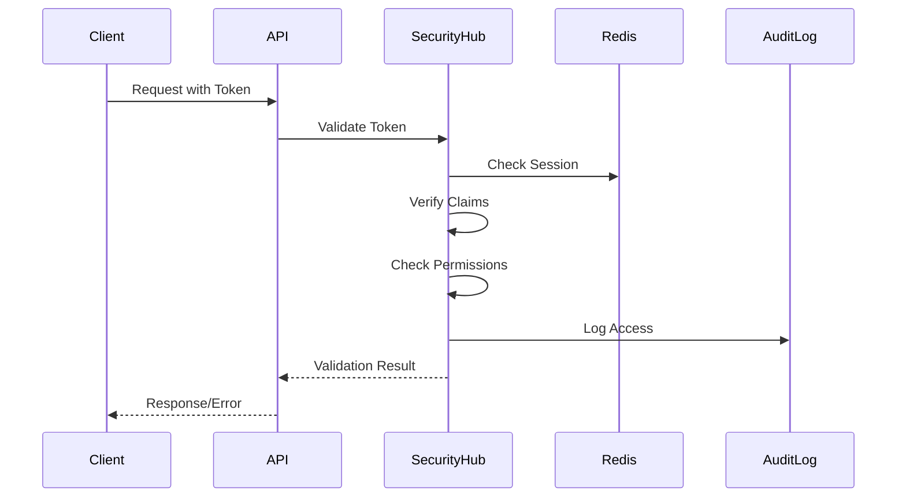

# Security Hub - Complete Implementation Guide

## Service Overview
**Purpose**: Centralized authentication, authorization, compliance, and security management  
**Technology**: Python 3.11+, FastAPI, PostgreSQL, Redis, HSM/KMS  
**Estimated Total Lines**: ~15,000  
**Complexity**: Very High  

---

## 🗂 Level 1: Folder Structure

```
security-hub/
├── src/
│   ├── api/                    # API layer (12 files, ~2,000 lines)
│   │   ├── v2/                 # Version 2 endpoints
│   │   │   ├── __init__.py
│   │   │   ├── auth_routes.py  # Authentication endpoints
│   │   │   ├── user_routes.py  # User management
│   │   │   ├── api_key_routes.py
│   │   │   ├── audit_routes.py
│   │   │   └── health_routes.py
│   │   ├── grpc/               # gRPC service definitions
│   │   │   ├── __init__.py
│   │   │   ├── auth_service.py
│   │   │   └── proto/
│   │   └── middleware/         # Security middleware
│   ├── core/                   # Core security logic (28 files, ~5,000 lines)
│   │   ├── auth/               # Authentication
│   │   │   ├── __init__.py
│   │   │   ├── jwt_manager.py
│   │   │   ├── session_manager.py
│   │   │   ├── mfa_manager.py
│   │   │   ├── password_manager.py
│   │   │   └── oauth_providers/
│   │   ├── authz/              # Authorization
│   │   │   ├── __init__.py
│   │   │   ├── rbac_engine.py
│   │   │   ├── permission_evaluator.py
│   │   │   ├── resource_guard.py
│   │   │   └── policy_engine.py
│   │   ├── crypto/             # Cryptography
│   │   │   ├── __init__.py
│   │   │   ├── encryption_service.py
│   │   │   ├── key_manager.py
│   │   │   ├── hsm_client.py
│   │   │   └── pii_detector.py
│   │   ├── compliance/         # Compliance management
│   │   │   ├── __init__.py
│   │   │   ├── gdpr_manager.py
│   │   │   ├── hipaa_manager.py
│   │   │   ├── soc2_manager.py
│   │   │   └── audit_logger.py
│   │   └── threat/             # Threat detection
│   │       ├── __init__.py
│   │       ├── anomaly_detector.py
│   │       ├── rate_limiter.py
│   │       ├── ip_validator.py
│   │       └── request_analyzer.py
│   ├── models/                 # Data models (12 files, ~1,800 lines)
│   │   ├── __init__.py
│   │   ├── postgres/           # PostgreSQL models
│   │   │   ├── __init__.py
│   │   │   ├── user_model.py
│   │   │   ├── api_key_model.py
│   │   │   ├── audit_log_model.py
│   │   │   └── permission_model.py
│   │   ├── redis/              # Redis data structures
│   │   │   ├── __init__.py
│   │   │   ├── session_store.py
│   │   │   ├── rate_limit_store.py
│   │   │   └── blacklist_store.py
│   │   └── domain/             # Domain models
│   │       ├── __init__.py
│   │       ├── auth_models.py
│   │       ├── permission_models.py
│   │       └── compliance_models.py
│   ├── services/               # Service layer (16 files, ~3,000 lines)
│   │   ├── __init__.py
│   │   ├── authentication_service.py
│   │   ├── authorization_service.py
│   │   ├── user_service.py
│   │   ├── api_key_service.py
│   │   ├── session_service.py
│   │   ├── audit_service.py
│   │   ├── compliance_service.py
│   │   └── security_monitoring_service.py
│   ├── repositories/           # Data access layer (8 files, ~1,200 lines)
│   │   ├── __init__.py
│   │   ├── user_repository.py
│   │   ├── permission_repository.py
│   │   ├── audit_repository.py
│   │   └── api_key_repository.py
│   ├── integrations/           # External integrations (6 files, ~800 lines)
│   │   ├── __init__.py
│   │   ├── sso_providers/
│   │   ├── vault_client.py
│   │   └── siem_client.py
│   ├── utils/                  # Utilities (10 files, ~1,000 lines)
│   │   ├── __init__.py
│   │   ├── validators.py
│   │   ├── token_generator.py
│   │   ├── security_headers.py
│   │   └── ip_utils.py
│   ├── exceptions/             # Custom exceptions (5 files, ~300 lines)
│   ├── config/                 # Configuration (4 files, ~500 lines)
│   └── main.py                 # Application entry point
├── tests/                      # Test suite (40 files, ~6,000 lines)
├── scripts/                    # Security scripts
├── policies/                   # Security policies
└── requirements.txt
```

**Folder Dependencies:**
- `api/` → `services/`, `models/`
- `services/` → `core/`, `repositories/`
- `core/` → `models/`, `utils/`, `integrations/`

---

## 📄 Level 2: File Specifications

### Core Authentication Files

#### `/src/core/auth/jwt_manager.py`
- **Responsibility**: JWT token generation and validation
- **Complexity**: Very High
- **Key Classes**: 
  - `JWTManager` - Token lifecycle management
  - `TokenValidator` - Token validation logic
  - `TokenBlacklist` - Revocation handling
- **Imports**: cryptography, redis, datetime
- **Exports**: JWTManager, TokenValidator

#### `/src/core/authz/rbac_engine.py`
- **Responsibility**: Role-based access control engine
- **Complexity**: Very High
- **Key Classes**: 
  - `RBACEngine` - Core RBAC logic
  - `RoleHierarchy` - Role inheritance
  - `PermissionResolver` - Permission calculation
- **Imports**: models, permission_evaluator
- **Exports**: RBACEngine

#### `/src/core/crypto/encryption_service.py`
- **Responsibility**: Field-level encryption and key management
- **Complexity**: High
- **Key Classes**: 
  - `EncryptionService` - Encryption operations
  - `FieldEncryptor` - Field-specific encryption
  - `KeyRotator` - Key rotation logic
- **Imports**: cryptography, hsm_client
- **Exports**: EncryptionService

### Service Layer Files

#### `/src/services/authentication_service.py`
- **Responsibility**: User authentication orchestration
- **Complexity**: Very High
- **Key Classes**: 
  - `AuthenticationService` - Main auth service
- **Imports**: jwt_manager, mfa_manager, session_manager
- **Exports**: AuthenticationService

#### `/src/services/authorization_service.py`
- **Responsibility**: Permission checking and enforcement
- **Complexity**: High
- **Key Classes**: 
  - `AuthorizationService` - Permission checks
- **Imports**: rbac_engine, resource_guard
- **Exports**: AuthorizationService

---

## ⚙️ Level 3: Method Details

### `/src/core/auth/jwt_manager.py`

```python
class JWTManager:
    def __init__(
        self,
        private_key: RSAPrivateKey,
        public_key: RSAPublicKey,
        redis_client: Redis,
        hsm_client: Optional[HSMClient] = None,
        config: JWTConfig = None
    ):
        self.private_key = private_key
        self.public_key = public_key
        self.redis = redis_client
        self.hsm = hsm_client
        self.config = config or JWTConfig()
        self.blacklist = TokenBlacklist(redis_client)
        self._key_rotation_task = None

    async def generate_token_pair(
        self,
        user: User,
        device_info: DeviceInfo,
        session_info: SessionInfo,
        scopes: List[str] = None
    ) -> TokenPair:
        """
        Generate access and refresh token pair
        
        Parameters:
        - user: User
            - user_id: str
            - tenant_id: str
            - role: str
            - permissions: List[str]
            - mfa_verified: bool
        - device_info: DeviceInfo
            - device_id: str
            - device_type: str
            - ip_address: str
            - user_agent: str
        - session_info: SessionInfo
            - session_id: str
            - login_method: str
            - risk_score: float
        - scopes: Optional[List[str]]
        
        Returns:
        - TokenPair
            - access_token: str
            - refresh_token: str
            - token_type: str
            - expires_in: int
            - scope: str
            
        Business Logic:
        1. Generate unique JTI for each token
        2. Calculate token expiration times
        3. Build comprehensive claims:
           a. Standard JWT claims (iss, sub, aud, exp, iat, nbf)
           b. Security claims (permissions, scopes, MFA status)
           c. Context claims (device, session, tenant)
           d. Compliance claims (data residency, consent)
        4. Add security constraints:
           a. IP binding for high-risk sessions
           b. Device fingerprint validation
           c. Time-based access windows
        5. Sign tokens with private key (or HSM)
        6. Store token metadata in Redis
        7. Register tokens for tracking
        8. Return token pair with metadata
        
        Error Handling:
        - KeyError: Use backup key or fail
        - HSMError: Fallback to local key
        - RedisError: Continue but log
        """

    async def validate_access_token(
        self,
        token: str,
        required_permissions: Optional[List[str]] = None,
        required_scopes: Optional[List[str]] = None,
        request_context: Optional[RequestContext] = None
    ) -> TokenValidationResult:
        """
        Comprehensive token validation
        
        Parameters:
        - token: str (JWT token)
        - required_permissions: Optional permission list
        - required_scopes: Optional scope list
        - request_context: Optional[RequestContext]
            - ip_address: str
            - user_agent: str
            - request_id: str
            
        Returns:
        - TokenValidationResult
            - valid: bool
            - claims: Dict[str, Any]
            - user_context: UserContext
            - errors: List[str]
            
        Business Logic:
        1. Parse token without verification
        2. Check token blacklist
        3. Verify signature with public key
        4. Validate standard claims:
           a. Expiration (exp)
           b. Not before (nbf)
           c. Issued at (iat)
           d. Audience (aud)
           e. Issuer (iss)
        5. Validate security constraints:
           a. IP address if bound
           b. Device fingerprint
           c. Session validity
        6. Check permissions if required
        7. Check scopes if required
        8. Validate custom claims
        9. Check for anomalies
        10. Update last activity
        11. Return validation result
        
        Error Handling:
        - ExpiredToken: Check grace period
        - InvalidSignature: Log security event
        - BlacklistedToken: Alert on reuse
        - PermissionDenied: Detailed reason
        """

    async def refresh_tokens(
        self,
        refresh_token: str,
        device_info: DeviceInfo,
        request_context: RequestContext
    ) -> TokenPair:
        """
        Refresh access token using refresh token
        
        Parameters:
        - refresh_token: str
        - device_info: Current device information
        - request_context: Current request context
        
        Returns:
        - New TokenPair
        
        Business Logic:
        1. Validate refresh token
        2. Check token family (detect reuse)
        3. Validate device consistency
        4. Check user status changes
        5. Generate new token pair
        6. Rotate refresh token
        7. Invalidate old tokens
        8. Update token family
        9. Log refresh event
        10. Return new tokens
        
        Error Handling:
        - TokenReuse: Invalidate entire family
        - DeviceMismatch: Require re-authentication
        - UserSuspended: Deny refresh
        """

    async def revoke_token(
        self,
        token_jti: str,
        reason: str,
        revoked_by: Optional[str] = None
    ) -> None:
        """
        Revoke token and related tokens
        
        Parameters:
        - token_jti: Token ID to revoke
        - reason: Revocation reason
        - revoked_by: User who revoked
        
        Business Logic:
        1. Add to blacklist with TTL
        2. Find related tokens (family)
        3. Revoke related tokens
        4. Terminate active sessions
        5. Log revocation event
        6. Notify connected services
        """
```

### `/src/services/authorization_service.py`

```python
class AuthorizationService:
    def __init__(
        self,
        rbac_engine: RBACEngine,
        policy_engine: PolicyEngine,
        resource_guard: ResourceGuard,
        audit_service: AuditService,
        cache_service: CacheService
    ):
        self.rbac = rbac_engine
        self.policy = policy_engine
        self.resource_guard = resource_guard
        self.audit = audit_service
        self.cache = cache_service
        self._permission_cache = TTLCache(maxsize=10000, ttl=300)

    async def check_permission(
        self,
        user_context: UserContext,
        resource: str,
        action: str,
        resource_attributes: Optional[Dict[str, Any]] = None
    ) -> PermissionResult:
        """
        Check if user has permission for action on resource
        
        Parameters:
        - user_context: UserContext
            - user_id: str
            - tenant_id: str
            - role: str
            - permissions: List[str]
            - attributes: Dict[str, Any]
        - resource: str (e.g., "conversations", "users", "config")
        - action: str (e.g., "read", "write", "delete")
        - resource_attributes: Optional resource metadata
        
        Returns:
        - PermissionResult
            - allowed: bool
            - reason: str
            - applied_policies: List[str]
            - conditions: List[str]
            
        Business Logic:
        1. Check cache for previous decision
        2. Evaluate RBAC permissions:
           a. Get role permissions
           b. Check explicit grants
           c. Check explicit denies
        3. Evaluate attribute-based policies:
           a. User attributes
           b. Resource attributes
           c. Environmental attributes
        4. Check resource-specific rules:
           a. Ownership rules
           b. Tenant isolation
           c. Data classification
        5. Apply time-based constraints
        6. Check delegation rules
        7. Evaluate custom policies
        8. Log authorization decision
        9. Cache result
        10. Return decision with reasoning
        
        Error Handling:
        - PolicyError: Deny by default
        - CacheError: Continue without cache
        - InvalidResource: Return not found
        """

    async def check_batch_permissions(
        self,
        user_context: UserContext,
        permission_requests: List[PermissionRequest]
    ) -> BatchPermissionResult:
        """
        Check multiple permissions efficiently
        
        Parameters:
        - user_context: UserContext
        - permission_requests: List of permission checks
        
        Returns:
        - BatchPermissionResult with individual results
        
        Business Logic:
        1. Group by resource type
        2. Bulk load policies
        3. Evaluate in parallel
        4. Aggregate results
        5. Apply consistency rules
        6. Return batch result
        """

    async def get_user_permissions(
        self,
        user_id: str,
        tenant_id: str,
        resource_type: Optional[str] = None
    ) -> UserPermissions:
        """
        Get all permissions for a user
        
        Parameters:
        - user_id: User identifier
        - tenant_id: Tenant identifier
        - resource_type: Optional filter by resource
        
        Returns:
        - UserPermissions object
        
        Business Logic:
        1. Load user roles
        2. Resolve role hierarchy
        3. Aggregate permissions
        4. Apply tenant policies
        5. Filter by resource if specified
        6. Include delegated permissions
        7. Format permission tree
        """

    async def enforce_data_access_policy(
        self,
        user_context: UserContext,
        data_query: DataQuery,
        classification: DataClassification
    ) -> DataAccessResult:
        """
        Enforce data access policies
        
        Parameters:
        - user_context: User context
        - data_query: Query details
        - classification: Data classification level
        
        Returns:
        - DataAccessResult with filters/masks
        
        Business Logic:
        1. Check data classification access
        2. Apply field-level permissions
        3. Generate row-level filters
        4. Apply data masking rules
        5. Set access conditions
        6. Log data access
        7. Return filtered query
        """
```

### `/src/core/crypto/encryption_service.py`

```python
class EncryptionService:
    def __init__(
        self,
        key_manager: KeyManager,
        hsm_client: Optional[HSMClient] = None,
        config: EncryptionConfig = None
    ):
        self.key_manager = key_manager
        self.hsm = hsm_client
        self.config = config or EncryptionConfig()
        self.field_encryptors = self._initialize_field_encryptors()
        self.pii_detector = PIIDetector()

    async def encrypt_sensitive_data(
        self,
        data: Dict[str, Any],
        encryption_context: EncryptionContext,
        auto_detect_pii: bool = True
    ) -> EncryptedData:
        """
        Encrypt sensitive fields in data
        
        Parameters:
        - data: Dictionary containing sensitive data
        - encryption_context: EncryptionContext
            - tenant_id: str
            - data_classification: str
            - purpose: str
            - retention_days: int
        - auto_detect_pii: Auto-detect and encrypt PII
        
        Returns:
        - EncryptedData
            - data: Dict with encrypted fields
            - encryption_metadata: Dict
            - detected_pii: List[str]
            
        Business Logic:
        1. Detect PII if enabled
        2. Determine fields to encrypt:
           a. Configured sensitive fields
           b. Auto-detected PII
           c. Classification-based rules
        3. Get appropriate encryption key
        4. For each sensitive field:
           a. Extract value
           b. Choose encryption method
           c. Encrypt with metadata
           d. Replace in data
        5. Generate encryption manifest
        6. Add integrity checksum
        7. Log encryption operation
        8. Return encrypted data
        
        Error Handling:
        - KeyNotFound: Use default key
        - EncryptionError: Log and throw
        - HSMUnavailable: Use software encryption
        """

    async def decrypt_sensitive_data(
        self,
        encrypted_data: EncryptedData,
        decryption_context: DecryptionContext,
        fields_to_decrypt: Optional[List[str]] = None
    ) -> Dict[str, Any]:
        """
        Decrypt sensitive fields
        
        Parameters:
        - encrypted_data: Encrypted data with metadata
        - decryption_context: Decryption context
        - fields_to_decrypt: Specific fields only
        
        Returns:
        - Decrypted data dictionary
        
        Business Logic:
        1. Verify integrity checksum
        2. Check access permissions
        3. Load encryption manifest
        4. Get decryption keys
        5. For each encrypted field:
           a. Check if requested
           b. Get encryption metadata
           c. Decrypt value
           d. Validate format
        6. Audit decryption access
        7. Return decrypted data
        """

    async def rotate_encryption_keys(
        self,
        tenant_id: str,
        key_type: str,
        batch_size: int = 100
    ) -> KeyRotationResult:
        """
        Rotate encryption keys for tenant
        
        Parameters:
        - tenant_id: Tenant identifier
        - key_type: Type of key to rotate
        - batch_size: Records per batch
        
        Returns:
        - KeyRotationResult
        
        Business Logic:
        1. Generate new encryption key
        2. Find all encrypted data
        3. For each batch:
           a. Decrypt with old key
           b. Encrypt with new key
           c. Update metadata
           d. Verify integrity
        4. Mark old key as retired
        5. Update key references
        6. Verify completion
        7. Log rotation event
        """

    def detect_and_classify_pii(
        self,
        data: Dict[str, Any]
    ) -> PIIDetectionResult:
        """
        Detect and classify PII in data
        
        Parameters:
        - data: Data to analyze
        
        Returns:
        - PIIDetectionResult
            - detected_fields: Dict[str, PIIType]
            - confidence_scores: Dict[str, float]
            - recommendations: List[str]
            
        Business Logic:
        1. Scan all string fields
        2. Apply PII patterns:
           a. Email addresses
           b. Phone numbers
           c. SSN/National IDs
           d. Credit cards
           e. Addresses
        3. Use ML model for context
        4. Classify by sensitivity
        5. Generate recommendations
        """
```

---

## 🔗 Level 4: Parameter & Type Definitions

### Core Security Types (`/src/models/domain/security_types.py`)

```python
from enum import Enum
from typing import List, Dict, Optional, Any, Set
from pydantic import BaseModel, Field, validator, EmailStr
from datetime import datetime, timedelta

class AuthenticationMethod(str, Enum):
    PASSWORD = "password"
    MFA = "mfa"
    SSO = "sso"
    API_KEY = "api_key"
    CERTIFICATE = "certificate"
    BIOMETRIC = "biometric"

class Role(str, Enum):
    OWNER = "owner"
    ADMIN = "admin"
    DEVELOPER = "developer"
    MANAGER = "manager"
    MEMBER = "member"
    VIEWER = "viewer"
    API_USER = "api_user"
    CUSTOM = "custom"

class Permission(str, Enum):
    # Conversation permissions
    CONVERSATIONS_READ = "conversations:read"
    CONVERSATIONS_WRITE = "conversations:write"
    CONVERSATIONS_DELETE = "conversations:delete"
    CONVERSATIONS_EXPORT = "conversations:export"
    
    # Configuration permissions
    CONFIG_READ = "config:read"
    CONFIG_WRITE = "config:write"
    CONFIG_FLOWS = "config:flows"
    CONFIG_INTEGRATIONS = "config:integrations"
    
    # User management
    USERS_READ = "users:read"
    USERS_WRITE = "users:write"
    USERS_DELETE = "users:delete"
    USERS_ROLES = "users:roles"
    
    # Analytics
    ANALYTICS_READ = "analytics:read"
    ANALYTICS_EXPORT = "analytics:export"
    
    # Admin
    ADMIN_BILLING = "admin:billing"
    ADMIN_SECURITY = "admin:security"
    ADMIN_COMPLIANCE = "admin:compliance"

class DataClassification(str, Enum):
    PUBLIC = "public"
    INTERNAL = "internal"
    CONFIDENTIAL = "confidential"
    RESTRICTED = "restricted"
    TOP_SECRET = "top_secret"

# User and Authentication Models
class User(BaseModel):
    user_id: str = Field(default_factory=lambda: str(uuid4()))
    tenant_id: str
    email: EmailStr
    username: Optional[str] = None
    first_name: Optional[str] = None
    last_name: Optional[str] = None
    role: Role
    custom_permissions: List[str] = Field(default_factory=list)
    status: str = Field(default="active")
    mfa_enabled: bool = Field(default=False)
    mfa_methods: List[str] = Field(default_factory=list)
    password_hash: Optional[str] = None
    last_login: Optional[datetime] = None
    failed_attempts: int = Field(default=0)
    locked_until: Optional[datetime] = None
    created_at: datetime = Field(default_factory=datetime.utcnow)
    updated_at: datetime = Field(default_factory=datetime.utcnow)
    metadata: Dict[str, Any] = Field(default_factory=dict)

class UserContext(BaseModel):
    user_id: str
    tenant_id: str
    role: Role
    permissions: Set[str]
    session_id: str
    ip_address: str
    device_id: Optional[str] = None
    mfa_verified: bool = Field(default=False)
    risk_score: float = Field(default=0.0, ge=0.0, le=1.0)
    attributes: Dict[str, Any] = Field(default_factory=dict)

class DeviceInfo(BaseModel):
    device_id: str
    device_type: str  # mobile, desktop, tablet, api
    platform: str
    browser: Optional[str] = None
    app_version: Optional[str] = None
    fingerprint: str
    trusted: bool = Field(default=False)
    last_seen: datetime = Field(default_factory=datetime.utcnow)

# Token Models
class TokenClaims(BaseModel):
    # Standard JWT claims
    iss: str  # Issuer
    sub: str  # Subject (user_id)
    aud: List[str]  # Audience
    exp: int  # Expiration time
    nbf: int  # Not before
    iat: int  # Issued at
    jti: str  # JWT ID
    
    # Custom claims
    tenant_id: str
    user_role: Role
    permissions: List[str]
    scopes: List[str]
    session_id: str
    device_id: Optional[str] = None
    ip_address: Optional[str] = None
    mfa_verified: bool = Field(default=False)
    
    # Security claims
    risk_level: str = Field(default="low")
    auth_method: AuthenticationMethod
    require_mfa_for: List[str] = Field(default_factory=list)
    
    # Compliance claims
    data_residency: str = Field(default="us")
    consent_version: Optional[str] = None
    compliance_flags: List[str] = Field(default_factory=list)

class TokenPair(BaseModel):
    access_token: str
    refresh_token: str
    token_type: str = Field(default="Bearer")
    expires_in: int  # seconds
    expires_at: datetime
    scope: str
    issued_at: datetime = Field(default_factory=datetime.utcnow)

class TokenValidationResult(BaseModel):
    valid: bool
    claims: Optional[TokenClaims] = None
    user_context: Optional[UserContext] = None
    errors: List[str] = Field(default_factory=list)
    warnings: List[str] = Field(default_factory=list)

# API Key Models
class APIKey(BaseModel):
    key_id: str = Field(default_factory=lambda: str(uuid4()))
    tenant_id: str
    name: str
    description: Optional[str] = None
    key_hash: str  # Hashed key
    key_prefix: str  # First 8 chars for identification
    created_by: str
    permissions: List[str]
    scopes: List[str] = Field(default_factory=list)
    rate_limit: Optional[RateLimitConfig] = None
    expires_at: Optional[datetime] = None
    last_used: Optional[datetime] = None
    status: str = Field(default="active")
    allowed_ips: List[str] = Field(default_factory=list)
    allowed_origins: List[str] = Field(default_factory=list)
    metadata: Dict[str, Any] = Field(default_factory=dict)

# MFA Models
class MFAMethod(BaseModel):
    method_id: str = Field(default_factory=lambda: str(uuid4()))
    user_id: str
    method_type: str  # totp, sms, email, webauthn
    is_primary: bool = Field(default=False)
    verified: bool = Field(default=False)
    secret: Optional[str] = None  # Encrypted
    phone_number: Optional[str] = None
    email: Optional[str] = None
    backup_codes: List[str] = Field(default_factory=list)
    created_at: datetime = Field(default_factory=datetime.utcnow)
    last_used: Optional[datetime] = None

class MFAChallenge(BaseModel):
    challenge_id: str = Field(default_factory=lambda: str(uuid4()))
    user_id: str
    method_type: str
    challenge_data: Dict[str, Any]
    expires_at: datetime
    attempts: int = Field(default=0)
    max_attempts: int = Field(default=3)
    completed: bool = Field(default=False)

# Authorization Models
class PermissionRequest(BaseModel):
    resource: str
    action: str
    resource_attributes: Optional[Dict[str, Any]] = None
    context: Optional[Dict[str, Any]] = None

class PermissionResult(BaseModel):
    allowed: bool
    resource: str
    action: str
    reason: str
    applied_policies: List[str] = Field(default_factory=list)
    conditions: List[str] = Field(default_factory=list)
    obligations: List[str] = Field(default_factory=list)

class RoleDefinition(BaseModel):
    role_id: str
    role_name: str
    description: str
    permissions: List[str]
    inherits_from: List[str] = Field(default_factory=list)
    constraints: Dict[str, Any] = Field(default_factory=dict)
    is_system_role: bool = Field(default=False)

# Audit Models
class AuditEvent(BaseModel):
    event_id: str = Field(default_factory=lambda: str(uuid4()))
    timestamp: datetime = Field(default_factory=datetime.utcnow)
    tenant_id: str
    user_id: Optional[str] = None
    event_type: str  # auth.login, auth.logout, authz.check, etc.
    resource: Optional[str] = None
    action: Optional[str] = None
    result: str  # success, failure, error
    ip_address: Optional[str] = None
    user_agent: Optional[str] = None
    session_id: Optional[str] = None
    details: Dict[str, Any] = Field(default_factory=dict)
    risk_indicators: List[str] = Field(default_factory=list)

# Compliance Models
class ComplianceRequirement(BaseModel):
    requirement_id: str
    framework: str  # GDPR, HIPAA, SOC2, etc.
    control_id: str
    description: str
    implementation_status: str
    evidence: List[str] = Field(default_factory=list)
    last_assessment: Optional[datetime] = None
    next_assessment: Optional[datetime] = None

class DataRetentionPolicy(BaseModel):
    policy_id: str
    data_type: str
    classification: DataClassification
    retention_days: int
    deletion_strategy: str  # soft_delete, hard_delete, anonymize
    legal_hold: bool = Field(default=False)
    review_frequency_days: int = Field(default=90)

# Encryption Models
class EncryptionContext(BaseModel):
    tenant_id: str
    data_classification: DataClassification
    purpose: str
    algorithm: str = Field(default="AES-256-GCM")
    key_id: Optional[str] = None
    retention_days: Optional[int] = None

class EncryptedData(BaseModel):
    data: Dict[str, Any]
    encryption_metadata: Dict[str, Any]
    detected_pii: List[str] = Field(default_factory=list)
    integrity_hash: str
    encrypted_at: datetime = Field(default_factory=datetime.utcnow)

# Rate Limiting
class RateLimitConfig(BaseModel):
    requests_per_minute: Optional[int] = None
    requests_per_hour: Optional[int] = None
    requests_per_day: Optional[int] = None
    burst_size: Optional[int] = None
    by_endpoint: Dict[str, int] = Field(default_factory=dict)

# Security Monitoring
class SecurityAlert(BaseModel):
    alert_id: str = Field(default_factory=lambda: str(uuid4()))
    timestamp: datetime = Field(default_factory=datetime.utcnow)
    severity: str  # low, medium, high, critical
    alert_type: str
    description: str
    affected_resources: List[str]
    indicators: Dict[str, Any]
    recommended_actions: List[str]
    auto_remediated: bool = Field(default=False)
    acknowledged: bool = Field(default=False)
    acknowledged_by: Optional[str] = None
```

---

## 📊 Level 5: Cross-Service Integration

### Service Dependencies

```yaml
Security Hub:
  Depends On:
    - None (Core service)
    
  Provides To:
    - All Services: Authentication, authorization
    - Chat Service: User context, permissions
    - MCP Engine: Flow access control
    - Model Orchestrator: API key validation
    - Adaptor Service: Credential encryption
    - Analytics Engine: Audit logs
    
  Communication:
    - Sync: gRPC for auth checks
    - Sync: REST for management
    - Async: Kafka for audit events
    - Cache: Redis for sessions
```

### Integration Patterns

#### 1. Service Authentication
```python
# /src/api/grpc/auth_service.py
class SecurityHubService(security_pb2_grpc.SecurityHubServicer):
    async def ValidateToken(
        self,
        request: ValidateTokenRequest,
        context: grpc.aio.ServicerContext
    ) -> ValidateTokenResponse:
        """
        gRPC endpoint for token validation
        
        Used by all services for:
        - Request authentication
        - Permission checking
        - Session validation
        """
```

#### 2. Credential Management
```python
# /src/core/crypto/credential_manager.py
class CredentialManager:
    """
    Secure credential storage for integrations
    
    Features:
    1. Encryption at rest
    2. Key rotation
    3. Access audit
    4. HSM integration
    """
    
    async def store_integration_credential(
        self,
        tenant_id: str,
        integration_id: str,
        credentials: Dict[str, Any]
    ) -> str:
        """Store encrypted credentials"""
```

### Security Patterns

#### Zero Trust Architecture
```python
# /src/core/security/zero_trust.py
class ZeroTrustValidator:
    """
    Never trust, always verify
    
    Validations:
    1. Device trust score
    2. Network location
    3. Behavior analysis
    4. Continuous verification
    """
    
    async def calculate_trust_score(
        self,
        user_context: UserContext,
        request_context: RequestContext
    ) -> TrustScore:
        """Calculate dynamic trust score"""
```

#### Threat Detection
```python
# /src/core/threat/anomaly_detector.py
class AnomalyDetector:
    """
    ML-based anomaly detection
    
    Monitors:
    1. Login patterns
    2. API usage patterns
    3. Permission escalation
    4. Data access patterns
    
    Actions:
    - Alert generation
    - Automatic blocking
    - Step-up authentication
    - Session termination
    """
```

### Compliance Implementation

```python
# /src/core/compliance/compliance_engine.py
class ComplianceEngine:
    """
    Multi-framework compliance
    
    Frameworks:
    - GDPR: Data privacy, right to forget
    - HIPAA: Healthcare data protection
    - SOC 2: Security controls
    - PCI DSS: Payment card security
    
    Features:
    1. Automated assessments
    2. Evidence collection
    3. Policy enforcement
    4. Audit trail
    """
```

### Session Management Flow



### Performance Optimizations

```python
# /src/utils/security_cache.py
class SecurityCache:
    """
    Performance optimizations:
    
    1. Permission Caching
       - User permissions: 5min TTL
       - Role definitions: 1hr TTL
       - Policy decisions: 30s TTL
    
    2. Session Caching
       - Active sessions in Redis
       - Distributed cache sync
       - Lazy loading
    
    3. Token Validation
       - Public key caching
       - Signature verification cache
       - Parallel validation
    """
```

---

## Testing Strategy

### Test Structure
```
tests/
├── unit/
│   ├── test_jwt_manager.py
│   ├── test_rbac_engine.py
│   └── test_encryption.py
├── integration/
│   ├── test_auth_flow.py
│   ├── test_mfa.py
│   └── test_compliance.py
└── security/
    ├── test_penetration.py
    └── test_vulnerabilities.py
```

### Critical Test Scenarios
1. **Token lifecycle management**
2. **Permission inheritance**
3. **MFA flows**
4. **Key rotation**
5. **Compliance controls**
6. **Security headers**

---

## Deployment Configuration

### Environment Variables
```env
# Service Configuration
SERVICE_NAME=security-hub
HTTP_PORT=8005
GRPC_PORT=50052

# Database Connections
POSTGRES_URI=postgresql://postgres:5432/security_db
REDIS_URL=redis://redis-cluster:6379

# Security Keys (Use secrets management)
JWT_PRIVATE_KEY_PATH=/secrets/jwt/private.key
JWT_PUBLIC_KEY_PATH=/secrets/jwt/public.key
ENCRYPTION_KEY_PATH=/secrets/encryption/master.key

# HSM Configuration (Optional)
HSM_ENABLED=false
HSM_URL=pkcs11:token=xxx

# MFA Settings
MFA_ISSUER_NAME=Chatbot Platform
MFA_ENFORCE_FOR_ADMINS=true

# Session Configuration
SESSION_TIMEOUT_MINUTES=60
REFRESH_TOKEN_DAYS=30

# Security Policies
MAX_LOGIN_ATTEMPTS=5
LOCKOUT_DURATION_MINUTES=30
PASSWORD_MIN_LENGTH=12
PASSWORD_REQUIRE_SPECIAL=true

# Compliance
ENABLE_AUDIT_LOGGING=true
DATA_RETENTION_DAYS=365
GDPR_MODE=true
```

### Security Monitoring
```yaml
Alerts:
  - Multiple failed login attempts
  - Privilege escalation
  - Unusual access patterns
  - Token reuse attempts
  - API key compromise
  - Compliance violations
  
Metrics:
  - Authentication success rate
  - MFA adoption rate
  - Permission check latency
  - Active sessions
  - Security events
```
