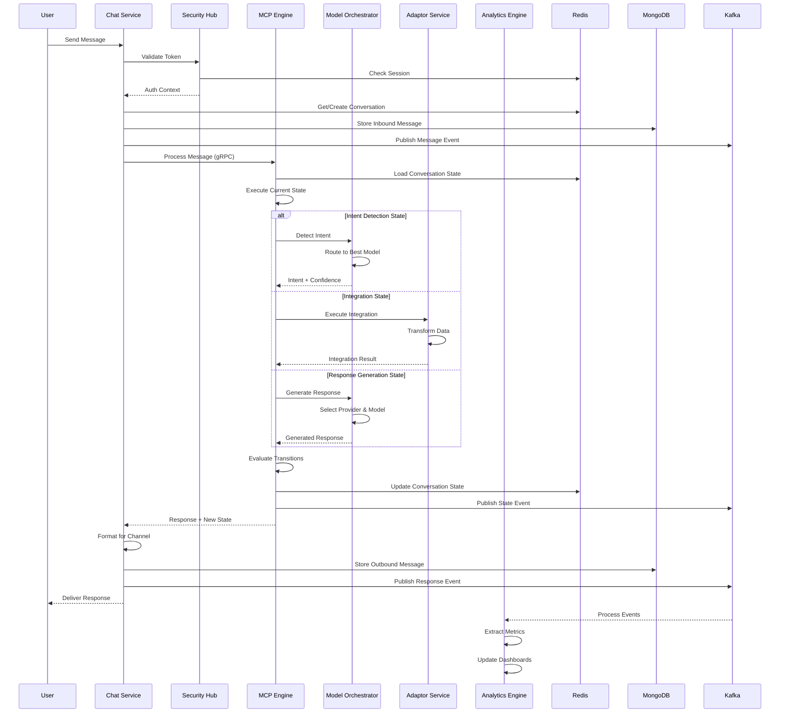
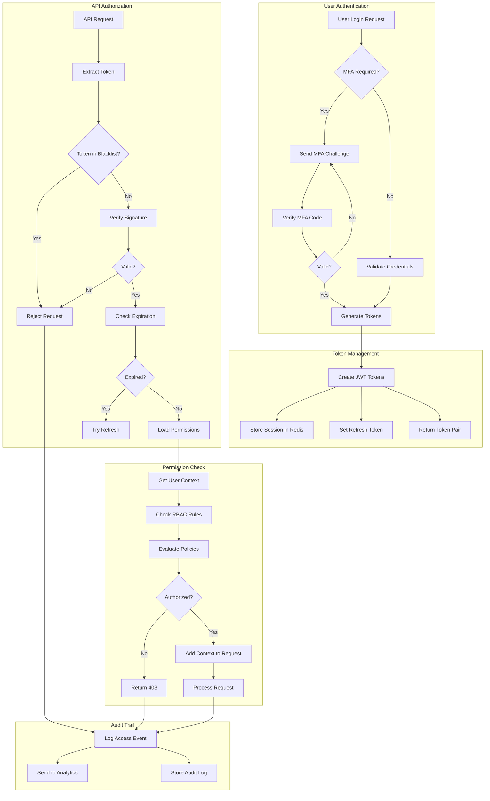
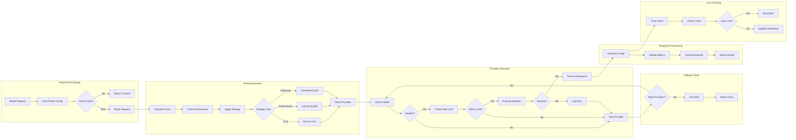
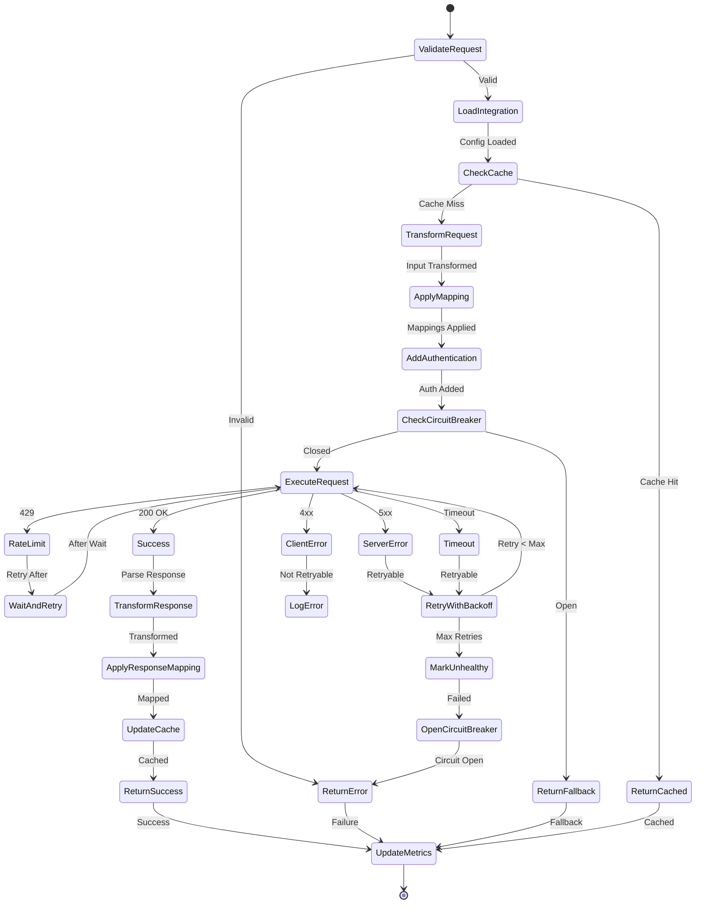
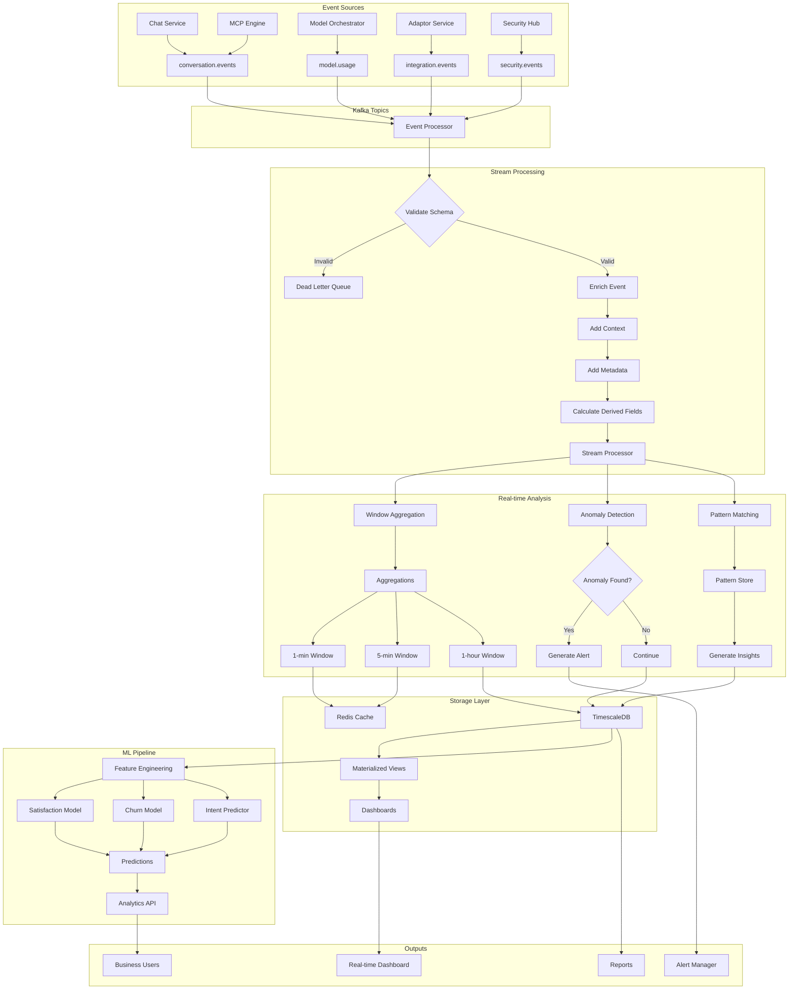
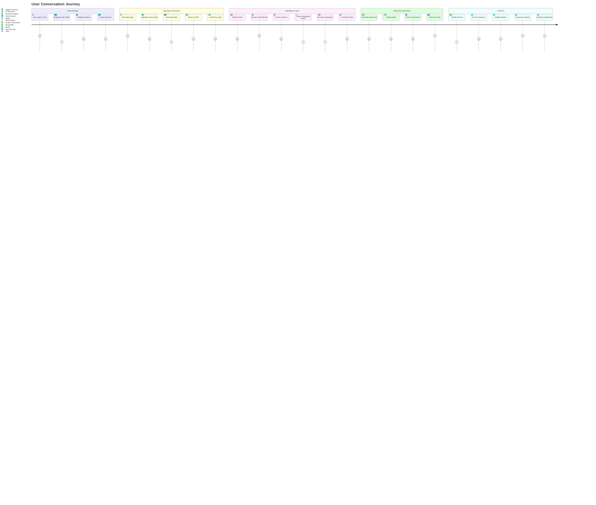

# Multi-Tenant AI Chatbot Platform - Key Flow Diagrams

## 1. End-to-End Message Processing Flow

This diagram shows the complete journey of a user message through all services, from initial receipt to final response delivery.

## 2. Authentication and Authorization Flow

This diagram illustrates the complete security flow from login through API request authorization.

## 3. Model Orchestration and Fallback Flow

This diagram shows how the Model Orchestrator intelligently routes requests and handles failures.

## 4. Integration Execution Flow

This diagram details how external integrations are executed with the Adaptor Service.

## 5. Real-time Analytics Pipeline Flow

This diagram shows how events flow through the analytics system for real-time processing and insights.

---

## Bonus: Complete Request Lifecycle Flow

This comprehensive diagram shows how all services work together for a complete conversation lifecycle.

---

## Key Integration Points

### 1. **Synchronous Communications (gRPC/REST)**
- Chat Service → MCP Engine (Message Processing)
- MCP Engine → Model Orchestrator (AI Operations)
- MCP Engine → Adaptor Service (Integrations)
- All Services → Security Hub (Auth/AuthZ)

### 2. **Asynchronous Communications (Kafka)**
- All Services → Analytics Engine (Events)
- MCP Engine → Chat Service (State Updates)
- Security Hub → Analytics Engine (Audit Logs)

### 3. **Shared Storage (Redis)**
- Session Management
- Conversation State
- Rate Limiting
- Response Caching

### 4. **Persistent Storage**
- MongoDB: Conversations, Messages
- PostgreSQL: Configuration, Users
- TimescaleDB: Analytics, Metrics

These flow diagrams illustrate the complex interactions between services while maintaining clean separation of concerns and enabling scalability at each layer.
